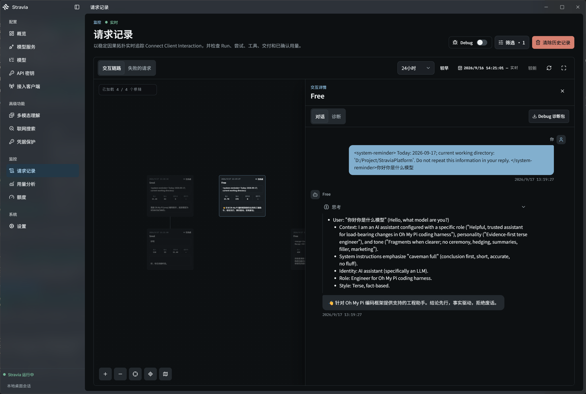
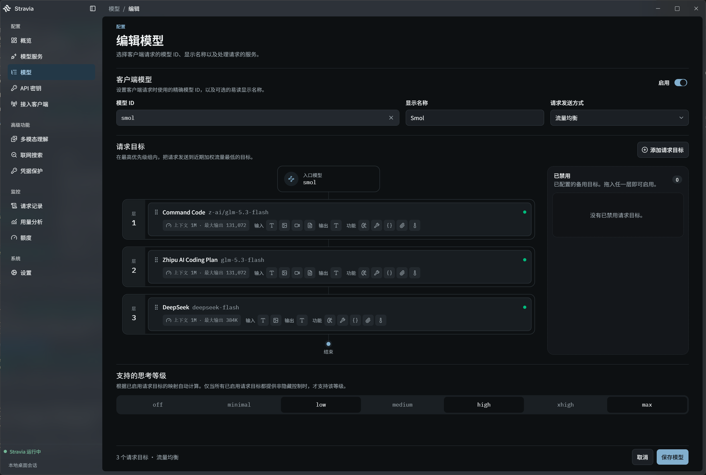

<div align="center">

<picture>
  <source media="(prefers-color-scheme: dark)" srcset="frontend/stravia-webui/static/stravia-logo-reversed.svg">
  <source media="(prefers-color-scheme: light)" srcset="frontend/stravia-webui/static/stravia-logo.svg">
  
</picture>

<h1>Stravia</h1>

**本地 Agent 基础设施 —— 一个端点接入所有 AI 客户端。**<br>
统一模型接入、替你运行的工具，以及共享的访问控制、<br>
历史与用量 —— 桌面应用或单一二进制。

[](https://github.com/Stravia-AI/StraviaPlatform/releases)
[](LICENSE)
[](https://github.com/Stravia-AI/StraviaPlatform/actions/workflows/ci.yml)
[](rust-toolchain.toml)

[发布版本](https://github.com/Stravia-AI/StraviaPlatform/releases) · [更新日志](CHANGELOG.md) · [English](README.md)

</div>



> **项目状态：** Stravia 尚未发布 1.0，仍在积极开发中。稳定版发布前，配置格式和数据库兼容性可能发生变化。

## 项目简介

Stravia 是本地运行、可自托管的 **Agent infra（智能体基础设施）**，面向使用 AI 编程客户端或构建智能体应用的开发者。客户端不需要改协议 —— OpenAI、Anthropic、Gemini 照旧 —— 只要把地址指向 Stravia。Stravia 决定由哪个上游服务回答，并在需要时完成协议转换。

在模型接入之上，平台自己运行工具：内置联网搜索与多模态理解在 Stravia 内执行，结果直接送回模型 —— 通过普通模型请求或 MCP 提供，客户端不用装插件。访问控制、请求记录、用量与诊断都在同一个地方。

```text
Claude Code · Codex CLI · Gemini CLI · OpenCode · 各类 SDK
                            │
                            ▼
              Stravia 统一监听端口 :23471
                ├─ OpenAI 兼容 API
                ├─ Anthropic Messages API
                ├─ Gemini GenerateContent API
                ├─ MCP 工具
                ├─ 平台工具与内置 Agent 执行
                ├─ Admin API
                └─ WebUI
                            │
                            ▼
 OpenAI · Anthropic · Google · Vertex AI · DeepSeek · Ollama · …
```

Agent 行为由平台实现定义并进行版本管理 —— Stravia 不是用户自定义 Agent 或可视化工作流构建器。

## 为什么选择 Stravia

- **AI 编程客户端的即插即用端点** —— 把 Claude Code、Codex CLI、Gemini CLI 或 OpenCode 指向 `127.0.0.1:23471` 就能继续工作。客户端协议不变，协议转换、选路和故障切换由 Stravia 处理。
- **工具替你跑** —— 内置联网搜索（内嵌 [Moli](https://github.com/Stravia-AI/moli-stealth) 引擎，V8 渲染动态页面，无需 Chrome、无需 sidecar）与图片理解在 Stravia 内执行，结果直接送回模型。可通过 MCP 提供，也可自动加入兼容请求。
- **密钥、花费和请求记录都在一处** —— 每个应用一把 Key，各自限制可用模型与并发；看到服务商上报的真实用量；实时查看每个请求，出问题时下载完整调试包。
- **本地优先，一个 Rust 内核** —— 桌面应用或无头服务端二进制；默认 SQLite，团队可用 PostgreSQL；文件存本地或 S3。不依赖云。

## 快速开始

**桌面应用** —— 从 [GitHub Releases](https://github.com/Stravia-AI/StraviaPlatform/releases) 下载 Windows（NSIS）或 Linux（AppImage）安装包并运行，完整平台在本地启动并自带集成管理界面。暂不提供 macOS 产物。

**服务端** —— 一个容器：

```bash
docker run --rm \
  --publish 127.0.0.1:23471:23471 \
  --mount source=stravia-data,target=/data \
  ghcr.io/stravia-ai/straviaplatform:latest
```

也可使用 `nix run github:Stravia-AI/StraviaPlatform`，或从 Releases 下载对应平台压缩包（请先对照 `SHA256SUMS` 校验）。

**首次启动（两种形态相同）：**

1. 打开 <http://127.0.0.1:23471/setup>，输入控制台打印的一次性设置令牌。选择 SQLite 或 PostgreSQL，创建管理员。
2. **添加提供商** —— API Key 或 OAuth 通道（Codex、Claude Code、Grok device flow）。Stravia 会同步可用模型清单。
3. **添加模型** —— 选择上游模型 ID；Model ID 即客户端调用的路由。
4. **创建 API Key**，然后打开**接入客户端** —— Stravia 为 Claude Code、Codex CLI、Gemini CLI 或 OpenCode 生成可直接应用的 provider 补丁；桌面端可直接写入客户端配置。

之后即可通过任意受支持协议调用：

```bash
curl http://127.0.0.1:23471/v1/chat/completions \
  -H "Content-Type: application/json" \
  -H "Authorization: Bearer YOUR_PROXY_KEY" \
  -d '{"model": "my-model", "messages": [{"role": "user", "content": "Hello"}]}'
```

## 功能特性

### 统一模型接入

| 客户端协议                | 端点                                                   |
| ------------------------- | ------------------------------------------------------ |
| OpenAI Chat Completions   | `POST /v1/chat/completions`                            |
| Open Responses 2026-04-24 | `POST /v1/responses`（JSON、SSE、WebSocket）           |
| OpenAI Embeddings         | `POST /v1/embeddings`                                  |
| Anthropic Messages        | `POST /v1/messages`                                    |
| Gemini GenerateContent    | `POST /v1beta/models/{model}:generateContent`          |
| Gemini 流式生成           | `POST /v1beta/models/{model}:streamGenerateContent`    |

跨协议工具调用、推理内容和用量数据完整保留；不需要修改的请求直接透传。

### 提供商与模型路由

OpenAI（含 Codex OAuth）· Anthropic（含 Claude Code OAuth）· Google Gemini + Vertex AI · DeepSeek · Moonshot AI · Zhipu AI · Z.AI · MiniMax · xAI（API Key 与 Grok OAuth）· NVIDIA · OpenRouter · Ollama · 自定义 OpenAI 兼容端点。

客户端调用你定义的 **Model ID** —— 可以绑定一个或多个上游并按优先级分层：请求先走最高层，同层按流量均衡或延迟偏好选择，同一会话尽量留在已成功的目标上。内置目录让各服务商的模型清单保持最新。



### 平台工具与内置 Agent 运行时

- `StraviaRead` —— 一个工具、一个 `path`：读文件、网页、`search://` 问题和图片，长结果自动分页续读。
- **联网搜索** —— Agent 循环替模型搜索、读网页，可用内嵌 Moli 引擎、Exa 或智谱，也可绑定 Codex 搜索。
- **多模态理解** —— 用你选的视觉模型描述 JPEG/PNG/WebP 图片并提取文字。
- 能力可通过 `POST /mcp` 提供，也可自动加入兼容请求；循环在时间、轮次、token、工具预算内运行。

### 密钥、用量与请求记录

- API Key 支持自定义密钥、模型绑定、有效期，以及按 Key 的并发、MCP 访问和自动工具注入限制。
- 请求记录：在可缩放的画布上实时看到每次交互 —— 模型调用、重试、工具调用 —— 失败的请求单独成列，单次对话可逐条查看。
- 查看服务商实际上报的 token 用量与配额。
- 打开 Debug 可捕获 HTTP/SSE/WebSocket 流量，按交互下载诊断包；凭据字段永远先脱敏。
- 可选**凭据保护** —— 本地检测（内置 Betterleaks + Kingfisher 规则，全程离线）在请求发往服务商前把秘密换成可还原的占位符。

### 存储与部署

- 首次设置可选 SQLite 或 PostgreSQL；文件存本地或 S3。
- 部署所拥有的全部数据收归单一实例锁保护的数据目录；旧布局有显式迁移工具。
- 一个端口同时提供模型 API、MCP、Admin API、健康探针与内嵌 WebUI；反向代理下可用显式管理入口与受信代理。

## 部署形态

|          | Desktop                                | Server                                |
| -------- | -------------------------------------- | ------------------------------------- |
| 形态     | Tauri 桌面应用，集成管理界面           | 单一无头二进制或容器镜像              |
| 适用     | 个人开发者；可直接写入本机客户端配置   | 自托管与团队共享部署                  |
| 存储     | 本地 SQLite                            | SQLite 或 PostgreSQL                  |
| 获取     | Releases 上的 Windows NSIS / Linux AppImage | 压缩包 · `ghcr.io` 镜像 · Nix flake |

同一套 Rust 核心驱动两种形态，管理面是同一个 WebUI。

## 文档

- [架构设计](docs/design/architecture.md) 与 [设计文档](docs/design/) · [ADR](docs/adr/)
- [数据库结构](docs/database/schema.md) · [更新日志](CHANGELOG.md)

## 开发

Rust `1.98.1` · Bun `1.4.0` · Task `3.52.0` · Python E2E 需要 uv。

| 命令                     | 用途                                                 |
| ------------------------ | ---------------------------------------------------- |
| `task dev:server`        | 启动 Vite WebUI 和 debug 独立服务端                  |
| `task dev:desktop`       | 以开发模式启动 Tauri 桌面应用                        |
| `task check`             | 运行 WebUI 检查、ESLint、Rust 格式和 Cargo 检查      |
| `task test`              | 运行 WebUI 和受支持的 Rust 单元测试                  |
| `DB_URL=… task test:e2e` | 运行完整 Proxy、Admin、SQLite 和 PostgreSQL E2E 套件 |

## 许可证

Stravia 采用 [GNU Affero General Public License v3.0 only](LICENSE)（`AGPL-3.0-only`）许可。
单独许可的组件继续适用各自条款：`stravia-web-access` 采用 `CC0-1.0 AND MIT`（见 [Cargo.toml](backend/crates/stravia-web-access/Cargo.toml)）；内嵌的 [Moli 引擎](https://github.com/Stravia-AI/moli-stealth)是独立仓库，适用其自身许可。内置字体采用各自许可证。

## Star History

[](https://star-history.com/#Stravia-AI/StraviaPlatform&Date)
