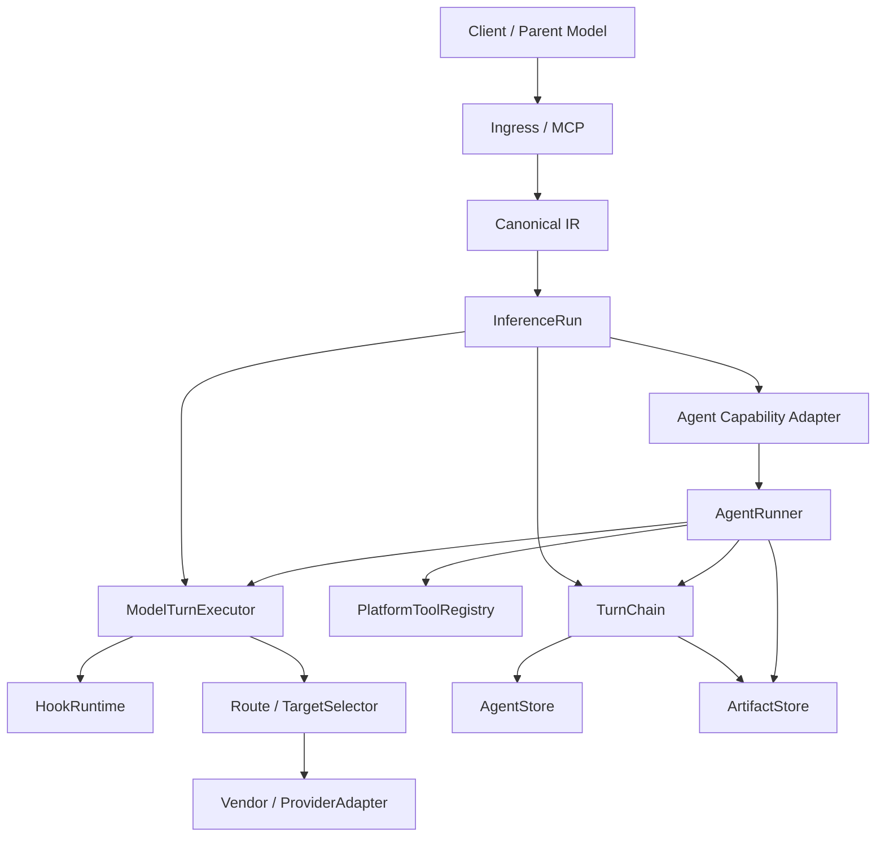
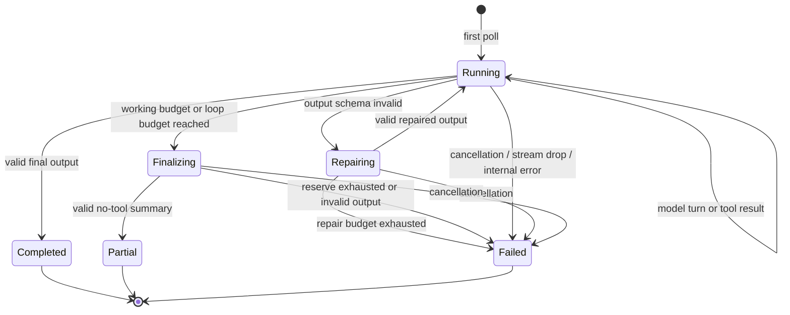

# Stravia Agent Core 融合设计

> 状态：Core、SQL persistence、Local ArtifactStore、HTTP/Admin/MCP/PlatformTool/Responses adapters、Web Search 与 Media Understanding vertical slices 已实施；generic Agent Admin API 已删除；S3 adapter 与 generic Agent WebUI 尚未实施
> 决策记录：[`ADR-0007`](../adr/0007-own-agent-execution-behind-native-seams.md)、[`ADR-0009`](../adr/0009-add-media-understanding-as-capability-tool.md)  
> 调研快照：2026-08-10  
> 范围：`stravia-core`、Server/Desktop adapters、持久化与协议 surface  
> 非目标：用户创建 Definition、generic Agent WebUI、后台 Task adapter

---

## 1. 结论

Stravia 不应直接嵌入 Rig、Swiftide 或非 Rust sidecar。目标方案是在现有 canonical protocol、routing、Hook、Platform Tool 与 storage 能力之上，原生增加两个 deep modules：

1. `ModelTurnExecutor`：完成一次 transport-neutral model turn，按显式 authorization policy 应用 client Model binding 或产品 capability grant，并复用 Target 选择、provider codec、重试、streaming 与 usage 计量。
2. `AgentRunner`：按代码内置 `AgentDefinition` 执行有界 model→tool→model loop，并把成功结果提交为可分支、可复用的 `Agent Turn`。

会话复用不引入 `AgentSession`。每次成功或预算收束成功只返回一个 `AgentTurnId`；后续调用显式传入该 ID，沿不可变父链恢复精确前缀。无 ID 创建新根，同一父节点允许多个分支，不提供合并或隐式 latest。

现有 `Response Chain` 与 Agent Turn 父链共享同一 `TurnChain` deep module。Responses 状态从进程内 TTL store 迁入 SQL，默认保留期从 1 小时调整为可配置的 7 天。`ToolContinuation` 仍保持现有进程内语义；本设计不引入客户端工具穿透。

图片、视频和未来联网研究不是 AgentRunner 的分支逻辑：

- 图片、视频通过 `AgentInput.artifacts` 引用 opaque Artifact；Runner 在模型调用前 materialize 为 canonical multimodal content；
- 内部能力只通过版本化 `PlatformTool` 进入 Definition allowlist；
- 不支持的媒体在 negotiation 阶段 typed reject；
- 抽帧、转录、WebAccess research 都是后续显式 leaf PlatformTool，不在 core 或 codec 中静默降级。

---

## 2. 目标与非目标

### 2.1 目标

- Rust 原生、provider-neutral、Desktop/Server 共用。
- 一个 `AgentRunner` interface 承载开放式多轮 agent loop，而非硬编码图片、视频或研究 workflow。
- 已完成 Turn 可在进程重启后继续；正在执行的 Run 不持久化、不恢复，也不产生失败 Turn。
- 复用现有 `PlatformTool`、Hook、canonical IR、Route/Target、Principal 与 admission seam。
- 同一逻辑 Model 可继续使用现有 Target failover 与 provider codec。
- 支持 canonical text/image/audio/video/file 输入和不可变 Artifact。
- 为未来 MCP Tasks/background adapter 保留稳定的 Run/Turn/Event seam，但当前仍为 request-bound 执行。

### 2.2 非目标

- 不实现用户可创建的 agent/workflow/prompt template。
- 不引入 `AgentSession`、workflow graph、multi-agent handoff 或 agent-as-tool nesting。
- 不支持 AgentRunner 内部客户端工具 continuation 或出站 MCP client tools。
- 不设计 WebAccess→AgentRunner 的具体 research workflow。
- 不选择首个生产内置 Definition；实施前必须另行选择真实 vertical slice。
- 不实现 UI、后台队列、durable task handle、自动 context compaction、幂等调用或显式 Turn/Artifact 删除。

---

## 3. 当前能力与缺口

### 3.1 当前调用链

当前 Server 与 Desktop 共用同一 HTTP application：

```text
stravia-server::build_http_app
  or DesktopGatewayRuntime
        │
        ▼
proxy::server::create_router
        │
        ▼
ingress decoder + ProtocolTransform
        │
        ▼
proxy::dispatcher::dispatch_pipeline
        │
        ▼
inference_run::execute / engine::dispatch_pipeline
        │
        ├─ Principal / model binding / root admission
        ├─ HookRuntime
        ├─ TargetSelector / negotiate
        ├─ Vendor / ProviderAdapter
        ├─ ProxyClient call / stream
        ├─ PlatformTool hidden rounds
        └─ delivery encoder
```

相关实现：

- `backend/crates/stravia-core/src/proxy/dispatcher/inference_run.rs`
- `backend/crates/stravia-core/src/proxy/dispatcher/inference_run/engine/mod.rs`
- `backend/crates/stravia-core/src/hook/runtime/mod.rs`
- `backend/crates/stravia-core/src/hook/tool.rs`
- `backend/crates/stravia-core/src/hook/response_chain.rs`
- `backend/crates/stravia-core/src/hook/continuation.rs`
- `backend/crates/stravia-core/src/protocol/ir/`

### 3.2 可直接复用的 seam

| 现有模块 | 可复用能力 | Agent Core 中的角色 |
|---|---|---|
| canonical IR | message、tool call/result、image/audio/file/document、stream delta、usage | Agent transcript 与 ModelTurn 输入输出 |
| Route / TargetSelector | 逻辑模型映射、健康感知、failover | Definition 绑定逻辑 Model ID |
| Vendor / codec | provider 认证、URL、请求/响应与 stream 转换 | `ModelTurnExecutor` implementation |
| HookRuntime | canonical request/response policy 与 stream transform | 每个内部 ModelTurn 的治理；禁止动态注入工具 |
| PlatformToolRegistry | 平台拥有、隐藏执行的工具 | Definition 的唯一内部工具来源 |
| Response Chain | 父 ID、分支、materialize、principal scope | 抽取共享 `TurnChain` |
| Security seam | Principal、key 状态、Model binding、root admission | 每个隐藏 step 动态重查 |
| SQLite/PostgreSQL storage | Desktop/Server 双后端 | Definition、Run、Turn 与 Artifact metadata |

### 3.3 明确缺口

- 没有 transport-neutral 的单次 model-turn interface；现有 provider call 被包在完整 `InferenceRun` 内。
- 没有通用 AgentRunner、AgentDefinition、AgentRun/AgentTurn 状态。
- `ResponseChainStore` 与 `ToolContinuationStore` 是进程内 TTL 状态；前者不能跨重启。
- 没有 Artifact/上传 surface；媒体只可 inline、URL 或 provider file ID。
- canonical IR 没有 `Video`，endpoint capability 也没有 native-video 位。
- Responses `background`、conversation 与 server-side context management 当前显式拒绝。
- `PlatformTool` 没有稳定 ToolVersion、agent artifact context 或 `parallel_safe` descriptor。

这些缺口说明新 seam 应位于 canonical dispatcher 与 provider call 之间，而不是 ingress、Vendor 或 WebAccess 内部。

---

## 4. 现有 Agent 方案比较

调研只采用官方文档、官方仓库与一手协议资料。版本与能力为 2026-08-10 快照；快速变化项在落地前必须复核。

| 方案 | Rust/部署 | 优点 | 与 Stravia 的冲突 | 结论 |
|---|---|---|---|---|
| 原生实现，借鉴外部契约 | 单 Rust 进程 | 保留现有 provider、Hook、IR、quota 与 Desktop 部署；interface 可按本项目语义收紧 | 需要实现 loop、TurnChain persistence 与 ArtifactStore | **采用** |
| Rig | Rust，MIT | `AgentRunner`/可序列化 AgentRun、typed hook、structured output、streaming 较完整 | 自带 provider client；与 Gateway 争夺模型调用所有权；其 `rmcp` 2.x 与项目 3.x 类型不共享；无开箱 durable backend | 不直接依赖；借鉴 AgentRun step/hook 契约 |
| Swiftide | Rust，MIT | RAG pipeline、task/state、structured tools | 更偏 RAG/task graph；自带 integrations；其 `rmcp` 1.x 与项目 3.x 跨两个 major | 不直接依赖 |
| LangGraph | Python/JS，MIT | checkpointer 与 durable execution 成熟 | 需要 sidecar、额外 runtime/运维；重复 provider client；不符合 Desktop 单进程形态 | 仅借鉴 checkpoint/thread 语义 |
| OpenAI Agents SDK | Python/JS，MIT | session、handoff、typed output、tracing、MCP | 无 Rust runtime；provider/runtime 归属与 Gateway 冲突 | 借鉴 Runner/session/hook interface |
| Google ADK | Python/JS/Go/Java，Apache-2.0 | agent loop、session、A2A、多 agent | 无 Rust runtime；Gemini/Vertex 优先；引入 sidecar | 不集成 |
| Microsoft Agent Framework | Python/.NET/Go，MIT | workflow、handoff、OTel、durable 扩展 | 无 Rust runtime；能力面远超单 Orchestrator 目标 | 不集成 |
| Claude Agent SDK | Python/TS，MIT | Claude Code 工具环境完整 | Claude-only，包装 bundled CLI 子进程，不是通用嵌入式 runtime | 排除 |

### 4.1 采用“协议借鉴”的原因

删除 Agent Core 后，其复杂度应重新出现在多个调用方，才说明模块有深度。Stravia 已拥有 provider-neutral model call、canonical tool semantics、Hook 与 storage；直接引入另一个 runtime 会保留两套 provider client、两套工具类型和两套观测路径，反而降低 locality。

原生方案借鉴但不复制：

- Rig：`AgentRunner`、可序列化 run step、typed hooks；
- LangGraph：immutable checkpoint/thread lineage；
- OpenAI Agents SDK：Definition/Runner/session 分离、structured output；
- MCP Tasks：未来 request-bound adapter 之外的 durable task shape。

### 4.2 外部方案来源

- [Rig](https://github.com/0xPlaygrounds/rig)
- [Swiftide](https://github.com/bosun-ai/swiftide)
- [LangGraph](https://github.com/langchain-ai/langgraph)
- [OpenAI Agents SDK](https://github.com/openai/openai-agents-python)
- [Google ADK](https://github.com/google/adk-python)
- [Microsoft Agent Framework](https://github.com/microsoft/agent-framework)
- [Claude Agent SDK](https://github.com/anthropics/claude-agent-sdk-python)
- [MCP Tasks extension](https://modelcontextprotocol.io/extensions/tasks/overview)

---

## 5. 领域模型

### 5.1 Agent Definition

`AgentDefinition` 是程序拥有的稳定用例身份，不是用户脚本。外部 tool name 为不可变、全局唯一的 `agent_<slug>`；slug 删除后不得复用为不同契约。

一个 Definition 包含稳定 interface：

- slug、description；
- 统一 `AgentInput` contract；
- 可选且不可破坏变更的 `OutputSchema`；
- current Revision identity。

`AgentDefinitionRevision` 是不可变 implementation contract：

- 显式单调版本；
- 完整 spec hash；
- instructions；
- `PlatformTool ID@version` allowlist；
- hard budgets 与 finalization reserve；
- Artifact policy；
- structured-output repair policy。

代码发布在启动时幂等注册并持久化 Revision。相同 slug+version 的 spec hash 不一致时 readiness 失败，禁止静默覆写旧语义。

`AgentDefinitionConfig` 是唯一用户可配置状态：

```text
enabled: bool
model_id: Option<LogicalModelId>
```

首次发现 Definition 时默认 disabled 且无 Model ID。Admin 不可创建、修改 instructions/tools/schema/budget 或删除 Definition。

Release 可停止注册某个 Definition：

- 不再允许新根，也不再进入 discovery；
- 当前已启动 Run 使用启动快照完成；
- 未过期 Turn 仍按已持久化 Revision 和根 Model ID 续接；
- 活跃 Revision 引用的 ToolVersion 必须继续随 binary 注册，否则实例不 ready；
- Revision 在最后引用过期并经过 grace 后可回收。

不引入显式 `Retired` 状态；registry absence 只决定能否创建新根，不删除持久化 Revision。

### 5.2 Agent Run

`AgentRun` 是一次 `AgentRunner` 调用的 request-bound 运行尝试。`RunStarted` 会携带一个预分配的 `AgentTurnId` 用于当前 Event Stream 关联；只有 Completed/Partial 提交成功后，该 ID 才成为可恢复的 Turn。不存在独立 `AgentRunId`、lease 或 Run record。

Run 可包含多个 Model Turns 和 AgentTool calls。失败、取消、stream drop 或进程退出只返回当前 terminal error，不产生可续接节点。

### 5.3 Agent Turn

`AgentTurn` 是一次 AgentRun 成功结束后提交的不可变 continuation point：

- `completion=complete`：模型正常完成且输出通过 schema；
- `completion=partial`：working budget 用尽，预留 finalization 成功收束；
- 其他终止状态不创建 Turn。

每个 Turn 有 `AgentTurnId`、可选 parent ID、principal、Definition Revision、根 Model ID、canonical transcript（Artifact 以内部 opaque marker 保存）与 usage/completion metadata。

### 5.4 Turn Chain

`TurnChain` 是 principal-scoped、不可变、有向无环的历史 deep module。它负责：

- append immutable node；
- 按 parent chain materialize 精确 canonical prefix；
- 从任意旧节点自然分支；
- 授权、TTL、ancestor refresh 与 GC；
- 对外隐藏 not-found/expired/forbidden/mismatch 的存在性差异。

它不拥有 model call、Hook、tool loop 或 delivery。

`Response Chain` 是 TurnChain 的 Responses adapter；`Agent Turn` 是 Agent adapter。二者共享存储行为，但保留各自 ID 与 payload contract。

### 5.5 Model Turn

`ModelTurn` 是一次完整、transport-neutral 的 model request/response。普通 Target retry 仍属于同一个 ModelTurn；AgentRunner 的下一次模型调用才是新的 ModelTurn。

### 5.6 Artifact

`Artifact` 是不可变、principal-scoped 的媒体或大对象。公共 `ArtifactId` 是随机 opaque ID；内容 hash 仅用于内部去重，不作为外部身份。

`ArtifactStore` 是保存/读取 bytes 的 seam。SQL 只保存 metadata、owner、hash、MIME、size、state、TTL 和 references。

---

## 6. 目标架构



### 6.1 责任划分

| Module | Interface 负责 | Implementation 隐藏 | 明确不负责 |
|---|---|---|---|
| `ModelTurnExecutor` | canonical request→event/final response | auth refresh、route、target retry、provider codec、usage | tool loop、history、delivery |
| `AgentRunner` | AgentInput→AgentEvent stream | bounded loop、tool calls、schema repair、finalization、Turn commit | transport、Definition CRUD、background task |
| `TurnChain` | append/materialize/branch/expire | DAG、principal scope、TTL、GC | model/tool execution |
| `ArtifactStore` | stage/open/attach/release | LocalFS/S3、hash、multipart、refcount | model encoding、media analysis |
| `PlatformToolRegistry` | versioned descriptor/execute | executor lookup、parallel policy | client tool continuation、agent nesting |
| adapters | wire↔AgentInput/ToolResult | protocol-specific declaration与错误映射 | Agent loop |

### 6.2 禁止的调用路径

- AgentRunner 不递归调用 `dispatch_pipeline` 或 HTTP ingress。
- AgentRunner 不直接调用 Vendor/reqwest；必须经过 `ModelTurnExecutor`。
- ModelTurnExecutor 不执行 PlatformTool。
- AgentRunner 不接受 Hook 动态注入工具。
- provider codec 不执行视频抽帧、URL 下载或 context compaction。
- ArtifactStore 不解释 prompt 或模型协议。

---

## 7. Core interfaces

以下摘录当前 Rust interface 的关键字段；完整定义以 `backend/crates/stravia-core/src/agent/` 为准。

### 7.1 AgentDefinition registry

```rust
pub struct AgentDefinitionSpec {
    pub id: AgentDefinitionId,
    pub slug: AgentSlug,
    pub revision: AgentDefinitionRevisionId,
    pub description: String,
    pub instructions: String,
    pub output_schema: Option<JsonSchema>,
    pub tools: Vec<VersionedToolId>,
    pub budgets: AgentBudgets,
    pub artifact_policy: ArtifactPolicy,
    pub repair_attempts: u32,
}

pub struct AgentDefinitionConfig {
    pub enabled: bool,
    pub model_id: Option<ModelId>,
}

pub struct AgentBindingSnapshot {
    pub definition_id: AgentDefinitionId,
    pub revision: AgentDefinitionRevisionId,
    pub model_id: ModelId,
}
```

启动注册必须验证：

- slug 和生成的 `agent_<slug>` 全局唯一；
- version/hash 一致；
- OutputSchema 与公开 contract 兼容；
- ToolVersion 全部存在、不是 agent capability tool；
- budget 与 finalization reserve 合法；
- Artifact policy 不超过实例绝对上限。

### 7.2 AgentRunner

```rust
pub struct AgentInput {
    pub principal: Principal,
    pub definition_id: AgentDefinitionId,
    pub parent_turn_id: Option<AgentTurnId>,
    pub prompt: String,
    pub artifacts: Vec<ArtifactId>,
    pub cancellation: CancellationToken,
}

impl AgentRunner {
    pub fn run(&self, input: AgentInput) -> AgentEventStream;
}
```

`definition` 由 adapter 固定，不来自模型 tool arguments。调用方只控制 prompt、artifacts 与 optional previous Turn。

Stream 为 poll-driven：不 poll 不推进；drop 触发 cancellation。实现不得在 `run()` 时创建脱离调用方生命周期的 background execution task。

### 7.3 Events 与 terminal

```rust
pub enum AgentEvent {
    RunStarted { turn_id: AgentTurnId },
    ModelStepStarted { ordinal: u32 },
    PublicOutputDelta { text: String },
    ToolStarted { tool: VersionedToolId, ordinal: u32 },
    ToolFinished { tool: VersionedToolId, ordinal: u32, is_error: bool },
    UsageUpdated { usage: Usage },
    Completed(AgentResult),
    Partial(AgentResult),
    Failed { error: AgentRunError },
}

pub struct AgentResult {
    pub turn_id: AgentTurnId,
    pub completion: AgentCompletion,
    pub output: Value,
    pub usage: Usage,
}
```

不变量：

- 每个被完整 poll 的 stream 恰好一个 Completed/Partial/Failed terminal；
- terminal 后无事件；
- 只有 Completed/Partial 对应已提交、可续接的 Turn；
- stream 不包含 private reasoning、provider raw、credential、完整 tool args/results；
- 当前 adapters 缓冲 stream 并只返回 `AgentResult` 或 typed error。

### 7.4 ModelTurnExecutor

```rust
pub enum ModelAuthorizationPolicy {
    ClientModelBinding,
    CapabilityOwned(CapabilityId),
}

pub struct ModelRunInput {
    pub principal: Principal,
    pub run_id: String,
    pub request: AiRequest,
    pub authorization: ModelAuthorizationPolicy,
    pub cancellation: CancellationToken,
}

pub struct ModelTurnInput {
    pub principal: Principal,
    pub model_id: String,
    pub request: AiRequest,
    pub accumulated_usage: Usage,
    pub allowed_tools: Vec<ToolSpec>,
    pub cancellation: CancellationToken,
    pub deadline: Instant,
}

pub trait ModelTurnExecutor: Send + Sync {
    fn begin_run(&self, input: ModelRunInput) -> Result<Arc<dyn ModelTurnRun>, ModelTurnError>;
}
```

`ModelAuthorizationPolicy` 是 crate-internal、由 ingress/产品 adapter 固定的执行策略，不从客户端 payload 反序列化。Media/Local Web Search 只能选择各自的 `CapabilityId`；generic Agent 继续使用 `ClientModelBinding`。

职责：

1. 每个 ModelTurn 开始前重读 API key enabled/expiry，按固定 authorization policy 校验 client Model binding 或产品 capability grant，并执行实时 quota；
2. 使用逻辑 Model ID 进入现有 TargetSelector/negotiation；
3. 普通可重试上游失败沿现有 Route failover；
4. 复用 Vendor codec、stream parsing、usage 与 request log；
5. 返回 canonical response/delta，不执行任何 tool call。

### 7.5 TurnChain

```rust
pub trait TurnChainStore: Send + Sync {
    async fn materialize(
        &self,
        principal: &Principal,
        id: TurnNodeId,
    ) -> Result<MaterializedChain, TurnUnavailable>;

    async fn commit(
        &self,
        transaction: TurnCommit,
    ) -> Result<TurnNodeId, TurnCommitError>;
}
```

`commit` 必须在一个数据库事务中校验 parent 仍可用、principal 与 kind 匹配，插入 immutable node，并刷新新节点及 ancestor path 的 expiry。AgentRunner 必须在发送 Completed/Partial terminal 前完成 commit。

Adapter delivery 失败不回滚已提交 Turn；当前没有独立 Run/delivery record，调用方仍可在 TTL 内用已返回或已产生的 TurnId 重试读取。

### 7.6 ArtifactStore

```rust
pub trait ArtifactStore: Send + Sync {
    async fn create_upload(
        &self,
        principal: &Principal,
        request: ArtifactUploadRequest,
    ) -> Result<ArtifactUpload, ArtifactError>;

    async fn upload_part(
        &self,
        principal: &Principal,
        upload_id: &str,
        upload_token: &str,
        part_number: u32,
        bytes: ArtifactByteStream,
    ) -> Result<UploadedArtifactPart, ArtifactError>;

    async fn complete_upload(
        &self,
        principal: &Principal,
        upload_id: &str,
        upload_token: &str,
        parts: &[UploadedArtifactPart],
    ) -> Result<ArtifactRef, ArtifactError>;

    async fn open(
        &self,
        principal: &Principal,
        id: &ArtifactId,
    ) -> Result<ArtifactReader, ArtifactError>;

    async fn sweep_expired(&self) -> Result<u64, ArtifactError>;
}
```

当前外部 ingest 只接受 API-key authenticated multipart upload；AgentInput 只接受同 principal 的 opaque ArtifactId。LocalFS path 只存在于 `ArtifactReader` 内部，不暴露给调用方；不接受 `file://`、任意本地路径、客户端 URL 或 provider file ID 作为持久化身份。

---

## 8. Agent Run 状态机



### 8.1 正常 loop

1. Adapter 固定 Definition ID，解析统一 AgentInput。
2. 校验 principal 非 anonymous、Definition 已启用且 Model 已配置。
3. 若有 previous Turn：materialize exact parent chain；若无则创建 root binding snapshot。
4. 对 inline/HTTPS artifacts 做 staging snapshot。
5. 建立一个 HookSession，并在整个 AgentRun 的每个 ModelTurn 复用。
6. ContextBuilder 组装 Definition instructions、完整 prefix、新 user content、允许的 ToolVersion schemas 与 finalization reserve；若 Definition 声明 OutputSchema，则每个 Model Turn 的 system instructions 还携带其完整 JSON Schema，使不支持原生 Structured Outputs 的 Target 也能遵循相同输出契约，最终结果仍由本地 validator 校验并按预算修复。
7. `ModelTurnExecutor` 执行一个 model turn。
8. 无 tool call 且输出合法：提交 complete Turn。
9. 有 tool calls：按 descriptor 受控并行执行，按原 call ordinal 回填 canonical ToolResult，进入下一 ModelTurn。
10. 达到 working budget：进入 finalization；禁用全部工具，只允许一次收束调用。

### 8.2 Context 规则

- 不做截断、摘要或原地替换。
- 父链在首次 model call 前已经超过 context window：typed `context_limit_exceeded`，不调用模型。
- working loop 必须同时预留 finalizer 所需 prompt context 与 output tokens；不能等 context 已满才尝试总结。
- finalizer 读取完整当前 canonical transcript，不得截断历史。
- `partial` Turn 保存 canonical `completion=partial, reason=limit_reached`；下一轮 ContextBuilder 通过受控 metadata 告知模型，不修改 user/assistant 原文。

### 8.3 Budget

Revision 固定至少以下上限：

- total wall time；
- working/finalization wall-time partition；
- max ModelTurns；
- max PlatformTool calls；
- max parallel tool calls；
- input/output/total tokens；
- finalization context/output reserve；
- structured-output repair attempts。

调用方不能扩大。设计不增加确定性重复-call detector；异常循环只由硬预算停止。

### 8.4 Tool 规则

- Definition allowlist 是 AgentRunner 的完整工具权限；不再与 per-key capability allowlist 取交集。
- `PlatformTool` descriptor 必须包含 ToolVersion 与 `parallel_safe`。
- `parallel_safe=true` 的 calls 可在 Revision 并行上限内运行；其他 calls 串行。结果始终按模型原 call 顺序写回。
- agent capability PlatformTool 不得出现在任何 Definition allowlist，启动校验阻止直接或跨 Definition nesting。
- 内部 Hook 的 `ExposeTool` 一律返回 typed policy failure；外层 InferenceRun Hook 仍可暴露 agent capability PlatformTool。
- 可恢复业务错误作为 canonical tool error 返回模型；权限、策略、取消和内部不变量错误终止 Run。

---

## 9. Definition 与安全快照

### 9.1 启动快照

Run 启动时冻结：

- Definition Revision；
- 根 Model ID；
- instructions、OutputSchema；
- Tool ID@version allowlist；
- budget、repair 与 Artifact policy；
- Run 开始时的 Definition enabled 状态。

Run 期间管理员修改 Definition config 不改变当前执行。Definition disabled 后：

- 已启动 Run 继续；
- 新根与后续基于旧 Turn 的新 Run 均拒绝；
- 重新启用后，未过期 Turn 可继续。

### 9.2 动态 Principal 检查

每个隐藏 ModelTurn 动态检查 API key 状态、根逻辑 Model 当前可用性与固定 authorization policy。generic Agent 使用 `ClientModelBinding`；Media/Local Web Search 等产品能力使用 code-owned `CapabilityOwned` policy，不要求 key 的 `model_ids` 包含 hidden Model。每个 PlatformTool side effect 前继续复查适用授权；MCP 的 `mcp_access_enabled` 在 invocation 入口检查。隐藏 ModelTurn 复用外层根请求的 Principal Concurrency Limit 名额。

任何检查失败立即终止 Run，不提交 Turn。这保持 `docs/adr/0005-client-credential-security-seam.md` 的现有不变量。

### 9.3 Capability 授权

generic `agent_<slug>` 本身不增加 per-key capability allowlist；产品 capability 可以定义专用 ACL：

- anonymous 永久禁止；
- Definition 必须全局 enabled；
- MCP 仍要求既有 `mcp_access_enabled`；
- generic Agent Definition Model 继续要求 principal 的现有 model binding；
- Media/Web Search 分别由平台 Gate 授权有效 API key 间接使用 hidden Model，不创建额外并发名额；Transparent Injection 只控制自动暴露；
- Definition allowlist 即内部工具授权。

未授权或 unavailable Definitions 从 discovery 中过滤；显式请求未授权 tool 返回 typed forbidden。Turn lookup 则统一返回 `TurnUnavailable`，避免 ID existence oracle。

---

## 10. 持久化模型

以下为逻辑实体，不锁定最终表名；实施时 SQLite/PostgreSQL migration 必须同步更新 `docs/database/schema.md` 并重新生成 `deploy/schema/postgres.sql`。

| 实体 | 关键字段 | 说明 |
|---|---|---|
| Agent Definition Revision | definition_id、slug、version、spec_hash、spec_json、created_at | 程序注册的 immutable spec |
| Agent Definition Config | definition_id、enabled、model_id、thinking_level、updated_at | Admin 唯一可改字段 |
| Turn Chain Node | node_id、kind、parent_id、principal、payload_version、payload、expires_at | kind 至少 response/agent |
| Artifact | artifact_id、principal、mime、size、backend_key、state、expires_at | opaque public ID；当前 backend 为 LocalFS |
| Artifact Upload | upload_id、artifact_id、principal、token_hash、declared/received size、expires_at | authenticated multipart staging |

当前不持久化运行中的 Agent Run、失败尝试、instance lease 或 event chunks。只有成功/预算收束成功的 Turn 会进入 Turn Chain；失败、取消或进程退出不会产生可续接节点。

### 10.1 Canonical transcript payload

Agent Turn 保存完整 semantic transcript：

- user/assistant messages；
- tool call 与 tool result；
- public reasoning summary 与协议续接必需 signature/encrypted state；
- Artifact 的内部 opaque FileId marker；
- usage、stop/completion metadata。

不保存：

- provider raw request/response/SSE；
- private chain-of-thought；
- credential/header；
- token chunk event stream。

Failed/Cancelled Run 不持久化；其 typed error 只通过当前 Event Stream 返回。Model Turn 的 provider/model/status/usage 继续写入既有 request log，且不记录 Agent transcript、tool arguments 或 Artifact bytes。

### 10.2 TTL 与 GC

- Agent Turn 与 Response Chain 默认 TTL 均为 7 天；成功续接刷新新 Turn 及其 ancestor path，未使用 sibling branch 独立过期。
- Artifact 默认保留 7 天；multipart upload 使用 idle TTL，每次成功 part 上传都会刷新。
- Gateway lifecycle 每小时驱动 Turn 与 Artifact sweep；失败记录 warning 并在下一周期重试。
- 当前 Artifact 没有引用计数或显式删除；到期后由 sweeper 清理 metadata、object 与未完成 staging。
- Revision 当前不自动回收，以保证已存活 Turn 可按固定 Revision 续接。
- 不提供显式 Turn/Artifact 删除 API。

---

## 11. Artifact 与多模态

### 11.1 Canonical IR 扩展

已实施的 canonical media 变更：

```text
ContentBlock::Video
EndpointCapabilities::native_video
```

`ArtifactId` 保持在 `AgentInput.artifacts` envelope 中，而不进入通用 protocol IR。AgentRunner 通过 principal-scoped ArtifactStore 打开对象，校验 Definition policy，并在 Model Turn 前 materialize 为 canonical image/audio/video/file Base64 content block；backend key 不暴露给模型或客户端。

### 11.2 Provider negotiation

截至 2026-08-10：

- OpenAI、Anthropic、Gemini 均支持图片输入；
- Gemini 官方支持原生视频输入；
- OpenAI/Anthropic 没有通用原生视频理解输入；跨 provider 最小公分母是 frames + timestamped transcript；
- provider file ID、public URL 支持与大小限制不同，不能作为 canonical 持久化身份。

因此：

- target 支持 native modality：codec 从 ArtifactStore materialize provider request；
- target 不支持：在 negotiation 前 typed `unsupported_modality`；
- 不自动切换 Definition Model；根 Model ID 固定；
- 不在 codec 内做下载、抽帧、转录或 OCR；
- 未来 portable video Definition 必须显式包含版本化 media preprocessing PlatformTool。

官方来源：

- [OpenAI image inputs](https://platform.openai.com/docs/guides/images-vision)
- [Anthropic vision](https://platform.claude.com/docs/en/build-with-claude/vision)
- [Gemini video understanding](https://ai.google.dev/gemini-api/docs/video-understanding)
- [Gemini Files API](https://ai.google.dev/gemini-api/docs/files)

### 11.3 Upload surface

当前 API：

```text
POST /v1/artifacts/uploads
PUT  /v1/artifacts/uploads/{upload_id}/parts/{part_number}
POST /v1/artifacts/uploads/{upload_id}/complete
```

实现满足：

- 使用 inference API key principal；anonymous 在读取上传 body 前拒绝；
- 单 Artifact 100 MiB absolute limit，per-principal 16 个/400 MiB staging reservation，并叠加 Definition size/count/declared MIME policy；
- upload token 只授权同 principal、同 upload；part 流式写盘并计算 SHA-256 etag；
- replacement delta、aggregate size、part manifest、owner 与完整内容 digest 在完成前校验；
- upload idle TTL 在每次成功 part 后刷新，Gateway sweeper 清理过期 staging 与 metadata。

当前不提供 S3 presigned multipart、客户端 URL ingest 或 content-based MIME sniffing；这些能力必须在对应 backend/validator 实施后再开放。

---

## 12. Adapter 设计

### 12.1 统一 tool contract

所有 Definition 使用：

```json
{
  "prompt": "继续核对结论中的时间线",
  "artifacts": [
    { "artifact_id": "artifact_..." }
  ],
  "previous_turn_id": "aturn_..."
}
```

`previous_turn_id` 可省略。Runner 固定把输入追加为一条 user message；调用者不能伪造 assistant/tool/system history。

统一 ToolResult：

```json
{
  "turn_id": "aturn_...",
  "completion": "complete",
  "output": {}
}
```

`output` 为 Definition OutputSchema value 或文本。usage 与内部事件不进入模型上下文。

### 12.2 PlatformTool adapter

- 代码为每个已注册 Definition 建立 `agent_<slug>` capability PlatformTool。
- `AgentDefinitionHook` 只对 enabled 且已绑定逻辑 Model 的 Definition 暴露工具。
- 平台拦截调用，执行 AgentRunner，把统一 ToolResult 作为 hidden canonical ToolResult 送回父模型。
- 父模型若要继续，必须在下一次调用时显式回传 `previous_turn_id`；Runner 不猜最近节点。
- 普通 PlatformTool contract 不改变：客户端看不到 call/result。

### 12.3 MCP adapter

- `/mcp` discovery 只列 enabled、model available、principal 有入口/模型权限的 `agent_<slug>`。
- MCP 客户端直接调用 tool，因此会直接收到包含 AgentTurnId 的 ToolResult。
- 首期使用普通 request-bound `tools/call`；父 request deadline/cancellation 生效。
- 支持将现有入站 `McpTool` 注册进 AgentRunner，也支持通过 streamable HTTP discovery 把远程 MCP server tools 映射成版本化 `AgentTool`。
- 未来长任务 adapter 应采用 MCP Tasks extension，而不是改变 AgentRunner。

### 12.4 Responses adapter

Responses 与 Chat/Anthropic/Gemini 共用 `AgentDefinitionHook` 和 hidden PlatformTool 路径，不新增 client-owned function call。AgentRunner 的 ToolResult 只进入父模型隐藏上下文：

- 不输出 client-visible agent call activity；
- 不伪装成 client-owned standard function call；
- Responses final output 额外包含一个 `stravia_agent_result` item，公开 opaque `turn_id`；
- SQL Response Chain 保存隐藏 tool state，`previous_response_id` materialize 后父模型仍可看到 TurnId。

Chat/Anthropic/Gemini 不增加 metadata extension；只有父模型通过 canonical ToolResult 看见 TurnId。

---

## 13. Hook 与现有 InferenceRun 融合

### 13.1 Hook session

一个 AgentRun 创建一个 HookSession，并在其全部 ModelTurns 中复用。Hook 可继续：

- patch canonical request/response/tool result；
- reject；
- 提前 respond；
- transform public-safe stream。

Hook 不获得 provider credential、Artifact backend key、原始 API key 或任意 storage handle。

### 13.2 工具暴露

- 外层 InferenceRun：保留现有 `ExposeTool`，可暴露 agent capability PlatformTool。
- 内层 AgentRun：`ExposeTool` 无条件 typed reject，即使 Tool ID 已在 Definition allowlist。
- 内部可见工具完全由固定 Revision 决定；Hook 不能扩大或动态缩小集合。

### 13.3 现有安全 seam

`ModelTurnExecutor` 必须保留：

- Request Hook 前建立 Principal；
- 最终 Model 绑定授权；
- 每个隐藏 ModelTurn 重读 key/model authorization；
- 普通 Target retry 不重复改变该 ModelTurn 的授权快照；
- usage 按真实 ModelTurn 计入 request log；并发准入由外层根请求统一持有。

外层 capability tool invocation 不重复计算模型 token，但 AgentRun aggregate 关联全部 child request logs。

---

## 14. Admin surface

ADR-0009 接受 clean cutover：删除当前已实施的 generic Agent Admin routes：

```text
GET   /api/v1/agent-definitions
PATCH /api/v1/agent-definitions/{slug}
```

删除范围包含对应 Core Admin methods、HTTP DTO/routes、测试与文档，不保留 alias/shim。仓库当前没有 generic Agents WebUI 页面。

Agent Definition Config 仍是 internal registry 的唯一 enabled/Model binding 事实源，但管理员只通过产品专用 surface 修改它：

- Web Search 由 `/api/v1/web-search/*` 与独立 WebUI 页面拥有；
- Media Understanding 由 [`media-understanding.md`](media-understanding.md) 定义的专用 Admin API/WebUI 拥有；
- 未来内置能力必须先拥有清晰的产品 contract 与专用 Admin owner，不能重新暴露 generic Definition editor。

保留 AgentDefinitionRegistry、revision/config persistence、AgentRunner 与 generic `agent_<slug>` PlatformTool/MCP adapters。删除 generic Admin surface 不删除 Agent Core。

该 clean cutover 已实施；generic Agent Admin routes 与 Core methods 已删除。

---
## 15. 错误 taxonomy

建议新增 typed categories；最终名称按现有 `GatewayError` convention 调整：

| Category | 触发 | 是否提交 Turn |
|---|---|---|
| `agent_definition_unavailable` | disabled、无 Model、registry 不允许新根 | 否 |
| `agent_turn_unavailable` | 不存在、过期、越权、Definition mismatch | 否 |
| `agent_context_limit_exceeded` | 完整 prefix + reserve 无法装入 context | 否 |
| `agent_output_schema_invalid` | repair budget 后仍不合法 | 否 |
| `agent_budget_finalization_failed` | reserve 内无法形成合法 partial | 否 |
| `agent_tool_policy_violation` | nested agent、Hook ExposeTool、未知 ToolVersion | 否 |
| `artifact_invalid` | MIME/size/hash/source/owner 不合法 | 否 |
| `artifact_quota_exceeded` | staging/instance/principal quota | 否 |
| `unsupported_modality` | Model/egress 无法表达 canonical media | 否 |
| `agent_cancelled` | parent cancellation/stream drop | 否 |

外部 Turn lookup 统一为 `agent_turn_unavailable`；内部诊断保留 not_found/expired/forbidden/mismatch 子原因。

MCP execution failure使用 tool `isError`/structured error；JSON-RPC error 仅用于无效协议请求。HTTP/Responses 复用 GatewayError renderer。

---

## 16. 可观测性

- 每个实际 Agent Model Turn upstream attempt 继续写既有 request log：API key、provider、Model、upstream protocol、status、usage 与 timing。
- failover 的每个真实 upstream attempt 分别记账；根 Inference Run 持有唯一 Principal admission slot，隐藏 Model Turn 不重复获取。
- prompt、tool arguments/results、transcript、Artifact bytes 与私有 reasoning 不进入普通 request log。
- Agent Event Stream 与 token chunks 不持久化；失败/取消只产生一个 terminal event，不产生 Turn。

---

## 17. 实施状态

阶段 A–E 的 Core 路径已实施，并由 core 全量测试、Server 测试、Desktop/Server 编译检查和隔离 HTTP 烟测覆盖；以下列表保留实施契约与未完成边界。

### 阶段 A：提取公共执行 seam，保持行为不变

1. 从 `InferenceRun` 提取 `ModelTurnExecutor`。
2. 让现有 InferenceRun 通过新 interface 调用 provider path。
3. 抽取 generic TurnChain interface，并以现有 memory adapter 接回 Responses。
4. 保持所有协议、Hook、PlatformTool、Target retry 与 delivery 行为一致。

验收：现有窄测试与 smoke proxy 请求全部通过；没有 Agent surface。

### 阶段 B：持久化 TurnChain

1. 增加 SQLite/PostgreSQL TurnChain store。
2. 迁移 Responses nodes，默认 TTL 改为 7 天。
3. 增加 principal scope、branch、ancestor refresh、GC 与事务测试。
4. 删除旧 `ResponseChainStore` implementation。

验收：`previous_response_id` 跨进程重启可恢复；旧节点可分支；越权不可探测。

### 阶段 C：ArtifactStore 与 canonical video

已完成 LocalFS、SQLite/PostgreSQL metadata、authenticated multipart HTTP、canonical `Video`、Gemini native-video 映射与非原生 typed reject。S3-compatible backend 与引用感知 GC 尚未实施。

验收：当前覆盖 principal isolation、MIME/size、multipart、TTL、native-video/reject；S3 与 refcount 不在当前实现内。

### 阶段 D：AgentDefinition 与 AgentRunner

已完成 code registry/startup sync、当前 generic config list/patch Admin interface、poll-driven bounded loop、repair、finalization、Agent Turn commit 与 TurnChain adapter。Run 是 request-bound 执行，不建立 durable task、owner lease 或失败 Run record；ADR-0009 已接受后续删除 generic Admin interface。

验收：deterministic model/tool adapters 覆盖 loop、会话分支与 Artifact input；测试工具不注册为生产 Definition。

### 阶段 E：协议 adapters

已完成 PlatformTool、入站/远程 MCP tool adapters、hidden Responses integration 与当前 Admin HTTP list/patch。Desktop 复用同一个内嵌 HTTP application；generic Admin routes 的 clean cutover 删除尚未实施。

验收：PlatformTool/MCP 使用同一 AgentInput/ToolResult 语义；MCP 直接返回 TurnId，Responses final item 返回 TurnId，其他协议只让父模型看见。

### 阶段 F：Web Search vertical slice

Web Search 已作为首个生产 vertical slice 实施。上层 `WebSearchRunner` 统一 Local Agent 与 Codex Agentic Search backends，而不把任务语义嵌入 AgentRunner 状态机；Local backend 使用 internal-only、ephemeral Agent Definition 和隐藏 WebAccess leaves。

完整 interface、clean cutover、迁移与验收见 [`web-search.md`](web-search.md) 和 [`ADR-0017`](../adr/0017-rename-web-research-to-web-search-and-split-tool-identities.md)。

Media Understanding 已实施：它以专用 `understand_media` adapters 调 internal-only Agent Definition，在 AgentRunner 前执行显式 Media preprocessing，并直接复用 Agent Turn。完整 contract、JPEG normalization、Gate、Admin surface 与验收见 [`media-understanding.md`](media-understanding.md)、[`ADR-0009`](../adr/0009-add-media-understanding-as-capability-tool.md) 和 [`ADR-0016`](../adr/0016-gate-advanced-capabilities-and-separate-transparent-injection.md)。

---

## 18. 验收场景

当前实现与后续 adapter 必须持续满足以下 observable contracts：

1. **新根与续接**：无 TurnId 创建根；给定成功 TurnId 恢复精确完整 prefix。
2. **分支**：同一 parent 并发产生两个独立 children，不存在 implicit latest 或 merge。
3. **Principal isolation**：其他 API key 使用 TurnId 只得到 TurnUnavailable。
4. **进程重启**：已提交 Turn 与 Responses chain 可恢复；运行中的 Run 不持久化、不恢复，也不产生失败 Turn。
5. **失败不提交**：provider/tool/schema/cancel failure 均无 AgentTurnId。
6. **预算收束**：working budget 到达后只使用 reserve；成功提交 partial，失败不提交；总硬上限不突破。
7. **Context 拒绝**：无法保留完整 prefix+reserve 时在 model call 前失败，不截断/摘要。
8. **Definition snapshot**：新根使用新 Revision/Model；旧 Turn 继续固定旧 Revision/Model。
9. **Definition 删除**：新根 discovery 消失；旧 Turn 在 TTL 内仍可按持久化 Revision 续接。
10. **动态撤权**：Run 中途禁用 key/撤销 Model binding，下一隐藏 step 终止；Definition config 更新不改变已启动 Run。
11. **Hook policy**：内层 Hook ExposeTool typed reject；其他受支持 Hook actions 每个 ModelTurn 生效。
12. **ToolVersion**：缺活跃 Revision 所需实现时 readiness 失败；agent nesting 在启动校验拒绝。
13. **Tool 并行**：仅 parallel-safe tools 并行，结果顺序稳定；取消传播到全部已启动 calls。
14. **Artifact**：opaque ID、principal scope、inline/HTTPS/upload snapshot、SSRF、quota、staging TTL、refcount/grace。
15. **Media negotiation**：native video target 成功编码；不支持 target typed reject，不静默抽帧。
16. **Adapter visibility**：父模型在所有 PlatformTool flow 看见 TurnId；MCP 直调客户端看见；Responses/Chat/Anthropic/Gemini 隐藏客户端看不见。
17. **Delivery failure**：Turn commit 后 adapter delivery 失败，Turn 不回滚，Run 记录 delivery_failed 并按 TTL 回收。
18. **无幂等保证**：相同调用重试产生新 Run/分支，文档与测试不得暗示去重。

---

## 19. 已接受风险

| 风险 | 已确认决策 | 影响 |
|---|---|---|
| Agent 并发无额外上限 | 不增加 instance/Definition semaphore 或 bounded queue | 认证 key 可并发耗尽内存、连接池、provider/tool 资源；上线前建议重新审视 |
| 无显式删除 | Turn/Artifact 只能等待 TTL/GC | 敏感媒体误上传后无法立即清除；默认暴露窗口 7 天 |
| 无 idempotency | tool/HTTP/MCP 重试不去重 | 重复 provider 成本与重复分支 |
| Response TTL 从 1h 变 7d | 所有 Responses chain 默认 7 天 | SQL 存储、隐私与 GC 压力扩大 |
| 无 context compaction | 超窗直接拒绝 | 长会话最终不可继续，即使 Artifact/Turn 尚未过期 |
| 无 deterministic loop detector | 只靠硬预算 | 重复昂贵 tool call 可耗尽全部工作预算 |
| Generic Agent 无 per-key capability ACL | 全局 enabled + Model binding | 能使用模型的认证 key 可使用该 generic Definition；Media/Web Search 等产品 capability 使用各自的平台 Gate |
| request-bound 首期 | disconnect 即取消 | 大视频/深度研究仍受客户端/proxy deadline；需后续 Tasks/background adapter |
| TurnId client visibility 有限 | hidden PlatformTool 只送父模型 | 非 MCP 客户端不能显式管理 AgentTurnId；依赖父模型隐藏上下文 |
| Definition 删除仍允许旧续接 | Revision/ToolVersion 必须保留到引用过期 | 发布与 readiness 负担增加，不能立即删除旧实现 |
| provider-native video 不一致 | 不静默降级 | 非 native target 直接失败，直到显式 preprocessing tool 落地 |

---

## 20. 拒绝方案

- **直接依赖 Rig/Swiftide**：重复 provider client 与 MCP major 类型分裂，不能让 Stravia 保持唯一模型调用 owner。
- **LangGraph/ADK/OpenAI Agents sidecar**：破坏 Rust/Desktop 单进程部署，引入额外生命周期、IPC、凭据与观测面。
- **递归调用 `dispatch_pipeline`**：嵌套完整 InferenceRun，重复 auth/Hook/delivery，并产生 agent tool 自递归风险。
- **把 InferenceRun 扩成 AgentRunner**：transport delivery、会话 DAG 与 agent loop 混成浅 interface。
- **新增平行 AgentTool**：现有 PlatformTool 已表达平台拥有的隐藏工具；第二套 registry/context 会重复。
- **Provider conversation ID 作为事实源**：绑定 provider，无法跨 Target、重启或审计完整上下文。
- **Session ID + mutable head**：与显式 TurnId prefix 形成两个事实源，并产生并发 latest 竞态。
- **自动媒体降级**：隐藏 ffmpeg/transcription 成本和语义，不符合 provider-neutral negotiation。
- **伪装 client function tool**：平台拦截并执行客户端声明的 function，破坏标准 tool ownership。
- **把 Web Search 语义嵌入 AgentRunner**：AgentRunner 只拥有通用 loop；Search Report、双 backend、来源校验和外部 tool adapters 由上层 `WebSearchRunner` 拥有。

---

## 21. 参考资料

### Stravia

- [`docs/design/architecture.md`](architecture.md)
- [`docs/adr/0001-inference-run-lifecycle-seam.md`](../adr/0001-inference-run-lifecycle-seam.md)
- [`docs/adr/0002-web-access-provider-seam.md`](../adr/0002-web-access-provider-seam.md)
- [`docs/adr/0003-general-mcp-tool-server.md`](../adr/0003-general-mcp-tool-server.md)
- [`docs/adr/0004-emulate-responses-web-search.md`](../adr/0004-emulate-responses-web-search.md)
- [`docs/adr/0005-client-credential-security-seam.md`](../adr/0005-client-credential-security-seam.md)
- [`docs/adr/0006-own-protocol-conversion-behind-canonical-stages.md`](../adr/0006-own-protocol-conversion-behind-canonical-stages.md)
- [`docs/database/schema.md`](../database/schema.md)
- [`docs/design/web-search.md`](web-search.md)
- [`docs/adr/0008-unify-web-research-behind-one-runner.md`](../adr/0008-unify-web-research-behind-one-runner.md)

### Agent runtimes

- [OpenAI Agents SDK](https://github.com/openai/openai-agents-python)
- [Claude Agent SDK](https://github.com/anthropics/claude-agent-sdk-python)
- [Google ADK](https://github.com/google/adk-python)
- [LangGraph](https://github.com/langchain-ai/langgraph)
- [Microsoft Agent Framework](https://github.com/microsoft/agent-framework)
- [Rig](https://github.com/0xPlaygrounds/rig)
- [Swiftide](https://github.com/bosun-ai/swiftide)

### Protocol 与媒体能力

- [MCP architecture/specification](https://modelcontextprotocol.io/docs/learn/architecture)
- [MCP Tasks extension](https://modelcontextprotocol.io/extensions/tasks/overview)
- [OpenAI vision](https://platform.openai.com/docs/guides/images-vision)
- [OpenAI web search](https://platform.openai.com/docs/guides/tools-web-search)
- [Anthropic vision](https://platform.claude.com/docs/en/build-with-claude/vision)
- [Anthropic web search](https://platform.claude.com/docs/en/agents-and-tools/tool-use/web-search-tool)
- [Gemini video understanding](https://ai.google.dev/gemini-api/docs/video-understanding)
- [Gemini Google Search](https://ai.google.dev/gemini-api/docs/google-search)
