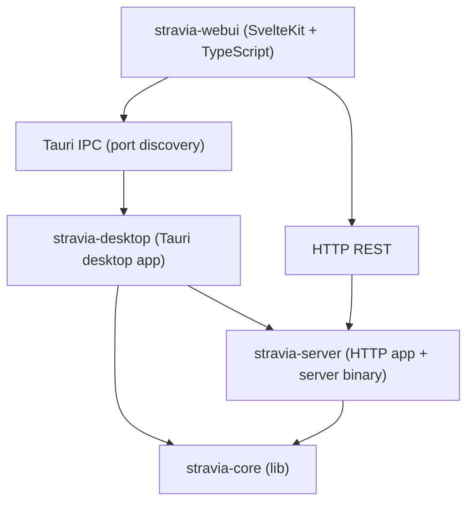

# Stravia AI Gateway — 架构设计

---

## 1. 产品定位与部署形态

Stravia 是一个 **AI 协议网关（AI Gateway）**：在 AI 客户端工具与模型提供商之间做实时协议转换与统一调度。任意使用 OpenAI / Anthropic / Gemini SDK 的客户端无需改代码，仅修改 `base_url` 即可路由到任意 LLM Provider。既可作为**桌面应用**本地零部署运行，也可作为**独立服务端**自托管或团队共享，管理与配置保持私有可控。

```
Claude Code · Codex CLI · Gemini CLI · OpenCode
     OpenAI SDK · Anthropic SDK · Gemini SDK
              Any HTTP API Client
                      ↓
              Stravia AI Gateway
            (localhost:23471)
                      ↓
    OpenAI · Anthropic · Google · DeepSeek
    MiniMax · xAI · Zhipu · Ollama · ...
```

**部署形态：**

| 形态 | 实现 | 适用场景 |
|---|---|---|
| Desktop | Tauri v2 桌面应用（macOS / Windows / Linux） | 个人开发者，零部署，数据不离开本机 |
| Server | 独立 Rust 二进制，始终启动 Proxy、Admin API 与内嵌 WebUI | 自托管、团队共享 |

核心原则：`stravia-core` 不绑定 HTTP listener，只保留 Gateway 业务能力、AdminService 和 Proxy 路由处理。独立 Server 与 Desktop 复用 `stravia-server` 的 HTTP application；WebUI 通过 HTTP REST 调用管理 API，Desktop IPC 仅用于发现本地 Server 端口。

---

## 2. Workspace 分层

```
stravia/
├── Cargo.toml                   # Rust workspace
├── backend/crates/
│   ├── stravia-core/
│   │   └── src/
│           ├── lib.rs            # 20 个顶层 pub mod + crate-private runtime modules + Gateway / GatewayConfig
│           ├── model_turn/       # Model Turn Executor deep module（crate-private）
│           │   ├── mod.rs            # execute(TurnInput) interface / Live + InMemory adapters
│           │   ├── live.rs           # 授权、选路、Target Continuation、transport
│           │   ├── continuation.rs   # ContinuationLookup
│           │   ├── provider.rs       # HTTP/SSE 与 Responses WebSocket
│           │   ├── accumulator.rs
│           │   ├── support.rs
│           │   └── tests.rs
│           ├── generation_chain/ # Generation Chain Write deep module（crate-private）
│           │   ├── mod.rs            # GenerationChain / Write interface
│           │   ├── write.rs          # observe / stage / persist 状态机
│           │   ├── store.rs          # durable TurnChainStore adapter
│           │   ├── materialize.rs    # Generation Materialization Cache
│           │   ├── project.rs        # 客户端可见历史投影
│           │   └── tests.rs          # Write 契约
│           ├── proxy/            # 代理面
│           │   ├── mod.rs
│           │   ├── auth.rs
│           │   ├── client/       # ProxyClient HTTP + Responses WebSocket transport
│           │   │   ├── mod.rs
│           │   │   └── websocket.rs
│           │   ├── context.rs    # RequestContext / ContextBag
│           │   ├── handler.rs    # models_list 只读端点（≤110 行）
│           │   ├── intake.rs     # 请求接入预处理
│           │   ├── observability.rs  # 日志工具（header 脱敏、URL 脱敏等）
│           │   ├── security.rs   # crate-private client credential policy deep module
│           │   ├── server.rs     # axum HTTP Server 启动
│           │   ├── server/tests.rs   # Proxy HTTP 装配契约
│           │   ├── stream.rs     # StreamBridge 状态机
│           │   ├── dispatcher/   # Inference Run 生命周期 deep module
│           │   │   ├── mod.rs        # ingress 薄入口：dispatch_pipeline
│           │   │   ├── inference_run.rs  # execute(RunInput) interface / Phase
│           │   │   └── inference_run/
│           │   │       ├── engine/
│           │   │       │   ├── mod.rs        # orchestrate：Inference Run 内部编排
│           │   │       │   ├── claim.rs · log.rs · errors.rs
│           │   │       │   ├── completion.rs · delivery.rs · stream.rs · util.rs
│           │   │       └── tests/            # lifecycle 契约与单一 fixture
│           │   ├── planner/      # 协议协商
│           │   │   ├── mod.rs        # ProtocolPlan / ProtocolMode 等 re-export
│           │   │   └── negotiator.rs # negotiate() / RoutingStrategy / OrderedStrategy
│           │   └── ingress/      # 4 个薄 ingress shell（按协议族分目录）
│           │       ├── mod.rs
│           │       ├── openai_compatible/
│           │       │   ├── mod.rs
│           │       │   ├── chat_completions.rs   # decode → inference_run::execute
│           │       │   └── embeddings.rs
│           │       ├── open_responses/
│           │       │   ├── responses.rs
│           │       │   └── websocket.rs
│           │       ├── anthropic_messages/
│           │       │   ├── mod.rs
│           │       │   └── messages.rs
│           │       └── google_generative/
│           │           ├── mod.rs
│           │           └── generate_content.rs
│           ├── hook/            # 唯一推理扩展 seam（显式 GatewayBuilder 注入）
│           │   ├── mod.rs        # HookRuntime / canonical types；run state 仅 crate-private
│           │   ├── runtime/      # HookRuntime deep module
│           │   │   ├── mod.rs        # 薄 interface 与内部 re-export
│           │   │   ├── types.rs      # Hook / HookSession / canonical events
│           │   │   ├── apply.rs      # action validation 与 patch 应用
│           │   │   ├── runtime.rs    # run state 与 stream transform
│           │   │   └── tests.rs
│           │   ├── context.rs    # ContextSnapshot / ContextItem / checkpoints
│           │   ├── stream.rs     # StreamTransformer / bounded semantic streaming
│           │   ├── tool.rs       # PlatformTool / ToolRegistry / canonical results
│           │   └── continuation.rs    # in-memory mixed-tool continuation
│           ├── protocol/         # 协议转换引擎
│           │   ├── mod.rs        # ProviderProtocols / ResolvedEgress 等
│           │   ├── ids.rs        # ProtocolEndpoint / EndpointCapabilities
│           │   ├── registry.rs   # endpoint identity / capability / alias / route registry
│           │   ├── transform.rs  # crate-private ProtocolTransform / ProtocolPair / stream session
│           │   ├── ir/           # 统一内部表示（IR）
│           │   │   ├── mod.rs
│           │   │   ├── canonical.rs # semantic item/request hashes
│           │   │   ├── request.rs   # AiRequest
│           │   │   ├── response.rs  # AiResponse
│           │   │   ├── stream.rs    # AiStreamDelta
│           │   │   ├── usage.rs     # Usage
│           │   │   └── ...          # envelope / ext / vendor_ext / cache / error 等
│           │   └── codec/        # ProtocolAdapter 的 wire codec implementation
│           │       ├── mod.rs
│           │       ├── reasoning.rs       # think-tag 提取工具
│           │       ├── tool_correlation.rs
│           │       ├── openai/
│           │       │   └── compatible/    # chat_completions + embeddings
│           │       ├── open_responses/    # dated 2026-04-24 Responses contract
│           │       ├── anthropic/
│           │       │   └── messages/
│           │       └── google/
│           │           └── gemini/
│           ├── provider/         # 厂商扩展层
│           │   ├── mod.rs
│           │   ├── vendor.rs     # inference Vendor trait / ProviderCtx
│           │   ├── vendor_ext.rs # VendorExtension trait / VendorCtx
│           │   ├── registry.rs   # VendorRegistry；inference、extension 与 metadata-only 注册
│           │   ├── metadata.rs   # VendorMetadata / Label / AuthMode
│           │   ├── outbound.rs   # OutboundRequest
│           │   ├── inbound.rs    # InboundResponse
│           │   ├── common/
│           │   │   ├── openai_compat.rs # OpenAI 兼容共用逻辑（唯一名称）
│           │   │   └── pipeline.rs   # 7 步 build_request / parse_response 自由函数
│           │   ├── openai/           # OpenAiVendor + OpenAIFamilyExt
│           │   │   └── codex/        # OpenAiCodexChannel（OAuth channel）
│           │   ├── anthropic/        # AnthropicVendor + AnthropicFamilyExt
│           │   │   └── claude_code/  # AnthropicClaudeCodeChannel
│           │   ├── google/ · google_vertex/ · amazon_bedrock/ · azure/
│           │   ├── sap_ai_core/ · cloudflare_ai_gateway/ · merge_gateway/ · gateway/
│           │   ├── openai_compatible/ · openrouter/ · ollama/ · custom/
│           │   └── aihubmix/ · cerebras/ · cohere/ · deepinfra/ · gitlab/ · groq/ · mistral/
│           │       · perplexity/ · qvac/ · salad_cloud/ · togetherai/ · venice/
│           │       · vercel/ · watsonx/ · xai/        # xAI API Key + Grok OAuth channel
│           ├── admin/            # AdminService 管理面（按职责拆分）
│           │   ├── mod.rs
│           │   ├── extensions.rs # list_loaded_extensions（provider/protocol 只读清单）
│           │   ├── provider_connection.rs · provider_connection/interface.rs · oauth.rs
│           │   ├── routes.rs · routes/{model_records,provider_model_records}.rs · api_keys.rs
│           │   ├── settings.rs · observability.rs · web_access.rs · web_search.rs
│           │   ├── model_catalog.rs · auth_data.rs · model_data.rs
│           │   └── session_tests.rs
│           ├── media/            # Media Understanding（crate-private）
│           ├── web_access/       # Web Access（crate-private）
│           │   ├── mod.rs            # request / response interface
│           │   ├── types.rs          # request / response DTO
│           │   ├── engine.rs         # SSRF policy 与运行时
│           │   └── providers.rs · platform.rs
│           ├── agent/
│           │   ├── runner/           # types / loop / schema / tests
│           │   └── artifact/         # ArtifactStore interface / Local store / quota / tests
│           ├── provider_catalog/ # Catalog facade / types / source / parse / persist
│           ├── turn_chain/       # TurnChainStore interface / memory / sql adapters
│           ├── admission.rs      # Principal Concurrency Limit（private）
│           ├── error.rs          # GatewayError taxonomy
│           ├── router/           # TargetSelector / HealthRegistry / CacheAffinity
│           ├── storage/          # SQLite / PostgreSQL 真实 adapters + Memory 测试替身
│           │   ├── sqlite/           # oauth/providers/models/api_keys/logs/settings 按表分文件
│           │   └── postgres/         # 与 SQLite 保持独立、同样按表分文件
│           ├── migrations.rs     # SQLx versioned migrations
│           ├── db/               # SQLite 连接与模型辅助函数
│           ├── logging/          # LogEntry / send_log
│           └── auth/
│   └── stravia-devtools/
├── backend/apps/
│   ├── stravia-desktop/
│   └── stravia-server/
└── frontend/stravia-webui/
```


**依赖关系：**



**stravia-core 顶层 `pub mod`（lib.rs，共 20 个）：**

```
admin · agent · auth · config · db · error · hook · logging · mcp
plugin · protocol · provider · provider_catalog · provider_models · proxy
router · storage · thinking · turn_chain · web_search
```

crate-private 运行时 module：`generation_chain`、`media`、`model_turn`、`web_access`；
`admission` 保持 crate root private。Generation Chain 不属于 Hook。

**核心 API：**

```
Gateway::new(config)      → 初始化数据库与 Gateway 业务运行时
Gateway::admin()          → 返回 AdminService，提供全部管理操作
  ├── .list_models()
  ├── .create_model(input)
  ├── .list_providers()
  ├── .create_provider(input)
  ├── .test_provider(id)
  ├── .list_api_keys()
  ├── .query_logs(filter)
  ├── .get_stats_overview()
  ├── .list_loaded_extensions()  ← provider/protocol 内建能力清单
  └── ...
stravia-server::build_http_app() → 组合 Proxy、Admin API、健康探针与可选内嵌 WebUI
stravia-server::start_http_server() → 绑定 listener 并提供优雅关闭
```

`AdminService` 是管理面唯一入口；`admin/` 子模块按功能职责分布，不引入新传输层抽象。

---

## 3. 协议转换架构

### 3.1 核心设计原则

- **统一错误 taxonomy**：`GatewayError` 覆盖 15 种错误类型，每个错误有稳定 code、HTTP status、user message、internal detail 和 retryable 标志。
- **请求生命周期追踪**：`RequestContext` 携带 request_id、deadline、cancellation token、outcome，以及请求范围扩展，端到端贯穿 dispatcher 与 handler。
- **确定性协议协商**：`negotiate()`（`proxy/planner/negotiator.rs`）实现三级 egress 解析（Exact → Same-family → Provider Default），`ProtocolRegistry` 只暴露 endpoint identity、capabilities、alias 与 ingress route 查询。
- **Pair-bound Protocol Conversion**：crate-private `ProtocolTransform::bind(ingress, egress)` 返回 `ProtocolPair`；调用方只通过 `decode_request` / `encode_request`、`decode_response` / `encode_response` 和有状态 stream session 转换 wire 与 canonical IR，不能直接取得 codec。
- **Fail-closed representability**：跨协议 encode 前按实际 `AiRequest`、`AiResponse` 或 delta 检查语义损失并返回 typed `ProtocolLossyRejected`；同 endpoint 路径不套用跨协议 loss policy。
- **Canonical-only 推理**：所有推理请求都经过 ingress decode、canonical IR、Vendor canonical mutation 与 ingress encode；不提供以 wire raw request/response 绕过 HookRuntime 的路径。
- **显式字段映射**：每个 codec 明确处理已知字段；允许的 vendor-specific 字段走 ExtensionBag，不隐式丢弃或把原始字节暴露给 hook。
- **唯一推理 seam**：`GatewayBuilder` 显式注入固定顺序的 `HookRuntime` hooks 与 `PlatformTool`，dispatcher 只通过 `HookRuntime` 处理推理扩展；`Vendor` 仍是 provider-specific adapter seam。
- **固定事件面**：`Request`、`UpstreamResponse`、`ToolResult`、`ClientOutput` 四个规范化事件，以及每个 HookSession 内的 `StreamTransformer` 流式事件。

### 3.2 完整调用流程

```
Client / CLI / SDK
    │ HTTP/SSE/WebSocket（协议 ingress）
    ▼
Ingress shell（proxy/ingress/<family>/）
    ├─ 捕获 RawEnvelope + 建立 RequestContext（request_id / cancel / extensions）
    └─ ProtocolPair::decode_request → AiRequest（canonical IR）
    │
    ▼
inference_run::execute(RunInput)（一次性 crate-private interface）
    ├─ Phase 状态机约束 Request → Selecting → Calling → Inspecting
    │                         → HiddenRound / SemanticComplete → AwaitingDelivery → Finished
    ├─ Responses gate：拒绝 background / conversation / server-side context management
    ├─ Security::required_principal（Request Hook 前验证 API key 并建立 Principal）
    ├─ 以 Principal 隔离的 Generation Chain materialize `previous_response_id`（完整历史）
    ├─ claim matching mixed-tool continuation，或 HookRuntime::begin
    │  （SessionContext + ContextCompleteness::Full/Partial）
    ├─ Request hooks（builder 固定顺序；路由选择前；每个隐藏 round 重新运行）
    │    ├─ PatchRequest / ExposeTool / Respond / Reject
    │    └─ 全部动作批次先校验，再原子应用；失败 fail-closed
    ├─ 以最终 `request.model` 查 Model，再由 Security::authorize_model 检查 binding
    └─ model_turn::execute(TurnInput)
         ├─ 按 RouteBinding 或 CapabilityGrant 授权
         ├─ 健康感知 Target iteration / negotiate() / Vendor / ProtocolPair
         ├─ ContinuationLookup 在锁定 Target 后准备上游前缀
         └─ Provider Transport（HTTP/SSE 或 Responses WebSocket）
              ├─ 两种 transport 均归一为 canonical AiResponse / AiStreamDelta
              └─ 仅 retryable provider 失败且尚无客户端可见输出时切换 Target
    │
    ▼
Inference Run module（同一 run 持有 HookRuntime run state 与跨 round 状态）
    ├─ Provider adapter 只产出 canonical AiResponse / AiStreamDelta
    ├─ 共同语义完成 implementation（四条交付路径共用）
    │    ├─ 统一补全 response ID / model / stop reason 并合并隐藏 round
    │    ├─ UpstreamResponse Hook → Platform Tool 分类 → ClientOutput Hook
    │    ├─ 验证 client tool-call 集合并准备 Generation Chain / Tool Continuation
    │    └─ 返回封闭结果：NextRound / Ready / Failed
    ├─ PlatformTool：
    │    ├─ 平台工具 call 隐藏，按响应顺序串行 execute
    │    ├─ ToolResult hook → canonical result → append assistant/tool round
    │    └─ 纯平台工具在同一客户端 stream 内续跑；中间 lifecycle/usage/done 不外发
    ├─ 混合 tool：
    │    ├─ 隐藏 platform calls，只返回 client calls + 可见内容
    │    ├─ 保存内存 Tool Continuation（默认 TTL 1h，主体隔离，单 claim）
    │    └─ 下一请求一次提交全部 client results，再恢复同一 Inference Run
    ├─ HookLegGuard：每条 stream leg 在结束、取消、error 或 drop 时恰好 close 一次
    ├─ Client Output Commit：commit 前可返回完整错误；commit 后失败只终止当前 stream
    └─ ClaimLease / DeliveryLeaseStream：
         ├─ 新 Generation Chain 仅在完整客户端 delivery 后保存；Tool Continuation 遵循其 delivery 完成契约
         └─ 被 claim 的 Tool Continuation 仅在客户端 delivery 完成后 complete，否则 release
    │
    ▼
DeliveryAdapter → ProtocolPair client encode（non-stream JSON / stream SSE / Responses WebSocket events）
```

管理面（`AdminService` / `/api/v1/*`）、健康探针、模型目录等非推理路由不进入 HookRuntime；生成和 embeddings 这两类推理请求会创建 `InferenceRun`。HTTP 管线始终经过 decoder、canonical pipeline 和 encoder，不暴露原始 wire body。

Client credential policy 只存在于 crate-private `proxy/security` deep module。该 module 直接使用 `AuthAccessStore` seam：Inference profile 接受 Bearer、`x-api-key` 与 `x-goog-api-key`，MCP profile 只接受 Bearer；models list 复用同一 implementation，凭据无效或存储失败时 fail-closed。Security interface 返回 Principal、Model access grant、visible Model IDs 或 typed `GatewayError`，不修改 `RequestContext`，不记录日志，也不渲染 transport response。

Inference Run 在 Request Hook 前验证 API Key、建立 Principal 并获取根执行准入名额，在 Hook 后针对 final Model 检查绑定；Target retry、隐藏 Model Turn 和透明 Tool 调用复用同一根请求名额。普通 Target retry 属于同一 round，复用该 round 的授权结果。Active Provider 与 Provider Model lookup 仍由 Inference Run 拥有。Expired client credential 统一映射为 `AuthFailure::Expired` 与 HTTP 401；MCP 保持其他 401/403/503 mapping，models list 仅返回有效 Key 已绑定的 Model。Principal Concurrency Limit 仅在单个 Gateway 进程内生效。

### 3.3 内部表示（IR）

位于 `backend/crates/stravia-core/src/protocol/ir/`，定义统一内部结构：

- `AiRequest`（`ir/request.rs`）：入站请求，含消息列表、工具定义、模型参数
- `AiResponse`（`ir/response.rs`）：出站响应，含 content / tool_calls / usage / reasoning_content
- `AiStreamDelta`（`ir/stream.rs`）：流式增量事件，支持 reasoning delta、text、tool_call
- `Usage`（`ir/usage.rs`）：prompt_tokens / completion_tokens / total_tokens / cache_read_tokens

**vendor-specific 字段命名约定（存于 IR extra 字段）：**

| 前缀 | 用途 |
|---|---|
| `__anthropic_raw_*` | Anthropic cache_control / exotic blocks 无损往返 |
| `__google_raw_*` | Google systemInstruction / built-in tools / generationConfig |
| `__emb_*` | Embeddings 已知字段（input / dimensions / encoding_format / user） |
| `__vendor_ingress` | 未知 vendor 字段集合（由 VendorFieldPolicy 决定是否转发） |

---

## 4. 请求生命周期与 HookRuntime

本节是当前实现的唯一生命周期说明。HookRuntime 是 dispatcher 的**唯一推理扩展 seam**；`Vendor` 仍独立负责 provider-specific 认证、URL、编解码和流式适配。

### 4.1 作用域与生命周期

HookRuntime 只处理经过 ingress decoder 的推理请求，不接管管理面、健康探针或其他非推理路由。Gateway 由 `GatewayBuilder` 构造：

```rust
Gateway::builder(config)
    .hook(Arc<dyn Hook>)                 // 按调用顺序重复添加
    .platform_tool(Arc<dyn PlatformTool>)
    .continuation_ttl(Duration::from_secs(...))
    .generation_chain_ttl(Duration::from_secs(...))
    .build()
```

`build()` 校验 HookId 非空且不重复，校验 PlatformTool 的稳定 `ToolId`，然后以 builder 顺序构造一个不可变的 `HookRuntime`。运行时不使用 hook 的进程级隐式发现；Hook 与 PlatformTool 是受信的、进程内 Rust 实现，依赖在构造时注入。

每个客户端推理 turn 只把 `RunInput` 交给 `inference_run::execute`；该一次性 `interface` 独占完整生命周期，并调用 `HookRuntime::begin(SessionContext, &AiRequest, ContextCompleteness)` 创建 crate-private run state 与每个 Hook 的 `HookSession`。一次 Inference Run 覆盖初始 provider round、纯 PlatformTool 隐藏续跑，以及混合工具等待客户端结果后的恢复；普通 provider Target 重试复用本 round 已校验的 canonical 请求。`SessionContext` 只含 request/run ID、RequestKind、ingress、HTTP/WebSocket transport 和脱敏主体；路由确定后事件才收到 model/provider/target/egress。

### 4.2 小接口、深实现

```rust
pub trait Hook: Send + Sync + 'static {
    fn descriptor(&self) -> HookDescriptor;
    fn create_session(&self, context: &SessionContext) -> Box<dyn HookSession>;
}

pub trait HookSession: Send {
    async fn handle(&mut self, event: HookEvent<'_>) -> Result<ActionBatch, String>;
    fn stream_transformer(&mut self) -> Option<&mut dyn StreamTransformer>;
}

pub struct HookDescriptor {
    pub id: HookId,
    pub request_kinds: Vec<RequestKind>,   // Generation / Embeddings
    pub event_kinds: Vec<EventKind>,       // 见下
    pub requires_full_context: bool,
    pub max_buffered_bytes: usize,
    pub max_delayed_events: usize,
}
```

Hook 是并发安全的共享工厂；Session 是每次 `InferenceRun` 的可变状态。Runtime 严格按 builder 顺序串行调用接受当前 `RequestKind`/`EventKind` 的 session，后一个 hook 只会看到前一个 hook 已成功应用的结果。

### 4.3 规范化事件面

| 事件 | 进入时机 | Hook 可观察/改变的范围 |
|---|---|---|
| `Request` | 路由选择前；初始请求及每个隐藏 platform round | canonical `AiRequest` 的语义字段、context spans、tool exposure、生成本地 `AiResponse` |
| `UpstreamResponse` | provider response 已由 Vendor 解码为 canonical `AiResponse` 后 | 内容、reasoning、items、允许的客户端 tool arguments |
| `ToolResult` | PlatformTool 执行结果生成后、追加回 provider 前 | canonical tool result content、error 标记、metadata |
| `ClientOutput` | 隐藏平台调用和中间 round 处理后、编码返回客户端前 | 最终客户端可见 response 的语义字段 |
| `Stream` | 上游规范化 `AiStreamDelta` 到达时 | 仅由 session 的 `StreamTransformer` 处理 text/reasoning/client tool arguments |

`HookEvent` 携带最小稳定 `SessionContext`、`round` 和必要的 canonical 只读 view；`UpstreamResponse`、`ToolResult`、`ClientOutput` 还需要已设置的 `RouteContext`。Embedding 使用 `RequestKind::Embeddings`，可由 descriptor 自然隔离。

### 4.4 动作批次与失败语义

```rust
pub enum HookAction {
    PatchRequest(RequestPatch),
    PatchResponse(ResponsePatch),
    PatchToolResult(ToolResultPatch),
    ExposeTool(ToolId),
    Respond(AiResponse),
    Reject(HookRejection),
    StreamAbort { message: String },
}

pub enum HookControl {
    Continue,
    Respond(AiResponse),
    Reject(HookRejection),
    StreamAbort { message: String },
}
```

一个 `ActionBatch` 先整体验证，再原子应用；任一 Patch 非法、hook 返回错误、hook session 创建 panic 或 runtime 状态非法都会 fail-closed。`Respond` 只允许 `Request`；`Reject` 只允许首字节发出前的 Request/UpstreamResponse；首字节后只能 `StreamAbort`，不能改变已经发送的 HTTP 状态。Hook 调用不设默认超时，但必须响应请求取消。

Request Patch 可改写 canonical model、system/instructions、ContextItems、generation、tools/tool choice、embedding input 和 protocol extension，但不得改变主体、认证、provider target 或凭据。Response/ToolResult Patch 不能修改 usage、stop/lifecycle、tool ownership/ID 或结构性 stream 事件；平台工具所有权在核心分类后保持不可变，arguments 可被安全语义 patch 后重新校验。

### 4.5 ContextSnapshot 与状态

`InferenceRun` 在 `begin()` 为原始请求建立 `ContextSnapshot`：有序 `ContextItem`（Message、Reasoning、ToolCall、ToolResult）、稳定请求内 `ContextItemId`、版本化 checkpoint/fingerprint 与 `ReplaceContextSpan`。每次请求独立从客户端提交的上下文匹配，不维护压缩 rollback 状态机；重叠 span、反向 span、未知/重复 item ID 均拒绝。

`ContextCompleteness::Full` 表示完整可见历史；provider opaque refs（例如 Google cached content、Anthropic container）会保留为 namespaced extension 并标记 `Partial`。声明 `requires_full_context` 的 hook 在 Partial 请求中跳过并记录 `HookSkip`，其他 hook 仍处理可见 canonical 语义。该能力只提供匹配原语，第一阶段不提供摘要模型、压缩算法、RewriteStore 或管理 UI。

### 4.5.1 Cache Affinity

Request Hook 完成后、首次 Target 选择前，`CacheAffinity` 对每个 canonical `AiItem` 计算 Canonical Item Hash，并以 Principal、Route 与有序 Hash 前缀查询 Gateway-local 的有界索引。索引只在 Target 成功响应且已报告 `prompt_tokens >= 20,000` 时记录该 Target 与请求的每条 Item Hash；最长精确前缀命中且 Target 仍是当前 Route 的健康候选时，`RouteAttemptPolicy` 仅将该 Target 提到首选位置。没有命中、Target 已移除/不健康、或首选 Target 可重试失败时，现有 Route 选择与重试顺序完整生效。该索引不持久化、不记录 raw 内容或 Hash 日志，也不创建 request-wide fingerprint、客户端/连接/Session 绑定，重启或淘汰只降低 Prompt Cache 命中率。

### 4.6 Stateful streaming 限制

`StreamTransformer` 只接收 canonical 语义 delta，支持 `Pass`、`Emit`、`Hold`、`Replace`、`Drop`，并可在 `flush/close` 返回语义事件。核心维护 message/response lifecycle、usage、Done、StreamError 和 PlatformTool owner/ID；transformer 不能伪造或改写这些结构事件。核心统计每个 session 的 buffered bytes 和 delayed events，超过 descriptor 上限即失败。

每个客户端 response leg 独立打开并关闭 transformer。结束、取消、错误均 flush/close；首字节前失败返回错误，首字节后仅终止当前流。纯平台 tool hidden rounds 仍复用同一客户端 SSE，最终只编码一个合法终止序列；不同 provider round 的 usage 在最终响应中聚合。混合 tool 在返回客户端后挂起 run，不能把已结束 leg 的未 flush 缓冲带入下一 HTTP 响应。

### 4.7 PlatformTool 与 continuation

`PlatformToolRegistry` 保存稳定内部 `ToolId`、provider-safe 显示名称/schema 和 executor。Request hook 只能以 `ExposeTool(ToolId)` 暴露已注册工具，不能删除客户端工具、注入临时闭包或按显示名取得所有权。provider 返回 tool calls 后核心先分类 platform/client owner；platform call/result 永不进入 `ClientOutput`，但模型最终自然语言可以引用结果。

工具参数解析为合法 JSON 后按响应顺序串行执行；领域错误、参数错误、panic 和执行失败都变成 `is_error` 的 canonical `PlatformToolResult` 并送回 provider，客户端取消会停止工具和续跑。当前 run 只缓存成功的 `(ToolId, call ID, arguments)` 结果，失败不缓存。纯平台 turn 在当前请求内隐式续跑；混合 turn 只向客户端返回 client calls 与可见内容，并保存内存 continuation。恢复请求必须一次提交全部预期 client tool results；缺失、重复、额外或上下文不匹配 fail-closed，单一 continuation 同时只能被一个请求 claim。默认 TTL 一小时，可由 builder 覆盖；状态不写数据库，进程退出/重启后丢失。

### 4.8 Generation Chain 与 Responses response-chain

Generation Chain 使用 `TurnChainStore` 保存所有 ingress 的完整交付生成历史；它是 Principal 隔离、不可变、可分支的 canonical DAG，默认 TTL 为 7 天。完整交付的 `completed` 与 `incomplete` 终态形成节点；`failed`、取消、客户端断线与 delivery failure 不形成节点。每个节点只保存 canonical 输入 delta、最终输出和 resolved profile delta。Gateway 在进程内以按字节上限淘汰的 LRU Generation Materialization Cache 加速读取；它保存精确物化的 execution context，但不是历史事实源。重启或淘汰后必须按父节点顺序重放 immutable delta，不能重跑 Hook。Response Chain 是它的 Responses 投影，使用 Gateway 自有 response ID。显式 `previous_response_id` 始终优先：命中后按 parent input/output + delta materialize 完整 canonical 历史，再交给 Hook；未提供父节点的协议只在同 Principal 内以严格 canonical 历史前缀自动选择最长且留下新 input item 的父链，任何语义差异或无候选都创建新根。未知、过期或跨 Principal ID 返回 `previous_response_not_found`。`store=false` 仅作为 Upstream Store Hint 发送给 Provider；它不禁用 Stravia 的 Generation Chain 持久化。connection-local state 仍可优化同 socket upstream continuation，但不是历史唯一来源。

Hook、Vendor canonical mutation 与 representability gate 完成后，dispatcher 才对完整 Effective Model Request 查找 Reusable Response Prefix。索引只保存已完整交付、upstream terminal 为 `completed` 且 UpstreamResponse/ClientOutput Hook 未改变输出的节点；匹配以完整 `AiItem` 边界进行，并要求 Principal、精确 Target、Provider 账号/配置、resolved model、egress protocol、instructions、tools、reasoning、response format 和其它请求控制严格一致。最长前缀优先；同长度按完成时间与节点 ID 确定性排序。无安全候选、当前 Target 不可续接或全请求相同时发送完整历史，不构造空自动 delta。

OpenAI direct 与 Codex OAuth 的 generation Target 通过同一个 Provider Transport seam 使用上游 Responses WebSocket；客户端协议与 stream/non-stream 交付模式不影响选择，Embeddings 保持 HTTP。连接按 Target namespace 与 upstream response ID 维护 affinity，同一 socket 一次只有一个 in-flight response，硬性 max-age 为 60 分钟。`store=false` 续接必须命中同 socket；排队 sibling 发现 tip 已前移、重启或过期时改用新 socket 发送完整历史。`previous_response_not_found` 只在没有客户端可见输出时于同 socket 全量重放一次。握手不支持或短暂连接失败可在请求尚未接受时回退同 Target HTTP/SSE；401/403/429、发送后的不确定失败、malformed/binary event、取消和 Client Output Commit 后错误不重放。

连接管理不设置本地数量上限，也不做 idle 回收；无 affinity 的 root socket 在终态关闭，保留 affinity 的连接最迟由 60 分钟 max-age 淘汰。高并发且存在大量活跃 continuation 时，文件描述符、内存和上游连接数会随 Target/branch 增长。结构化日志只记录 transport、Target namespace、response/connection ID、连接年龄、fallback/replay 与 close reason，不记录 prompt、content、tool arguments、媒体或 credential。

### 4.9 安全、观测与边界

- Hook 运行在受信 in-process Rust 环境，不获得可变 `Gateway`、任意存储、原始 `Authorization`、API key、provider credential 或 raw request/response。
- Runtime 仅提供 canonical IR、稳定主体/路由标识、受限 ContextSnapshot 和受控 PlatformTool；凭据始终由 dispatcher/Vendor adapter 持有。
- 默认 payload logging 为关闭：默认日志只记录 HookId、事件、动作类型、跳过原因、耗时、tool/continuation 元数据和状态，不记录 messages、arguments、results 或 replacement 内容。只有显式启用 payload logging 才记录完整载荷，并由运维负责敏感数据访问与留存。
- 管理面、非推理路由和 provider adapter 不通过 HookRuntime 的事件面；Vendor 是独立 adapter seam，而不是 hook 的凭据出口。

---

## 5. 协议层（codec/）详情

### 5.1 ProtocolAdapter 注册体系

每个 endpoint 的注册壳位于 `codec/<family>/<endpoint>/` 对应目录，通过 `inventory::submit!` 自动注册进 `ProtocolRegistry`：

```rust
inventory::submit! {
    EndpointRegistration { make: || Box::new(XxxAdapter) }
}
```

| 目录 | 注册的 `ProtocolEndpoint` |
|---|---|
| `codec/openai/compatible/` | `openai-compatible/chat-completions/v1`、`openai-compatible/embeddings/v1` |
| `codec/open_responses/` | `open-responses/responses/2026-04-24` |
| `codec/anthropic/messages/` | `anthropic-messages/messages/2023-06-01` |
| `codec/google/gemini/` | `google-gemini/generate-content/v1beta` |

`ProtocolRegistry` 对外只提供 endpoint identity、static capabilities、alias 与 ingress route 查询。聚合 codec 的 `ProtocolAdapter` trait、adapter lookup 和 `EndpointRegistration` 均为 crate-private，调用方不能绕过 Protocol Conversion seam。

### 5.2 ProtocolPair interface

`ProtocolTransform::bind(ingress, egress)` 验证两个 endpoint 均已注册，并返回持有方向的 `ProtocolPair`：

```rust
pair.decode_request(body)       -> AiRequest
pair.encode_request(&request)   -> EncodedRequest { body, headers, path }
pair.decode_response(body)      -> AiResponse
pair.encode_response(&response) -> Value
pair.stream()                   -> StreamSession
```

Request/response encode 和 stream delta encode 在跨协议时执行 per-value representability 检查；不可表示语义返回 typed `ProtocolLossyRejected`。同 endpoint 路径仍经过同一 canonical IR 和 adapter，但不套用跨协议 loss policy。`StreamSession` 拆成同一 pair 绑定的 decoder/encoder state，流式解析继续位于 protocol module，Vendor adapter 只接收 canonical delta。

### 5.3 EndpointCapabilities 矩阵

| 字段 | 类型 | 含义 |
|---|---|---|
| `streaming` | bool | 支持 SSE 流式 |
| `tools` / `function_calling` | bool | 支持 tool call |
| `reasoning` / `extended_reasoning` | bool | 支持 thinking / reasoning |
| `embeddings` | bool | Embeddings endpoint |
| `override_model_in_body` | bool | model 写入请求 body 而不是 URL path（Google） |
| `ingress_routes` | `&[(method, path)]` | endpoint 声明的 ingress route |
| `multimodal` / `structured_output` / `parallel_tool_calls` / `deterministic_seed` | bool | 请求语义能力 |
| `stream` | `StreamCaps` | SSE、stream usage 与 stream flag 能力 |
| `unknown_field_policy` | `VendorFieldPolicy` | 未识别 egress vendor 字段的 Drop policy |

### 5.4 Codec 主要字段映射

**OpenAI Chat**：完整映射 logprobs、seed、response_format、parallel_tool_calls、audio 等 20+ 字段；reasoning 字段透传。

**Open Responses 2026-04-24**：独立 decoder/encoder/parser/formatter；严格验证 dated request、ResponseResource 与 SSE lifecycle；Target 是否仅支持流式由 `ResolvedTargetCapabilities::stream_only` 声明。

**Anthropic Messages**：cache_control、thinking config、context_management、exotic blocks（Document / InputAudio）保留 `__anthropic_raw_*` 做无损往返；built-in tools（web_search_call）作为 sentinel ToolDef 处理。

**Google GenerateContent**：完整 generationConfig（20+ fields）、safety_settings、built-in tools（googleSearch / codeExecution）；`__google_generation_config` 在 encoder 中被 model 参数 overlay。

**OpenAI Embeddings**：`VendorFieldPolicy::Drop`；`__emb_*` 明确解析；unknown fields 进 `__vendor_ingress` 但不转发。

### 5.5 语义工具（codec/reasoning.rs & codec/tool_correlation.rs）

**reasoning.rs**：
- `normalize_response_reasoning`：结构化字段优先，`<think>` tag 兜底提取
- `split_think_tags`：多 `<think>` block 支持，未闭合 tag 保留为文本

**tool_correlation.rs**：`normalize_request_tool_results`，统一 tool_call_id 关联（精确 ID → content hint → 工具名 hint → FIFO fallback → 自动补合成 assistant message）。

---

## 6. 厂商扩展层（provider/）

三层职责分离：

```
protocol/codec/   ← 序列化层：AiRequest/AiResponse ↔ wire-format JSON
provider/         ← 编排层：Vendor trait（build_request / parse_response）+ VendorExtension hooks
```

`VendorExtension` 的 hook 仅是 adapter 内部的 provider-specific 编解码/流式适配，不属于 HookRuntime 的推理事件面；它们不能绕过 canonical IR，也不能取得 HookRuntime 未授权的凭据或状态。


### 6.1 Vendor trait（原 ProviderAdapter）

`dispatcher` 的唯一接触点（`provider/vendor.rs`）：

```rust
#[async_trait]
pub trait Vendor: Send + Sync + 'static {
    // 标识 / 元数据
    fn scope(&self) -> VendorScope;              // Vendor | Channel
    fn vendor_id(&self) -> &'static str;
    fn supported_protocols(&self) -> &'static [ProtocolId];
    fn metadata(&self) -> &'static VendorMetadata;

    // Auth / URL
    fn auth_headers(&self, ctx: &VendorCtx) -> HeaderMap;
    fn build_url(&self, ctx: &VendorCtx, base_url: &str, path: &str) -> String;

    // 编解码 hook（可选，默认 no-op）
    async fn pre_request(&self, ctx, req: &mut AiRequest, gw: &Gateway);
    async fn pre_encode(&self, ctx, req: &mut AiRequest);
    async fn post_encode(&self, ctx, body: &mut Value, headers: &mut HeaderMap);
    async fn pre_parse(&self, ctx, body: &mut Value);
    async fn post_parse(&self, ctx, resp: &mut AiResponse);

    // 流式 hook
    async fn on_stream_raw_chunk(&self, ctx, chunk: &str);
    async fn on_stream_delta(&self, ctx, delta: &mut AiStreamDelta);

    // 编排（required）
    async fn build_request(&self, req: &mut AiRequest, ctx: &ProviderCtx)
        -> Result<OutboundRequest, GatewayError>;
    async fn parse_response(&self, resp: InboundResponse, ctx: &ProviderCtx)
        -> Result<AiResponse, GatewayError>;
    fn map_error(&self, status: u16, body: Value) -> GatewayError;
    fn validate_environment(&self, provider: &Provider) -> Result<(), GatewayError>;

    // Vendor-specific pre/post encode/parse and stream adaptation stay here.
    // Inference traffic always traverses canonical IR; no raw bypass is exposed.
}
```

**7 步 build_request pipeline**（`provider/common/pipeline.rs`）：
`pre_request` → `normalize_tool_results` → `pre_encode` → `codec_encode` → `post_encode` → `auth_headers` → `build_url`

**ProviderCtx**（`provider/vendor.rs`）：

```rust
pub struct ProviderCtx<'a> {
    pub provider:             &'a Provider,
    pub protocol:             ProtocolId,        // 即 ProtocolEndpoint
    pub egress_base_url:      &'a str,
    pub api_key:              &'a str,
    pub actual_model:         &'a str,
    pub credential:           Option<&'a StoredCredential>,
    pub gw:                   &'a Gateway,
    pub disable_default_auth: bool,
}
```

### 6.2 VendorExtension（channel / family ext）

`VendorExtension`（`provider/vendor_ext.rs`）仍存在，包含 9 个 hook（auth_headers / build_url / pre_encode / post_encode / pre_parse / post_parse / on_stream_raw_chunk / on_stream_delta / pre_request）。

**关系：**
- `Vendor` 通过 blanket `impl<T: Vendor> VendorExtension for T` 自动实现 `VendorExtension`
- Channel-only 类型（`OpenAiCodexChannel`、`AnthropicClaudeCodeChannel`）仅 impl `VendorExtension`

**两套注册（均通过 `inventory::submit!`）：**

```rust
// 完整 vendor
inventory::submit! { VendorRegistration { make: || Box::new(XxxVendor) } }
// Channel / family ext
inventory::submit! { ExtensionRegistration { make: || Box::new(XxxChannel) } }
```

`VendorRegistry::resolve(provider, protocol_id)` 返回 `Arc<dyn VendorExtension>`，内部通过 `VendorAsExt` 包装统一两类注册。

### 6.3 共用 helpers（provider/common/openai_compat.rs）

所有 OpenAI 兼容厂商共用：`openai_bearer_auth_headers`、`openai_build_url`、`openai_map_error`、`openai_build_request`、`openai_parse_response`、`GenericOpenAICompatibleAdapter`。

### 6.4 厂商列表

| 厂商 | vendor_id | 特殊处理 |
|---|---|---|
| OpenAI | `openai` | 含 `codex` channel（OAuth） |
| Anthropic | `anthropic` | `x-api-key` + `anthropic-version`；含 `claude-code` channel |
| Google | `google` | URL 追加 `?key=<api_key>`；`override_model_in_body=true` |
| Vertex AI | `vertexai` | Service account auth + 区域 endpoint |
| DeepSeek / Moonshot / Zhipu / MiniMax / ZAI / OpenRouter / Nvidia / Ollama | 各自 vendor_id | 委托 `GenericOpenAICompatibleAdapter` / openai_compat_* |
| xAI | `xai` | API Key 默认 channel；`grok` channel 使用 device-code OAuth、Grok Build identity headers 与 Responses upstream |
| custom | `custom` | 用户自定义 vendor preset |

---

## 7. 错误处理

`GatewayError` 统一 taxonomy：

| 变体 | HTTP | 含义 |
|---|---|---|
| `BadRequest` | 400 | 客户端格式错误 |
| `Unauthorized` | 401 | 无有效 API Token |
| `Forbidden` | 403 | Token 状态异常或无权限 |
| `ConcurrencyLimitExceeded` | 429 | Principal 的根执行数达到并发上限 |
| `RouteNotFound` | 404 | 无匹配模型/路由 |
| `ProtocolUnsupported` | 400 | 协议不支持 |
| `ProtocolLossyRejected` | 422 | lossy 转换被拒绝 |
| `ProviderUnavailable` | 503 | 无可用 vendor extension |
| `UpstreamStatus` | 上游 status | 上游返回错误 |
| `UpstreamTimeout` | 504 | 上游超时 |
| `StreamParseError` | 502 | SSE chunk 解析失败 |
| `ClientCancelled` | 499 | 客户端断开 |
| `Internal` | 500 | 内部错误 |

每个错误由 `GatewayError::render(request_id)` 统一序列化为 OpenAI 兼容 JSON 错误格式。

---

## 8. 模型（路由）与访问控制

### 8.1 Model 模型（原 Route）

模型唯一键为 `name`，客户端请求中的 `model` 值与之精确匹配即命中：

| 字段 | 类型 | 说明 |
|---|---|---|
| `id` | TEXT PK | UUID |
| `name` | TEXT | 显示名称，同时作为模型匹配键 |
| `balance` | TEXT | 负载策略：`weighted` / `priority` / `cooldown` / `latency` |
| `target_provider` | TEXT FK | 默认目标 Provider（兜底）|
| `target_model` | TEXT | 默认上游模型名 |
| `is_enabled` | BOOL | 模型启用状态，默认 true |

> `ingress_protocol` 不在数据库中。协议在运行时由 `RequestContext` 携带，日志写入 `request_logs.client_protocol`。

**后端列表（model_backends）**：一个 Model 可绑定多个 backend，每个 backend 指向 `provider_id` + `model`，带 `weight`（weighted balance）、`priority`（priority balance）和七行 `thinking_level_map`；后端健康状态在内存 `HealthRegistry` 管理，不入库。

客户端继续使用 Chat Completions、Open Responses、Anthropic Messages 或 Gemini 的原生 thinking 字段。codec 先解码为规范 Thinking Level，Request Hook 可修改该等级；Route 以所有 Target 非 Hidden Thinking Level Map 的交集派生支持等级并据此钳制，每次 Target 尝试再用该 Target 的 Thinking Level Map 生成 protocol-native control。`GET /v1/models` 仅在派生交集非空时返回可选的 `stravia:thinking_levels`，不暴露 Target control。

### 8.2 API Token 模型

Model 与 API Token 是**独立管理、多对多绑定**的关系（经 `api_key_models` 表）：

```
API Token ──── (授权绑定) ──── Model
  │                             │
  ├── 并发上限: concurrency_limit ├── 匹配键 (name)
  ├── 过期时间                  ├── 后端列表 (model_backends)
  ├── 状态: is_enabled           ├── 负载策略 (balance)
  └── 名称                       └── 语义 (operation)
```

Token 格式：`sk-<32位hex>`（存储字段名 `token`）。

### 8.3 代理请求鉴权与并发准入流程

```
1. 从请求头提取 `api_token`
   （优先级：`Authorization: Bearer` > `x-api-key`）
2. `api_token` 为空 → `GatewayError::Unauthorized` (401)
3. 验证 `api_token`：
   a. 不存在 → 401 invalid token
   b. `is_enabled == false` → 403 token revoked
   c. `expires_at < now` → 401 token expired
4. 认证成功后，在 Request Hook 前获取一个根执行准入名额
   └── 已达 `concurrency_limit` → `ConcurrencyLimitExceeded` (429)
5. 执行 Request Hook，再按最终 `model` 精确匹配 `models.name`
   └── 未匹配 → `GatewayError::ModelNotFound` (404)
6. 最终模型不在 API Key 绑定列表（`api_key_models`）→ 403 forbidden
7. 执行路由转发 → `model_backends` → 健康感知 target 选择

MCP 的外部 `tools/call` 与 Proxy 的 `Inference Run` 共用同一 Principal
准入计数；嵌套模型轮次、Platform Tool 和 MCP 工具内部调用不重复占用名额。
准入名额直到完整响应交付、流终止或客户端断开后的清理完成才释放。
```

---

## 9. Provider Catalog 与 Provider Model

### 9.1 Catalog 生命周期

`ProviderCatalog` 是管理面选择 Provider 与 channel、下载与校验 Catalog、缓存 generation 与 Provider scope 的唯一 seam。唯一远端源是 revisioned `https://models.stravia.cn`：`/version.json` 是 revision gate，`/providers.json` 与 `/models.json` 分别提供轻量 Provider 索引和 Canonical Model 索引，`/providers/{provider_id}/models.json` 按需提供完整的 Provider Catalog Entry。

进程先加载只含 Provider 与 Canonical Model 索引的内嵌 bootstrap，再异步检查远端 revision。新 revision 会下载、校验并规范化两个全局索引，写入同一不可变 generation；仅在复查 revision 未变化后才切换 active manifest。任一下载或校验失败时继续使用完整的 last-known-good generation。自动刷新间隔为一小时，同一时刻只允许一个刷新任务。Provider scope 以 `(revision, provider_id)` 隔离：同 revision 的已验证 cache 可在重启后复用，缺失时才加载；当前 revision 的 scope 失败会使同步或 re-import 失败，而不会把旧 scope 冒充为最新结果。

`GET /api/v1/catalog/providers` 与 `GET /api/v1/catalog/models` 分别返回 Provider/channel 和 Canonical Model summary，并以 active revision 作为 ETag；`POST /api/v1/catalog/refresh` 触发手动刷新。`GET /api/v1/catalog/providers/{provider_id}/logo` 只代理 Catalog 的公开 SVG，因此无需管理 token；浏览器不必在图片 URL 中暴露 bearer token。远端 Provider 数据与本地受版本控制的 protocol/channel、OAuth、URL 和模型过滤规则合并后再暴露给管理面。

### 9.2 Provider 实例与 Provider Model 快照

从 Catalog 创建 Provider 时，Core 将 channel 解析为运行时 `protocol`、`base_url`、认证模式和 `models_source = catalog`，并保存 Catalog revision/fingerprint。OAuth 完成后，认证驱动可将 `models_source` 更新为账号作用域的动态模型端点；目录身份字段仍不可修改，变更 channel 需重建 Provider。

Provider discovery 只负责提供当前可见的模型 ID。动态端点响应包含 `visibility` 时只保留 `list` 项；Core 再以相同 Provider Catalog scope 中的精确 upstream model ID 补齐初始 metadata。Catalog 独有模型不会扩充动态 discovery 集合，端点独有模型则以最小 metadata 创建。没有可靠账号 discovery 的 Catalog Provider 直接使用其按需加载的 scoped inventory。

`provider_models` 按 `(provider_id, model_id)` 保存 Provider 实例拥有的可编辑模型快照。首次同步插入 discovery 结果；后续同步只对账 `presence` 与来源生命周期，不覆盖管理员已编辑的 metadata。管理员可显式执行 re-import，以当前来源值整体替换单个模型 metadata。未知字段保存在 `metadata_json` 中，成本与上限的常用查询列及分档成本规则同时规范化到关系列。

Canonical Model 只用作一次性模板：创建 Route 时，客户端请求使用的 Route ID 仍落在现有 `models.name` 存储列；准备手动 Provider Model 时，`POST /api/v1/providers/{provider_id}/model/prepare` 接受 `{model_id, template_id?}`，由 Core 从 active revision 复制完整 Canonical record 并把 `id` 替换为最终 upstream model ID。两个流程都不保存 Canonical Model binding。

`stravia-core` 通过 crate-private Provider connection 与 Route 两个深模块收口管理写入。Provider connection 负责 Catalog/custom 解析、Adapter Credentials、Base URL、OAuth、连通性与删除；Route 负责 Provider Model snapshot、discovery、Selection Policy、Canonical Model 一次性模板、Route ID 与 Target。Admin HTTP 只做 DTO adapter：`POST /api/v1/models/bind` 执行一键或指定 Route ID 的 Target 绑定，`POST /api/v1/models/unbind` 摘除 Target，并在最后一个 Target 被摘除时删除 Route。

`GET/POST /api/v1/providers/{provider_id}/models` 分别列出 Provider Model 与创建手动模型，`POST /models/sync` 执行 discovery 对账。单模型详情、编辑、选择策略、re-import 和手动删除使用 `/api/v1/providers/{provider_id}/model` 及其子资源，并通过 `model` query 或 `model_id` body 字段传递可包含 `/` 的模型 ID。`SelectionPolicy` 的 `auto`、`force_enabled`、`force_disabled` 与 discovery presence、生命周期共同计算 Effective Availability，只影响新 Target 资格；已有 Target 不因 missing 或 deprecated 被自动删除。删除 Provider 会在存储事务内摘除其 Target、删除空 Route，并把仍有 Target 的 Route 主目标更新为剩余的第一项。

---

## 10. 存储与数据层

### 10.1 多后端

| 后端 | 适用形态 | 路径 |
|---|---|---|
| SQLite | Desktop（单用户本地） | `backend/crates/stravia-core/src/storage/sqlite/` |
| PostgreSQL | Server（多用户自托管） | `backend/crates/stravia-core/src/storage/postgres/` |
| Memory | 测试 / mock | `backend/crates/stravia-core/src/storage/memory.rs` |

统一接口定义在 `backend/crates/stravia-core/src/storage/traits.rs`，上层代码不感知具体后端。
SQLite 与 PostgreSQL 在启动服务前应用 SQLx versioned migrations；权威 Schema 文档为 [docs/database/schema.md](../database/schema.md)（含供审阅的 `deploy/schema/postgres.sql`）。

### 10.2 核心表结构（最终态，post-migration）

> 首个 SQLx migration 直接创建最终表名；仅支持新建数据库，不提供旧 schema 的就地升级。

```sql
-- 提供商配置
CREATE TABLE providers (
    id              TEXT PRIMARY KEY,
    name            TEXT NOT NULL,
    vendor          TEXT,             -- canonical vendor_id
    protocol        TEXT NOT NULL,
    base_url        TEXT NOT NULL,
    api_key         TEXT NOT NULL,    -- static api key
    auth_mode       TEXT NOT NULL,
    use_proxy       INTEGER NOT NULL DEFAULT 0,
    is_enabled      INTEGER NOT NULL DEFAULT 1,
    created_at      TEXT NOT NULL,
    updated_at      TEXT NOT NULL
);

-- 模型（路由规则）
CREATE TABLE models (
    id              TEXT PRIMARY KEY,
    name            TEXT NOT NULL UNIQUE,  -- 匹配键 + 显示名
    balance         TEXT NOT NULL DEFAULT 'weighted',
    target_provider TEXT NOT NULL REFERENCES providers(id),
    target_model    TEXT NOT NULL,
    is_enabled      INTEGER NOT NULL DEFAULT 1,
    created_at      TEXT NOT NULL
);

-- 模型后端列表
CREATE TABLE model_backends (
    id          TEXT PRIMARY KEY,
    model_id    TEXT NOT NULL REFERENCES models(id) ON DELETE CASCADE,
    provider_id TEXT NOT NULL REFERENCES providers(id),
    model       TEXT NOT NULL,        -- 上游实际模型名
    weight      INTEGER NOT NULL DEFAULT 100,
-- 访问控制 Token
CREATE TABLE api_keys (
    id                 TEXT PRIMARY KEY,
    token              TEXT NOT NULL UNIQUE,  -- sk-<32位hex>
    name               TEXT NOT NULL,
    concurrency_limit  INTEGER CHECK (concurrency_limit > 0),
    is_enabled         INTEGER NOT NULL DEFAULT 1,
    expires_at         TEXT
);

-- Token 与 Model 的绑定关系
CREATE TABLE api_key_models (
    api_key_id TEXT NOT NULL REFERENCES api_keys(id) ON DELETE CASCADE,
    model_id   TEXT NOT NULL REFERENCES models(id) ON DELETE CASCADE,
    PRIMARY KEY (api_key_id, model_id)
);

-- 请求日志（append-only，快照，无 FK）
CREATE TABLE request_logs (
    id                        TEXT PRIMARY KEY,
    created_at                INTEGER NOT NULL,  -- Unix 毫秒
    api_key_id                TEXT,
    api_key_name              TEXT,
    client_protocol           TEXT,              -- ingress 协议
    upstream_protocol         TEXT,              -- egress 协议
    provider_id               TEXT,
    provider_name             TEXT,
    model_id                  TEXT,
    model_name                TEXT,
    upstream_url              TEXT,
    client_model              TEXT,
    upstream_model            TEXT,
    method                    TEXT,
    path                      TEXT,
    upstream_status_code      INTEGER,
    client_status_code        INTEGER NOT NULL,
    latency_total_ms          INTEGER,
    latency_upstream_ms       INTEGER,
    input_tokens              INTEGER,
    output_tokens             INTEGER,
    cache_read_tokens         INTEGER,
    is_stream                 INTEGER,
    stream_chunks_count       INTEGER,
    stream_first_chunk_ms     INTEGER,
    -- payload（固定记录；敏感 header 脱敏，媒体桥接正文按安全策略清除）
    client_request_headers    TEXT,
    client_request_body       TEXT,
    client_response_headers   TEXT,
    client_response_body      TEXT,
    upstream_request_headers  TEXT,
    upstream_request_body     TEXT,
    upstream_response_headers TEXT,
    upstream_response_body    TEXT
);

-- 全局配置 KV
CREATE TABLE settings (
    name       TEXT PRIMARY KEY,
    value      TEXT NOT NULL,
    updated_at TEXT NOT NULL
);

-- OAuth 凭据（与 providers 1:1）
CREATE TABLE provider_oauth_credentials (
    provider_id    TEXT PRIMARY KEY REFERENCES providers(id) ON DELETE CASCADE,
    driver_key     TEXT NOT NULL,
    scheme         TEXT NOT NULL,
    access_token   TEXT,
    refresh_token  TEXT,
    expires_at     TEXT,
    status         TEXT NOT NULL,
    last_error     TEXT,
    created_at     TEXT NOT NULL,
    updated_at     TEXT NOT NULL
);
```

> 后端健康状态（熔断 / 成功率）在运行时内存 `HealthRegistry`（`router/health.rs`）管理，**不持久化到数据库**。

### 10.3 安全

- Desktop 模式下共享 HTTP Server 监听 `127.0.0.1:0`，由操作系统分配端口；Desktop 不设 Admin token，其他本机进程可访问该管理 API 是已接受的风险
- Server 模式下 Proxy、Admin API、健康探针和 WebUI 共用一个 listener；当 `--host` 不是回环地址时必须设置 Admin token

---

## 11. 前端适配层

前端（`frontend/stravia-webui/`）通过单一管理 transport 兼容两种部署形态（`frontend/stravia-webui/src/lib/admin-client.ts`）：

- **Desktop 版**：仅通过 Tauri IPC 取得动态端口，随后通过 loopback HTTP 调用 `/api/v1/*`
- **Server 版**：通过当前页面 origin 的 HTTP 调用 `/api/v1/*`

**技术栈：**

| 层 | 技术 |
|---|---|
| 框架 | Svelte 5 + SvelteKit + TypeScript |
| 状态 | Svelte runes + mode-watcher |
| 数据获取 | TanStack Svelte Query |
| 路由 | SvelteKit 文件路由 |
| 组件 | Bits UI + shadcn-svelte |
| 样式 | Tailwind CSS 4 |
| 图表 | LayerChart |

---

## 12. 未实施能力 / Future Work

### 12.1 Canonical inference path（当前实现）

所有推理请求都经过 ingress decoder、canonical IR、HookRuntime、Vendor 编解码和 ingress formatter。不存在绕过 canonical pipeline、把原始 request/response/SSE 字节直接交给客户端或 hook 的路径；未知但允许的 vendor 字段必须通过协议定义的 ExtensionBag 往返，无法安全编码时明确失败。

### 12.2 Principal admission boundary（当前实现）

每个有效 API Key 建立的 Principal 维护活动根请求计数。Proxy Inference Run 与 MCP `tools/call` 在认证后、Hook 或工具执行前各获取一个 slot；根请求内的重试、隐藏 Model Turn、Platform Tool 和 function call 复用该 slot，完整交付或终止清理后释放。超出 `concurrency_limit` 立即返回 HTTP 429，不排队，也不发送 `Retry-After`。

### 12.3 Fixture 契约测试体系

```
tests/fixtures/protocol/
  openai_chat/ · open_responses_2026_04_24/ · anthropic_messages/ · google_generate/

tests/contract/
  openai_chat_to_anthropic.rs  anthropic_to_openai_chat.rs  ...

tests/stream/
  normal_done.rs  upstream_disconnect.rs  malformed_chunk.rs
  client_cancel.rs  usage_in_final_chunk.rs
```

### 12.4 Compatibility Matrix CI

自动化验证每个 ingress→egress protocol 组合的支持程度（Native / Transform / LossyTransform / Reject），在 CI 生成兼容性报告，防止回归。

### 12.5 Record-Replay

捕获真实上游请求/响应 pair，存为 fixture，用于离线复现 bug、provider 更新后兼容性测试、流式异常场景精确重放。

### 12.6 可观测性 Exporter（后续适配）

当前运行时默认记录 HookRuntime、PlatformTool、continuation 和 Generation Chain 的结构化元数据；完整 payload logging 必须显式开启。将这些元数据导出到 OTel Collector / Jaeger / Prometheus / Grafana 仍属于后续观测适配，不改变当前 HookRuntime seam。

### 12.7 长尾厂商适配

当前覆盖主流厂商（OpenAI / Anthropic / Google / Vertex AI / DeepSeek / Moonshot / Zhipu / MiniMax / xAI / ZAI / OpenRouter / Nvidia / Ollama）。待补充：
- AWS Bedrock（SigV4 签名 + wrapper protocol）
- Azure AI Foundry（Azure AD token + deployment URL pattern）
- Cohere / Mistral / Together AI 等

### 12.8 Router 故障策略（部分已落地）

已落地：多 backend 健康感知迭代（`HealthRegistry`）+ `balance` 策略（weighted / priority / cooldown / latency）+ 可重试状态码自动续跑。待补充：指数退避 + jitter、可配置重试上限、单 backend 精细化熔断（滑动窗口）。

### 12.9 Transport 策略

- HTTP/2 上游连接（降低延迟，复用连接）
- 连接池配置（per-provider max connections）
- 请求级超时精细化（connect_timeout / read_timeout / total_timeout 分离）
- 可配置重试策略
