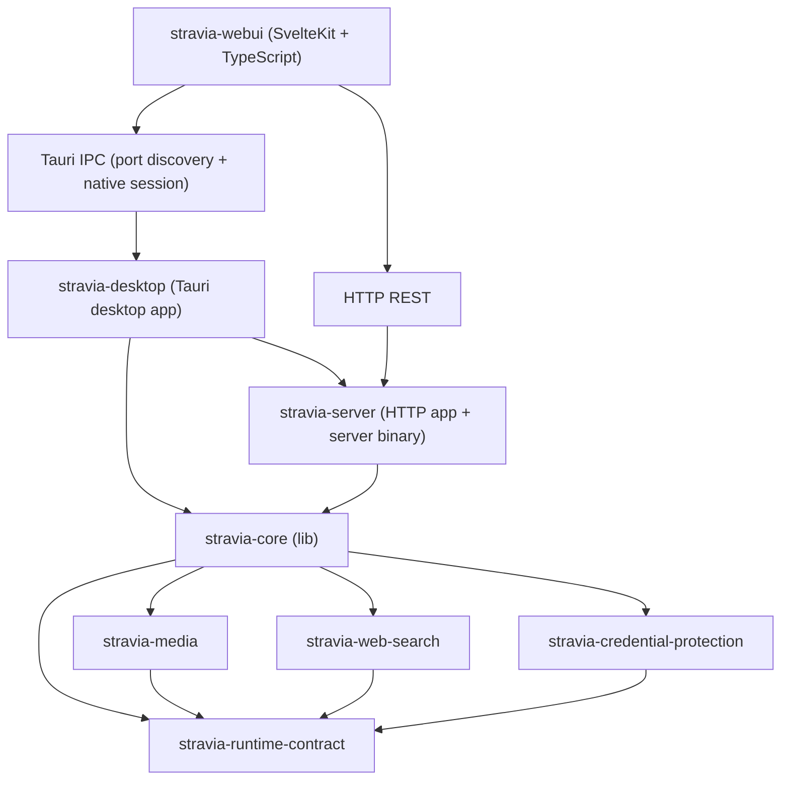

# Stravia Agent infra — 架构设计

---

## 1. 产品定位与部署形态

Stravia 定位为本地运行、可自托管的 **Agent infra（智能体基础设施）**，面向使用 AI 编程客户端或构建智能体应用的开发者，提供模型接入、平台工具与内置 Agent 执行，以及统一的访问控制、历史、用量统计和诊断。

协议网关是模型接入层：兼容的客户端可沿用受支持的 OpenAI / Anthropic / Gemini 协议，配置 Stravia 端点、API Key 与 Model ID，由平台完成上游选路和可表示的协议转换。执行层在平台内运行工具并推进有界模型循环，通过兼容模型请求与 MCP 暴露联网搜索、多模态理解等能力。Agent Definition 由程序定义并进行版本管理；管理员配置受支持的能力设置和模型绑定，不创建或改写 Agent 行为。

Stravia 可作为**桌面应用**在本地运行，也可作为**独立服务端**自托管，管理与配置由部署者控制。自托管不代表请求数据始终留在本机：模型调用和外部工具访问仍会发送至配置的上游服务。

平台生成的随机不透明 ID 固定为 28 位 ASCII 小写字母，由密码学安全随机生成器在 `a`–`z` 中均匀采样（约 131.6 bit）。完整 SHA-256 派生身份使用 55 位 ASCII 小写字母的定长 base-26 编码，不截断 256-bit 摘要。协议外壳各自独立：Artifact Reference 为 `stravia://artifacts/<55 位 ID>`，Turn Reference 为 `stravia://turns/<28 位 ID>`，Search Source 为 `stravia://turns/<28 位 ID>/sources/<ordinal>`；History Marker 为 `<!--sh:<28 位 ID>-->`，Projection Delimiter 为 `<!--sp:<28 位 ID>:<t|p>:<ordinal>:<s|e>-->`，可逆脱敏引用为 `<!--sr:<28 位 ID>-->`。平台资源自身统一以 `path` 输出，续接统一使用 `previous_path` 和完整 Turn URI；报告正文以方括号包裹完整 Artifact 或 Search Source URI，媒体 bridge 不再使用 `sm`／`st` 短提示。外壳不授予访问权；外部 Provider／客户端 ID、Codex UUID 请求／连接元数据和真实凭据 token 保持其协议格式。协议修复保留请求内确定性定位符，不额外为临时序号计算内容摘要。Open Responses item 保留 `<type>_<原样 response ID>_<ordinal>` 的可逆定位结构。旧 `sa:`、裸 Turn ID 与 `[sc:...]`／`[sm:...]`／`[st:...]` 不提供兼容解析；已有历史不批量重写或删除，旧历史引用可能明确失败。

```
Claude Code · Codex CLI · Gemini CLI · OpenCode
     OpenAI SDK · Anthropic SDK · Gemini SDK
              Any HTTP API Client
                      ↓
              Stravia Agent infra
            (localhost:23471)
       模型接入 · 工具与内置 Agent 执行
       访问控制 · 历史 · 用量与诊断
                      ↓
    OpenAI · Anthropic · Google · DeepSeek
    MiniMax · xAI · Zhipu · Ollama · ...
```

**部署形态：**

| 形态 | 实现 | 适用场景 |
|---|---|---|
| Desktop | Tauri v2 桌面应用，当前发布 Windows / Linux 安装包 | 个人开发者，本地运行与集成管理 |
| Server | 独立 Rust 二进制，始终启动 Proxy、Admin API 与内嵌 WebUI | 自托管、团队共享 |

核心原则：`stravia-core` 不绑定 HTTP listener，拥有模型接入、平台工具与内置 Agent 执行、存储和管理业务逻辑。独立 Server 与 Desktop 复用 `stravia-server` 的 HTTP application；WebUI 通过 HTTP REST 调用管理 API，Desktop IPC 提供本地 Server 端口发现与原生管理会话凭据。

---

## 2. Workspace 分层

```
stravia/
├── Cargo.toml                   # Rust workspace
├── backend/crates/
│   ├── stravia-core/
│   │   └── src/
│           ├── lib.rs            # crate module declarations 与稳定 Gateway re-export
│           ├── gateway/          # Gateway public facade 与构建/运行时生命周期
│           │   ├── mod.rs            # Gateway 类型与稳定接口
│           │   ├── builder.rs · lifecycle.rs · runtime.rs
│           │   └── extensions.rs · history_marker_executions.rs
│           ├── model_turn/       # Model Turn Executor deep module（crate-private）
│           │   ├── mod.rs            # execute(TurnInput) interface / Live + InMemory adapters
│           │   ├── live.rs           # 授权、router::selection 与 Wasm Vendor 尝试循环
│           │   ├── live/
│           │   │   ├── lifecycle.rs  # 单次 Vendor operation、事件接收/drain 与输出推进
│           │   │   ├── lifecycle/precommit.rs # 16 MiB buffer、提交分类与边界测试
│           │   │   └── tests.rs      # attempt deadline 与 Thinking Replay 契约
│           │   ├── capability.rs     # Vendor capability 执行与 canonical event bridge
│           │   ├── provider/mod.rs   # 通用尝试观测；无 native Provider transport
│           │   ├── support.rs
│           │   ├── tests.rs          # Executor 共用 fixtures 与其余行为测试
│           │   └── tests/            # publication / recovery / compaction 契约
│           ├── reversible_redaction/ # 凭据保护的设置/观测 Host Adapter 与 SQL 集成回归
│           ├── generation_chain/ # Generation Chain Write deep module（crate-private）
│           │   ├── mod.rs            # GenerationChain / Write interface
│           │   ├── write.rs          # observe / stage / persist 状态机
│           │   ├── store.rs          # durable TurnChainStore adapter
│           │   ├── materialize.rs    # Generation Materialization Cache
│           │   ├── project.rs        # 客户端可见历史投影
│           │   └── tests/            # store discovery / projection / write marker 契约
│           ├── proxy/            # 代理面
│           │   ├── mod.rs
│           │   ├── auth.rs
│           │   ├── context.rs    # RequestContext / ContextBag
│           │   ├── handler.rs    # models_list 只读端点（≤110 行）
│           │   ├── artifacts.rs  # multipart upload / signed download adapters
│           │   ├── security.rs   # crate-private client credential policy deep module
│           │   ├── server.rs     # axum HTTP Server 启动
│           │   ├── server/tests.rs   # Proxy HTTP 装配契约
│           │   ├── stream.rs     # StreamBridge 状态机
│           │   ├── dispatcher/   # Inference Run 生命周期 deep module
│           │   │   ├── mod.rs        # ingress 薄入口：dispatch_pipeline
│           │   │   ├── inference_run.rs  # execute(RunInput) interface / Phase
│           │   │   └── inference_run/
│           │   │       ├── engine/
│           │   │       │   ├── mod.rs        # orchestrate：Inference Run 内部编排
│           │   │       │   ├── claim.rs · errors.rs · projection.rs · util.rs
│           │   │       │   ├── completion.rs · delivery.rs · followup.rs · canonical_stream.rs
│           │   │       │   └── stream/mod.rs  # stream 编排
│           │   │       └── tests/            # lifecycle / projection / transport 契约与共享 support
│           │   ├── planner/      # 协议协商
│           │   │   ├── mod.rs        # ProtocolPlan / ProtocolMode 等 re-export
│           │   │   └── negotiator.rs # negotiate() / RoutingStrategy / OrderedStrategy
│           │   └── ingress/      # 4 个协议族薄 shell + observation admission
│           │       ├── mod.rs
│           │       ├── observation.rs  # observation admission / rejection shell
│           │       ├── openai_compatible/
│           │       │   ├── mod.rs
│           │       │   ├── chat_completions.rs   # decode → inference_run::execute
│           │       │   └── embeddings.rs
│           │       ├── open_responses/
│           │       │   ├── responses.rs
│           │       │   └── websocket.rs
│           │       ├── anthropic_messages/
│           │       │   ├── mod.rs
│           │       │   └── messages.rs
│           │       └── google_generative/
│           │           ├── mod.rs
│           │           └── generate_content.rs
│           ├── hook/            # 唯一推理扩展 seam（显式 GatewayBuilder 注入）
│           │   ├── mod.rs        # HookRuntime；run state 仅 crate-private
│           │   ├── runtime/      # HookRuntime deep module
│           │   │   ├── mod.rs        # 薄 interface 与内部 re-export
│           │   │   ├── types.rs      # HookRuntime 装配状态
│           │   │   ├── apply.rs      # action validation 与 patch 应用
│           │   │   ├── runtime.rs    # run state 与 stream transform
│           │   │   └── tests.rs
│           │   └── tool.rs       # PlatformToolRegistry 与执行/结果归一化
│           ├── protocol/         # 协议转换引擎
│           │   ├── mod.rs        # ProviderProtocols / ResolvedEgress 等
│           │   ├── registry.rs   # endpoint identity / capability / alias / route registry
│           │   ├── transform.rs  # crate-private ProtocolTransform / ProtocolPair / stream session
│           │   ├── conversion/   # thinking/Open Responses/Gemini/cross-protocol 契约测试
│           │   └── codec/        # ProtocolAdapter 的 wire codec implementation
│           │       ├── mod.rs
│           │       ├── reasoning.rs       # think-tag 提取工具
│           │       ├── tool_correlation.rs
│           │       ├── openai/
│           │       │   └── compatible/    # chat_completions + embeddings
│           │       ├── open_responses/    # dated 2026-04-24 Responses contract
│           │       ├── anthropic/
│           │       │   └── messages/
│           │       └── google/
│           │           └── gemini/
│           ├── plugin/           # Wasm Vendor host：安装、权限、网络、状态与调度
│           │   ├── mod.rs        # 对外类型与执行接口导出；无编译期 Vendor inventory
│           │   ├── builtin.rs    # 内嵌 base 的内存装载与 descriptor 身份核对（不写 artifact）
│           │   ├── execution.rs  # execute_vendor / typed OperationInput / publication fence
│           │   ├── manager.rs    # 安装版本、更新切换与运行中 operation 管理
│           │   ├── lifecycle.rs  # 更新写栅栏与结果发布读栅栏
│           │   ├── network.rs    # descriptor 授权下的 HTTP/WebSocket host transport
│           │   ├── permissions.rs# descriptor origin 与配置字段权限解析
│           │   └── store.rs      # 组件、私有状态与 data epoch 持久化
│           ├── admin/            # AdminService 管理面（按职责拆分）
│           │   ├── mod.rs
│           │   ├── extensions.rs # list_loaded_extensions（provider/protocol 只读清单）
│           │   ├── provider_connection.rs
│           │   ├── provider_connection/{interface,configuration,capabilities}.rs
│           │   ├── oauth.rs · oauth/{runtime,session_store}.rs
│           │   ├── routes.rs · routes/{model_records,provider_model_records,thinking_map}.rs · api_keys.rs
│           │   ├── settings.rs · observability.rs · web_access.rs · web_search.rs
│           │   ├── model_catalog.rs · auth_data.rs · model_data.rs
│           │   └── session_tests.rs
│           ├── media/            # 媒体 Host/MCP Adapter 与集成回归（crate-private）
│           ├── web_search/       # 搜索 Host/MCP Adapter 与集成回归（crate-private）
│           ├── web_access/       # Web Access（crate-private）
│           │   ├── mod.rs            # request / response interface
│           │   ├── types.rs          # request / response DTO
│           │   ├── engine.rs         # provider adapter 与请求引擎
│           │   ├── service.rs        # 编排入口
│           │   ├── policy.rs · ssrf.rs
│           │   └── providers.rs · platform.rs
│           ├── agent/
│           │   ├── runner/           # loop / context / tools / types / schema / tests
│           │   ├── adapters/         # agent call / hook / remote MCP adapters
│           │   ├── artifact/         # 内部/S3 ArtifactStore、quota、传输授权和读取保护
│           │   └── upload_grant.rs   # 固定期限上传授权、回放保护与上传说明
│           ├── provider_catalog/ # Catalog facade / types / source / parse / persist
│           ├── turn_chain/       # SqlTurnChainStore 与集成回归
│           ├── rpm/              # RootRequest、严格滑动 RPM 与实际发送门禁
│           ├── error.rs          # GatewayError taxonomy
│           ├── router/           # 选路装配(selection) / RouteAttemptPolicy / RoutePolicyState / CacheAffinity / ContinuationLookup
│           ├── interaction_observation/ # Interaction Observation deep module（crate-private）
│           │   ├── mod.rs            # 小 interface：准入、事件、查询、SSE、Debug、清理、bundle
│           │   ├── grouping.rs · writer.rs · query.rs · store.rs
│           │   └── trace.rs · redaction.rs · retention.rs · bundle.rs
│           ├── storage/          # SQLite / PostgreSQL 真实 adapters + Memory 测试替身
│           │   ├── sqlite/           # oauth/providers/models/api_keys/usage_stats/settings 按职责分文件
│           │   └── postgres/         # 与 SQLite 保持独立、同样按职责分文件
│           ├── migrations.rs     # SQLx versioned migrations
│           ├── db/               # SQLite 连接与模型辅助函数
│           └── auth/
│   ├── stravia-runtime-contract/ # IR/协议身份、Hook、Agent、Artifact、TurnChain、脱敏 trace 契约
│   ├── stravia-media/            # 完整媒体理解、预处理、bridge、Derivative、报告与配置策略
│   ├── stravia-web-search/       # Runner、Backend、报告/证据、公开工具与配置策略
│   ├── stravia-credential-protection/ # Betterleaks/Kingfisher 规则、检测、替换/还原与 SQL 映射实现
│   ├── stravia-web-access/       # 联网 Adapter、浏览器与静态地址策略
│   ├── stravia-web-access-contract/ # search/fetch 契约、域名规范化与内部工具 ID
│   └── stravia-devtools/
├── backend/apps/
│   ├── stravia-desktop/
│   └── stravia-server/
└── frontend/stravia-webui/
    └── src/lib/components/
        ├── ui/data-table/             # facade、filter/column UI、CSV、virtual range、持久化
        ├── provider-model-catalog/    # filter、manual、editor、confirmation overlays
        ├── provider-model-form.ts     # metadata/cost form model 与精确 decimal serialization
        └── route-targets-form.ts      # Target 列表恢复、排序、校验与提交投影
```


**开发构建与调试：**

所有 Rust crate（包括三个 Wasm 测试夹具）的包版本和依赖版本统一声明在根 `Cargo.toml` 的 `workspace.package` 与 `workspace.dependencies`，crate 清单通过 `workspace = true` 继承，只补充自身的特性、可选依赖与目标平台条件。全工作区使用根 `Cargo.lock`；上游仍要求不同不兼容版本时，在根使用明确的多版本依赖键，不在 crate 内另写版本，也不强制覆盖第三方的版本约束。Wasm 夹具通过 `task build:vendor-fixtures` 定向构建，常规 host 检查和单元测试不编译这些 Wasm 专用包。

根 `Cargo.toml` 的开发配置保留工作区 crate 的完整调试信息与增量编译；常规测试继承这一配置。第三方依赖默认使用 `debug = 1`，保留文件、行号与模块级信息，但不生成完整的类型与局部变量信息，以减少 PDB 大小和增量构建成本。依赖的 `opt-level = 3` 与 release 配置保持不变；原生构建所需的个别符号例外以根配置为准。

需要调试某个依赖内部的变量时，可使用包级覆盖，例如 `cargo build -p stravia-server --config 'profile.dev.package.tokio.debug=2'`；依赖仍处于优化构建，部分变量可能被优化掉。工具链、`CARGO_HOME`、profile、features 或符号配置变化会使部分编译产物失效，首次重新构建不代表之后的增量耗时。日常反馈应保持构建环境与配置一致，不通过清空 `target` 提速。

Desktop 与独立 Server 的清单对齐共享依赖的运行期、宿主构建与过程宏特性，以及各平台已共享的底层系统绑定，减少切换入口时的依赖变体。Server 的 `embed-webui` 仍是独立特性：Desktop 不启用 Server 的 WebUI 嵌入，也不会把 Tauri、WebView 或桌面插件引入独立 Server。Desktop 独有的构建路径可以保留自己的依赖变体；这些不是双方都需要编译的单元。首次特性对齐需要重编扩大特性的依赖，之后的复用仍要求 profile、目标平台和编译环境一致。修改共享 Core 源码仍会更新两端的相关工作区产物，不会因此反向重编未变化的第三方依赖。

共享 `reqwest` 启用与 Desktop 相同的 TLS 和系统代理编译特性，但默认 Gateway、Provider Catalog 与 S3 客户端显式直连，不继承环境变量或操作系统代理。Provider 关闭 `use_proxy` 时保持直连；开启时仍由应用配置选择显式代理客户端。编译特性对齐不改变这个出站选择，也不移除现有 TLS provider 或 JSON 默认递归深度保护。

**依赖关系：**


```mermaid
graph TD
    straviaCoreLib["stravia-core (lib)"]
    desktopApp["stravia-desktop (Tauri desktop app)"]
    serverApp["stravia-server (HTTP app + server binary)"]
    webui["stravia-webui (SvelteKit + TypeScript)"]
    tauriIPC["Tauri IPC (port discovery + native session)"]
    httpREST["HTTP REST"]
    runtimeContract["stravia-runtime-contract"]
    mediaCapability["stravia-media"]
    searchCapability["stravia-web-search"]
    credentialCapability["stravia-credential-protection"]

    desktopApp --> straviaCoreLib
    desktopApp --> serverApp
    serverApp --> straviaCoreLib
    straviaCoreLib --> runtimeContract
    straviaCoreLib --> mediaCapability
    straviaCoreLib --> searchCapability
    straviaCoreLib --> credentialCapability
    mediaCapability --> runtimeContract
    searchCapability --> runtimeContract
    credentialCapability --> runtimeContract
    webui --> tauriIPC
    webui --> httpREST
    tauriIPC --> desktopApp
    httpREST --> serverApp
```

三个能力使用独立 Rust crate，在 `gateway/extensions.rs` 与 Gateway runtime 中编译期装配，不引入动态加载、热卸载或能力对 core 的反向依赖。能力拥有完整业务实现；core 的 Host Adapter 只连接模型执行、当前授权、Provider/Artifact/配置存储和观测。共享契约由 `stravia-runtime-contract` 唯一声明，Rust 调用方直接从其所属 crate 导入，不保留旧 core 类型出口。

凭据保护的扫描、规则资源、canonical 文本替换、流式还原及 SQLite/PostgreSQL 映射实现归 `stravia-credential-protection`。Core 保留 settings/observation Adapter、Model Turn 成功终态 gate 和历史保留期集成：还原与映射发布失败仍显式终止，关闭保护仍还原有效旧映射，取消不回滚已发布映射。HTTP/MCP、配置键、Definition Revision 与数据库 schema 不因 crate 拆分改变。

**Local Web Access 运行边界：**

`stravia-web-access` 的 HTTP Search/Fetch 使用固定版本的 `wreq` 与 `wreq-util`，动态页面通过 CDP 控制已安装的 Chrome/Chromium，不内嵌浏览器引擎或下载浏览器。`LocalWeb` 在构造时固定代理快照；HTTP Search 使用共享内存 Cookie jar，HTTP Fetch 禁用 Cookie，浏览器使用临时 profile，身份不跨进程重启持久化。现有 Moli profile 和 search-cookie 文件保留在磁盘上，但不读取、迁移或删除。HTTP 适配器逐跳检查重定向与目标地址、清除跨 origin 凭据，并对解压后的正文实施大小和总时限限制；直连 Fetch 使用策略层验证后的固定地址。

Chrome 按需启动，运行时持有浏览器 context，最后一个所有者释放时回收 target、进程和临时 profile。CDP 自动附加页面、iframe 和 worker：导航前注入含 UA metadata 的隐身补丁，worker 恢复前完成初始化；页面提取在隔离世界执行。脚本固定移植自 OMP commit `daf07999c2fee9b22edc7bf8fea1fb6272e0df5e` 并保留 MIT 许可，指纹缓解不构成“不可检测”的承诺。下载拒绝；Chrome 保持操作系统沙箱，不使用 `--no-sandbox`。

浏览器 HTTP 与 WebSocket 出站经过同一 EgressProxy；Search、静态 Fetch、渲染及子资源共用构造期代理快照。出口策略检查公共地址、直连 DNS 地址固定和上游代理转发，不进行 TLS 中间人解密；显式代理保持远端 DNS 语义。页面、重定向、iframe 和 worker 均不能绕过出口。

Desktop 与 Server 在 Local 服务编辑器提供浏览器路径配置；Desktop 使用系统文件选择器，Server 输入服务器本机路径。手动设置优先于 `STRAVIA_CHROME_PATH`，后者优先于自动探测；显式无效路径不回退。管理认证保护 `GET/PUT /api/v1/web-access/browser`：GET 只检查路径而不启动浏览器，PUT 接受 `{path: string|null}`，先校验并原子保存，再激活；`null` 清除手动设置。配置保存在 `web-access-browser.json`，缺失时迁移旧 `desktop-browser.json`；读盘损坏显式报告。缺少浏览器时不得新增 Local 来源，已保存 Local 可移除或保持，执行时跳过 Local 并保留远程来源。Web Access 仍只管理来源与优先级，公开联网搜索仍由唯一的 Web Search 总开关控制；远程 Exa/Zhipu 不依赖本地浏览器。

Fetch 继续限制下载与渲染结果大小，并保留超时、取消与静态提取回退契约。搜索优先 HTTP，在需要时回退 Chrome；Google 和 Bing 保留各自的请求策略。Google 的浏览器 preflight 与目标导航共用页面，在隔离世界先检测拦截，再检测结果就绪；命中异常流量挑战立即返回明确错误，而不是等待完整 deadline。

正常结果标题与无结果提示优先排除 Google 拦截误报；其他来源与 Fetch 不启用该判定。

**stravia-core 顶层 `pub mod`（以 lib.rs 为准）：**

```
admin · agent · auth · config · connect_client_apply · db · error · history_marker
hook · mcp · plugin · protocol · provider · provider_catalog · provider_models · proxy
router · rpm · storage · thinking · turn_chain
```

crate-private 运行时 module：`generation_chain`、`interaction_observation`、`media`、`model_turn`、`reversible_redaction`、`web_access`、`web_search`；`admission` 保持 crate root private。Generation Chain 与 Interaction Observation 都不属于 Hook，且彼此保持独立：前者保存不可变交付历史，后者保存可丢失的可变诊断投影。

**核心 API：**

```
Gateway::new(config)      → 初始化数据库与 Gateway 业务运行时
Gateway::admin()          → 返回 AdminService，提供全部管理操作
  ├── .list_models()
  ├── .create_model(input)
  ├── .list_providers()
  ├── .create_provider(input)
  ├── .test_provider(id)
  ├── .list_api_keys()
  ├── .observation_forest(query) / .observation_interaction(id, filters)
  ├── .observation_rejections(query) / .observation_rejection(id)
  ├── .observation_subscribe(after_sequence)
  ├── .observation_debug() / .set_observation_debug(enabled)
  ├── .clear_observation_history()
  ├── .issue_observation_bundle_ticket(...) / .consume_observation_bundle_ticket(...)
  ├── .get_stats_overview()
  ├── .list_loaded_extensions()  ← provider/protocol 内建能力清单
  └── ...
stravia-server::build_http_app() → 组合 Proxy、Admin API、健康探针与可选内嵌 WebUI
stravia-server::start_http_server() → 绑定 listener 并提供优雅关闭
```

`AdminService` 是管理面唯一入口；`admin/` 子模块按功能职责分布，不引入新传输层抽象。

`Gateway` 的公共路径仍为 crate root re-export；实现位于 `gateway/`，由 `builder`、生命周期、运行时扩展和 history marker execution 子模块共同封装。`lib.rs` 不再承载 Gateway 方法实现，外部调用方无需迁移 import。

---

## 3. 协议转换架构

### 3.1 核心设计原则

- **统一错误 taxonomy**：`GatewayError` 覆盖 15 种错误类型，每个错误有稳定 code、HTTP status、user message、internal detail 和 retryable 标志。
- **请求生命周期追踪**：`RequestContext` 携带 request_id、deadline、cancellation token、outcome，以及请求范围扩展，端到端贯穿 dispatcher 与 handler。
- **确定性协议协商**：`negotiate()`（`proxy/planner/negotiator.rs`）实现三级 egress 解析（Exact → Same-family → Provider Default），`ProtocolRegistry` 只暴露 endpoint identity、capabilities、alias 与 ingress route 查询。
- **Pair-bound Protocol Conversion**：crate-private `ProtocolTransform::bind(ingress, egress)` 返回 `ProtocolPair`；调用方只通过 `decode_request` / `encode_request`、`decode_response` / `encode_response` 和有状态 stream session 转换 wire 与 canonical IR，不能直接取得 codec。
- **Fail-closed representability**：跨协议 encode 前按实际 `AiRequest`、`AiResponse` 或 delta 检查语义损失并返回 typed `ProtocolLossyRejected`；同 endpoint 路径不套用跨协议 loss policy。
- **Canonical-only 推理**：所有推理请求都经过 ingress decode、canonical IR、Vendor Plugin canonical execution 与 ingress encode；不提供以 wire raw request/response 绕过 HookRuntime 的路径。
- **显式字段映射**：每个 codec 明确处理已知字段；允许的 vendor-specific 字段走 ExtensionBag，不隐式丢弃或把原始字节暴露给 hook。
- **唯一推理 seam**：`GatewayBuilder` 显式注入固定顺序的 `HookRuntime` hooks 与 `PlatformTool`，dispatcher 只通过 `HookRuntime` 处理推理扩展；`Gateway::execute_vendor` 是唯一供应商执行 seam，且只调用已安装的 Wasm Vendor Plugin，不保留 native adapter。
- **固定事件面**：`Request`、`UpstreamResponse`、`ToolResult`、`ClientOutput` 四个规范化事件，以及每个 HookSession 内的 `StreamTransformer` 流式事件。

### 3.2 完整调用流程

```
Client / CLI / SDK
    │ HTTP/SSE/WebSocket（协议 ingress）
    ▼
Ingress shell（proxy/ingress/<family>/）
    ├─ 建立 RequestContext，并在认证/解码前创建 IngressObserver
    ├─ pre-Run decode / protocol / auth 失败 → Rejected Request Observation
    └─ ProtocolPair::decode_request → AiRequest（canonical IR）
    │
    ▼
inference_run::execute(RunInput)（一次性 crate-private interface）
    ├─ 准入时 IngressObserver::admit → RunObserver；独立快照进程 Debug 开关
    ├─ 通过单一 typed event seam 记录 Run / Model Turn / Target attempt / tool / projection / delivery
    ├─ Observation/Trace/SSE/export 失败仅产生 gap/partial，绝不改变推理、选路或交付
    ├─ Interaction grouping 在 Observation writer 内完成，不反写 Generation Chain
    ├─ Phase 状态机约束 Request → Selecting → Calling → Inspecting
    │                         → HiddenRound / SemanticComplete → AwaitingDelivery → Finished
    ├─ Responses gate：拒绝 background / conversation / server-side context management
    ├─ Security::required_principal（Request Hook 前验证 API key 并建立 Principal）
    ├─ 以 Principal 隔离的 Generation Chain materialize `previous_response_id`（完整历史）
    ├─ claim matching mixed-tool continuation，或 HookRuntime::begin
    │  （SessionContext + ContextCompleteness::Full/Partial）
    ├─ Request hooks（builder 固定顺序；路由选择前；每个隐藏 round 重新运行）
    │    ├─ PatchRequest / ExposeTool / Respond / Reject
    │    └─ 全部动作批次先校验，再原子应用；失败 fail-closed
    ├─ 以最终 `request.model` 查 Model，再由 Security::authorize_model 检查 binding
    └─ model_turn::execute(TurnInput)
         ├─ 可逆脱敏：按 Principal 加载有效映射；开启时全请求检测、持久化、精确替换
         ├─ 按 RouteBinding 或 CapabilityGrant 授权
         ├─ 健康感知 Target iteration / negotiate() / Vendor Plugin descriptor / ProtocolPair
         ├─ ContinuationLookup 在锁定 Target 后准备上游前缀
         ├─ Vendor Plugin 经受控 host transport 执行（HTTP/SSE 或 Responses WebSocket）
              ├─ 两种 transport 均归一为 canonical AiResponse / AiStreamDelta
              ├─ 按原始 Provider 视图记录引用与续接证明，再还原回答及工具参数
              └─ 仅 retryable provider 失败且尚未提交首个 canonical 输出时切换 Target
         └─ 内部终态 gate：还原尾部 delta → 当前共享引用发布 → 唯一 Completed
              ├─ 取消 / deadline 可抢占读取和发布等待，已发布映射不回滚
              └─ gate 拥有 Model Turn 终态观测，上游 attempt / usage 保持独立真实
    │
    ▼
Inference Run module（同一 run 持有 HookRuntime run state 与跨 round 状态）
    ├─ Vendor Plugin 只向宿主产出 canonical AiResponse / AiStreamDelta
    ├─ 共同语义完成 implementation（四条交付路径共用）
    │    ├─ 统一补全 response ID / model / stop reason 并合并隐藏 round
    │    ├─ UpstreamResponse Hook → Platform Tool 分类 → ClientOutput Hook
    │    ├─ 验证 client tool-call 集合并准备 Generation Chain / Tool Continuation
    │    └─ 返回封闭结果：NextRound / Ready / Failed
    ├─ PlatformTool：
    │    ├─ 平台工具 call 隐藏，按响应顺序串行 execute
    │    ├─ ToolResult hook → canonical result → append assistant/tool round
    │    └─ 纯平台工具在同一客户端 stream 内续跑；中间 lifecycle/usage/done 不外发
    ├─ 混合 tool：
    │    ├─ 隐藏 platform calls，只返回 client calls + 可见内容
    │    ├─ 保存内存 Tool Continuation（默认 TTL 1h，主体隔离，单 claim）
    │    └─ 下一请求一次提交全部 client results，再恢复同一 Inference Run
    ├─ HookLegGuard：每条 stream leg 在结束、取消、error 或 drop 时恰好 close 一次
    ├─ Client Output Commit：commit 前可返回完整错误；commit 后失败只终止当前 stream
    └─ ClaimLease / DeliveryLeaseStream：
         ├─ Generation Chain stage 必须提供当前 Model Leg 的 Target 或明确 Hook 来源
         ├─ 新 Generation Chain 仅在完整客户端 delivery 后保存；Tool Continuation 遵循其 delivery 完成契约
         └─ 被 claim 的 Tool Continuation 仅在客户端 delivery 完成后 complete，否则 release
    │
    ▼
DeliveryAdapter → ProtocolPair client encode（non-stream JSON / stream SSE / Responses WebSocket events）
```

Model Turn Executor 的 private `live/lifecycle.rs` 集中事件与输出推进。`OutputLifecycle` 的生命周期覆盖所选 Target 的 recovery 循环，独占 canonical 输出提交进度、streamed 事实、一次性 ready 通知、attempt reservation 与最后发布的 Vendor Publication Fence；driver 只查询提交进度，不逐字段改写输出状态。每次调用创建新的 `Operation`，由同一事件处理行为接收运行中事件并 drain operation 返回后的事件，独占 emitted-delta、precommit 与 pending failure。首次输出计时仍归属当前 `AttemptObservation`，不会因共享输出 owner 而升格为整轮的全局时间。

`Operation` 同时拥有单次 Vendor 调用的上下文装配、reprepare、发送准入接入、请求媒体 materialize 与 typed 响应的 Provider proof 应用，使 guest 执行和事件消费保持一个完整生命周期。这些动作使用 driver 选定的 Target、固定 execution lease 与既有策略；RPM 准入仍由发送门禁裁决，recovery 的资格、预算和请求选择仍由 driver 裁决，不形成第二个策略 owner。

`Operation` 在发布媒体 delta 前执行现有 normalization，precommit 保留每个事件的原 fence 与顺序，并沿用 16 MiB 占用估算和精确边界；committing delta 释放 buffer，不额外占用 pre-output 预算。runtime `Completed` / `Compacted` 通知不发布成功终态，typed return 仍为权威结果。无 plugin delta 时先规范化完整响应，再合成 canonical delta；typed terminal 使用同一输出 owner 发布。driver 保留 retry、认证恢复、Thinking Replay、Target Continuation、健康与最终策略 accounting，成功 accounting 后由输出 owner 完成 reservation 与 ready 通知。现有还原与映射发布 gate 保持独立；Executor 的 canonical 输出提交不等于 Client Output Commit，也不接管客户端 Delivery。

管理面（`AdminService` / `/api/v1/*`）、健康探针、模型目录等非推理路由不进入 HookRuntime；生成和 embeddings 这两类推理请求会创建 `InferenceRun`。HTTP 管线始终经过 decoder、canonical pipeline 和 encoder，不暴露原始 wire body。

Client credential policy 只存在于 crate-private `proxy/security` deep module。该 module 直接使用 `AuthAccessStore` seam：Inference profile 接受 Bearer、`x-api-key` 与 `x-goog-api-key`，MCP profile 只接受 Bearer；models list 复用同一 implementation，凭据无效或存储失败时 fail-closed。Security interface 返回 Principal、Model access grant、visible Model IDs 或 typed `GatewayError`，不修改 `RequestContext`，不记录日志，也不渲染 transport response。

Inference Run 在 Request Hook 前验证 API Key、建立 Principal 并计一次 API Key Root RPM，在 Hook 后针对 final Model 检查绑定；Target retry、隐藏 Model Turn、透明 Tool 与后台 execution 保留同一 RootRequest，不重复计入口请求。普通 Target retry 属于同一 round，复用该 round 的授权结果。Active Provider 与 Provider Model lookup 仍由 Inference Run 拥有。Expired client credential 统一映射为 `AuthFailure::Expired` 与 HTTP 401；MCP 保持其他 401/403/503 mapping，models list 仅返回有效 Key 已绑定的 Model。RPM 运行态只在单个 Gateway 实例内共享，配置持久化但窗口不持久化，重启清空窗口；不协调多实例额度。

### 3.3 内部表示（IR）

位于 `backend/crates/stravia-runtime-contract/src/protocol/ir/`，由宿主与能力 crate 共用，定义统一内部结构：

- `AiRequest`（`ir/request.rs`）：入站请求，含消息列表、工具定义、模型参数
- `AiResponse`（`ir/response.rs`）：出站响应，含 content / tool_calls / usage / reasoning_content
- `AiStreamDelta`（`ir/stream.rs`）：流式增量事件，支持 reasoning delta、text、tool_call
- `Usage`（`ir/usage.rs`）：prompt_tokens / completion_tokens / total_tokens / cache_read_tokens

**vendor-specific 字段命名约定（存于 IR extra 字段）：**

| 前缀 | 用途 |
|---|---|
| `__anthropic_raw_*` | Anthropic cache_control / exotic blocks / 工具 `strict` / `tool_result.is_error` 无损往返 |
| `__google_raw_*` | Google systemInstruction / built-in tools / generationConfig |
| `__emb_*` | Embeddings 已知字段（input / dimensions / encoding_format / user） |
| `__vendor_ingress` | 未知 vendor 字段集合（由 VendorFieldPolicy 决定是否转发） |

### 3.4 Devin Connect 回放与工具说明

Devin Connect 的 `delta_text`、`delta_thinking` 与 `delta_signature` 是同一响应内的字段增量，不是独立内容块。Decoder 为正文与 thinking 各保留一个稳定的 canonical 索引；即使正文、thinking 与工具调用交错到达，仍分别追加原始字节，不插入分隔符，也不因正文或工具调用新建签名块。晚到的签名归属同一响应，并在 trailer 后封口；不同响应使用不同 parser 实例，签名不会跨轮拼接。

Devin 请求编码只在目标协议边界恢复连续助手段，不改写 canonical 历史。Responses 分开的正文、单个带签名思考项和并行工具调用合入同一 `ChatMessagePrompt`；用户输入和工具结果截断合并。已经独立存在于历史中的签名项仍保留各自 prompt 边界，不拼接或相互覆盖。响应的 `output_id` 保留在 opaque 历史载荷中，但与原生 CLI 一致，不编码到历史 prompt 的 `#15` 字段；`thinking`、`signature` 与 `signature_type` 继续回放。调用结果仍按 call ID 紧跟对应的调用 prompt。

工具顶层说明在 system prompt 的工具说明区按自然语言句子和列表条目连续编号，代码围栏与完整 JSON 段保留结构，最后执行 XML 转义。此处理不补回参数 schema 内的说明；原有 ToolDef 名称占位和 schema 注释剥离策略保持不变。

---

## 4. 请求生命周期与 HookRuntime

本节是当前实现的唯一生命周期说明。HookRuntime 是 dispatcher 的**唯一推理扩展 seam**；`Vendor` 仍独立负责 provider-specific 认证、URL、编解码和流式适配。

### 4.1 作用域与生命周期

HookRuntime 只处理经过 ingress decoder 的推理请求，不接管管理面、健康探针或其他非推理路由。Gateway 由 `GatewayBuilder` 构造：

```rust
Gateway::builder(config)
    .hook(Arc<dyn Hook>)                 // 按调用顺序重复添加
    .platform_tool(Arc<dyn PlatformTool>)
    .continuation_ttl(Duration::from_secs(...))
    .generation_chain_ttl(Duration::from_secs(...))
    .build()
```

`build()` 校验 HookId 非空且不重复，校验 PlatformTool 的稳定 `ToolId`，然后以 builder 顺序构造一个不可变的 `HookRuntime`。运行时不使用 hook 的进程级隐式发现；Hook 与 PlatformTool 是受信的、进程内 Rust 实现，依赖在构造时注入。

每个客户端推理 turn 只把 `RunInput` 交给 `inference_run::execute`；该一次性 `interface` 独占完整生命周期，并调用 `HookRuntime::begin(SessionContext, &AiRequest, ContextCompleteness)` 创建 crate-private run state 与每个 Hook 的 `HookSession`。一次 Inference Run 覆盖初始 provider round、纯 PlatformTool 隐藏续跑，以及混合工具等待客户端结果后的恢复；普通 provider Target 重试复用本 round 已校验的 canonical 请求。`SessionContext` 只含 request/run ID、RequestKind、ingress、HTTP/WebSocket transport 和脱敏主体；路由确定后事件才收到 model/provider/target/egress。

### 4.2 小接口、深实现

```rust
pub trait Hook: Send + Sync + 'static {
    fn descriptor(&self) -> HookDescriptor;
    fn create_session(&self, context: &SessionContext) -> Box<dyn HookSession>;
}

pub trait HookSession: Send {
    async fn handle(&mut self, event: HookEvent<'_>) -> Result<ActionBatch, String>;
    fn stream_transformer(&mut self) -> Option<&mut dyn StreamTransformer>;
}

pub struct HookDescriptor {
    pub id: HookId,
    pub request_kinds: Vec<RequestKind>,   // Generation / Embeddings
    pub event_kinds: Vec<EventKind>,       // 见下
    pub requires_full_context: bool,
    pub max_buffered_bytes: usize,
    pub max_delayed_events: usize,
}
```

Hook 是并发安全的共享工厂；Session 是每次 `InferenceRun` 的可变状态。Runtime 严格按 builder 顺序串行调用接受当前 `RequestKind`/`EventKind` 的 session，后一个 hook 只会看到前一个 hook 已成功应用的结果。

### 4.3 规范化事件面

| 事件 | 进入时机 | Hook 可观察/改变的范围 |
|---|---|---|
| `Request` | 路由选择前；初始请求及每个隐藏 platform round | canonical `AiRequest` 的语义字段、context spans、tool exposure、生成本地 `AiResponse` |
| `UpstreamResponse` | provider response 已由 Vendor 解码为 canonical `AiResponse` 后 | 内容、reasoning、items、允许的客户端 tool arguments |
| `ToolResult` | PlatformTool 执行结果生成后、追加回 provider 前 | canonical tool result content、error 标记、metadata |
| `ClientOutput` | 隐藏平台调用和中间 round 处理后、编码返回客户端前 | 最终客户端可见 response 的语义字段 |
| `Stream` | 上游规范化 `AiStreamDelta` 到达时 | 仅由 session 的 `StreamTransformer` 处理 text/reasoning/client tool arguments |

`HookEvent` 携带最小稳定 `SessionContext`、`round` 和必要的 canonical 只读 view；`UpstreamResponse`、`ToolResult`、`ClientOutput` 还需要已设置的 `RouteContext`。Embedding 使用 `RequestKind::Embeddings`，可由 descriptor 自然隔离。

### 4.4 动作批次与失败语义

```rust
pub enum HookAction {
    PatchRequest(RequestPatch),
    PatchResponse(ResponsePatch),
    PatchToolResult(ToolResultPatch),
    ExposeTool(ToolId),
    Respond(AiResponse),
    Reject(HookRejection),
    StreamAbort { message: String },
}

pub enum HookControl {
    Continue,
    Respond(AiResponse),
    Reject(HookRejection),
    StreamAbort { message: String },
}
```

一个 `ActionBatch` 先整体验证，再原子应用；任一 Patch 非法、hook 返回错误、hook session 创建 panic 或 runtime 状态非法都会 fail-closed。`Respond` 只允许 `Request`；`Reject` 只允许首字节发出前的 Request/UpstreamResponse；首字节后只能 `StreamAbort`，不能改变已经发送的 HTTP 状态。Hook 调用不设默认超时，但必须响应请求取消。

Request Patch 可改写 canonical model、system/instructions、ContextItems、generation、tools/tool choice、embedding input 和 protocol extension，但不得改变主体、认证、provider target 或凭据。Response/ToolResult Patch 不能修改 usage、stop/lifecycle、tool ownership/ID 或结构性 stream 事件；平台工具所有权在核心分类后保持不可变，arguments 可被安全语义 patch 后重新校验。

### 4.5 ContextSnapshot 与状态

`InferenceRun` 在 `begin()` 为原始请求建立 `ContextSnapshot`：有序 `ContextItem`（Message、Reasoning、ToolCall、ToolResult）、稳定请求内 `ContextItemId`、版本化 checkpoint/fingerprint 与 `ReplaceContextSpan`。每次请求独立从客户端提交的上下文匹配，不维护压缩 rollback 状态机；重叠 span、反向 span、未知/重复 item ID 均拒绝。

`ContextCompleteness::Full` 表示完整可见历史；provider opaque refs（例如 Google cached content、Anthropic container）会保留为 namespaced extension 并标记 `Partial`。声明 `requires_full_context` 的 hook 在 Partial 请求中跳过并记录 `HookSkip`，其他 hook 仍处理可见 canonical 语义。该能力只提供匹配原语，第一阶段不提供摘要模型、压缩算法、RewriteStore 或管理 UI。

### 4.5.1 Cache Affinity

Request Hook 完成后、首次 Target 选择前，`CacheAffinity` 对每个 canonical `AiItem` 计算 Canonical Item Hash，并以 Principal、Route 与有序 Hash 前缀查询 Gateway-local 的有界索引。索引只在 Target 成功响应且已报告 `prompt_tokens >= 20,000` 时记录该 Target 与请求的每条 Item Hash；最长精确前缀命中且 Target 仍是当前 Route 的健康候选时，`RouteAttemptPolicy` 仅将该 Target 提到首选位置。没有命中、Target 已移除/不健康、或首选 Target 可重试失败时，现有 Route 选择与重试顺序完整生效。该索引不持久化、不记录 raw 内容或 Hash 日志，也不创建 request-wide fingerprint、客户端/连接/Session 绑定，重启或淘汰只降低 Prompt Cache 命中率。

### 4.6 Stateful streaming 限制

`StreamTransformer` 只接收 canonical 语义 delta，支持 `Pass`、`Emit`、`Hold`、`Replace`、`Drop`，并可在 `flush/close` 返回语义事件。核心维护 message/response lifecycle、usage、Done、StreamError 和 PlatformTool owner/ID；transformer 不能伪造或改写这些结构事件。核心统计每个 session 的 buffered bytes 和 delayed events，超过 descriptor 上限即失败。

每个客户端 response leg 独立打开并关闭 transformer。结束、取消、错误均 flush/close；首字节前失败返回错误，首字节后仅终止当前流。纯平台 tool hidden rounds 仍复用同一客户端 SSE，最终只编码一个合法终止序列；不同 provider round 的 usage 在最终响应中聚合。混合 tool 在返回客户端后挂起 run，不能把已结束 leg 的未 flush 缓冲带入下一 HTTP 响应。

### 4.7 PlatformTool 与 continuation

`PlatformToolRegistry` 保存稳定内部 `ToolId`、provider-safe 显示名称/schema 和 executor。Request hook 只能以 `ExposeTool(ToolId)` 暴露已注册工具，不能删除客户端工具、注入临时闭包或按显示名取得所有权。provider 返回 tool calls 后核心先分类 platform/client owner；platform call/result 永不进入 `ClientOutput`，但模型最终自然语言可以引用结果。

仅 Platform Tool 的参数在实际执行边界解析为合法 JSON 后按响应顺序串行执行。客户端工具参数作为不透明字符串交付，响应 Hook 的只读字段校验不得因其空串或非法 JSON 拒绝整轮响应；解析与执行责任属于客户端。既有凭据保护与 Hook 主动修改参数的校验仍生效。

领域错误、参数错误、panic 和执行失败都变成 `is_error` 的 canonical `PlatformToolResult` 并送回 provider，客户端取消会停止工具和续跑。当前 run 只缓存成功的 `(ToolId, call ID, arguments)` 结果，失败不缓存。纯平台 turn 在当前请求内隐式续跑；混合 turn 只向客户端返回 client calls 与可见内容，并保存内存 continuation。恢复请求必须一次提交全部预期 client tool results；缺失、重复、额外或上下文不匹配 fail-closed，单一 continuation 同时只能被一个请求 claim。默认 TTL 一小时，可由 builder 覆盖；状态不写数据库，进程退出/重启后丢失。

### 4.8 Generation Chain 与 Responses response-chain

Responses 的跨协议 Thinking Preview 与其 History Marker 属于同一个合成 reasoning carrier。流式交付与非流式交付生成相同的客户端 Item 边界，Generation Chain 保存的客户端历史必须与实际交付一致；独立 reasoning Item、原生 summary/content part 的身份及受保护载荷仍分别保存。该规则不合并全局相邻消息、不放宽严格前缀核验，也不重写已保存的节点或 Observation。回放时 Marker 恢复权威原始载荷，Preview 不再重复进入执行历史。

`stage` 在进程内登记待提交屏障，按 Principal、精确客户端历史前缀、显式父 ID 或 item reference 匹配后续请求。父发现与物化先等待相关写入结束，再读取 durable history，避免客户端已收到终止事件而 SQL 尚未提交时错连旧父。屏障不是历史事实源，不提前发布节点；失败和取消释放等待但不形成可续接历史。无关分支与其他 Principal 不等待，dispatcher 的既有取消和 deadline 覆盖真实的 begin/compaction 等待。该机制不提供跨进程的提交协调。

Generation Chain 使用 `TurnChainStore` 保存所有 ingress 的完整交付生成历史；它是 Principal 隔离、不可变、可分支的 canonical DAG，默认 TTL 为 7 天。完整交付的 `completed` 与 `incomplete` 终态形成节点；`failed`、取消、客户端断线与 delivery failure 不形成节点。每个节点只保存 canonical 输入 delta、最终输出和 resolved profile delta。Gateway 在进程内以按字节上限淘汰的 LRU Generation Materialization Cache 加速读取；它以共享不可变对象保存精确物化的 execution context，缓存命中只复制共享引用，不在锁内复制整段历史；构造可变请求时再复制所需字段。缓存大小通过流式序列化计数估算，不分配用于计量的完整 JSON 缓冲；条目仍受原有字节上限与 TTL 限制，缓存不是历史事实源。重启或淘汰后必须按父节点顺序重放 immutable delta，不能重跑 Hook。Response Chain 是它的 Responses 投影，使用 Gateway 自有 response ID。显式 `previous_response_id` 始终优先：命中后按 parent input/output + delta materialize 完整 canonical 历史，再交给 Hook；未提供父节点的协议只在同 Principal 内以严格 canonical 历史前缀自动选择最长且留下新 input item 的父链，任何语义差异或无候选都创建新根。未知、过期或跨 Principal ID 返回 `previous_response_not_found`。`store=false` 仅作为 Upstream Store Hint 发送给 Provider；它不禁用 Stravia 的 Generation Chain 持久化。connection-local state 仍可优化同 socket upstream continuation，但不是历史唯一来源。

父节点恢复在首次物化时一并收集根节点与压缩记录 ID，并将这些元数据计入缓存字节预算。无 Item Reference 的普通父节点恢复在冷缓存下只读取一次完整历史，热缓存下不再读取数据库。自动父发现胜出后，未过期且无引用的 delta 直接复用核验得到的不可变物化对象，不再二次查缓存；对象已过期时沿用原恢复与错误处理路径。含 Item Reference 时，冷缓存路径在同一次读链和解码中折叠执行上下文并构造祖先引用目录；热缓存路径复用执行上下文，若已有对应 ingress 的引用目录则不再读链，否则读取一次祖先历史构造目录。目录包含全部祖先的客户端可见输入与输出，不能用最终执行窗口替代，否则会丢失 `Replace` 前仍可引用的条目或漏掉跨祖先的歧义。引用目录按 ingress 惰性缓存，并计入同一字节预算。

SQLite 与 PostgreSQL 的候选查询将 `(prefix_fingerprint, prefix_item_count)` 表达为配对集合，供优化器使用既有索引，不拆成独立集合。SQLite 借此避免多条件 OR 在长历史下退化为 namespace 范围扫描；Principal、kind、namespace、过期过滤及候选排序保持不变。候选仍须通过完整 canonical 历史前缀核验，session hint 不能替代语义一致性检查。自动父发现先查询并严格核验 session 层，只有该层没有可用父链时才查询 controls 层，保留各层内部排序与 session 优先级；`candidate_count` 只累计实际查询层返回的候选。父发现只计算实际用于查询的 controls/session 指纹，不额外构造未使用的全历史 context hash。

共享内容恢复先按节点批次读取引用元数据，再按唯一 `(Principal, content_key)` 分批读取正文，避免同一大块内容随每个引用重复传输。每个唯一内容在当前节点批次内只校验摘要和解析一次，再恢复到各引用位置；仍校验存储格式、引用数量、路径及缺失内容，不跨 Principal 共享正文。SQLite 引用元数据 JOIN 对引用表的 Principal 列使用单目 `+` 排除 principal-leading 索引条件，避免每个节点扫描同主体的全部引用；仍保留与节点 Principal 的等值校验，并由右侧节点列的 TEXT affinity 保持比较语义。该查询选择不依赖自动生成的索引名，不要求修改 schema 或运行 `ANALYZE`；PostgreSQL 保持普通等值条件。

历史指纹与精确前缀核验复用完整消息语义投影：忽略应用 `metadata`、`internal_chat_message_metadata_passthrough` 和交付身份字段，不忽略角色顺序、内容块、工具关联、推理密文、原生压缩状态或未分类协议扩展。原始 wire 字段继续保留。Gateway 初始化时按版本重建旧 Generation 前缀索引，只更新派生列；缺失祖先或过期历史撤销不可用索引，不重写原始节点或父边。

Hook、Vendor Plugin 协议选择与 representability gate 完成后，dispatcher 才对完整 Effective Model Request 查找 Reusable Response Prefix。索引只保存已完整交付、upstream terminal 为 `completed` 且 UpstreamResponse/ClientOutput Hook 未改变输出的节点；匹配以完整 `AiItem` 边界进行，并要求 Principal、精确 Target、Provider 账号/配置、resolved model、egress protocol、instructions、tools、reasoning、response format 和其它请求控制严格一致。最长前缀优先；同长度按完成时间与节点 ID 确定性排序。无安全候选、当前 Target 不可续接或全请求相同时发送完整历史，不构造空自动 delta。

OpenAI direct 与 Codex OAuth 的 generation Target 由各自 Vendor Plugin 通过同一个受控 host transport seam 使用上游 Responses WebSocket；客户端协议与 stream/non-stream 交付模式不影响选择，Embeddings 保持 HTTP。连接按 Target namespace、affinity、URL、认证和握手参数隔离，记录最新成功完成的 upstream response ID，同一 socket 一次只有一个 in-flight response，硬性 max-age 为 60 分钟。`store=false` 续接必须原子取得匹配 tip 的可用 socket；分支占用、tip 前移、断线或淘汰时，不先发送旧 ID，而是直接使用 Executor 已保留的完整历史，不消耗恢复预算。Codex 连接身份由 affinity 派生，轮次 ID 留在消息中。上游明确返回 `previous_response_not_found` 或 Codex 无 code 的 ``Invalid `previous_response_id`.`` 时，只有实际请求了续接、尚无模型响应事件且恢复预算允许，才清除 tip 并最多全量回放一次。普通 400、已开始响应和未知接受状态不获得该重放许可。

宿主空闲连接池最多保留 64 条连接，满时淘汰最早归池的连接，并按原始建连时间执行 60 分钟 max-age；无 affinity 的 socket 在终态关闭。该空闲池容量不限制正在执行的连接，高并发分支仍会增加文件描述符、内存和上游连接占用。淘汰只影响续接优化，不影响 Generation Chain 提供完整历史。结构化日志只记录 transport、Target namespace、response/connection ID、连接年龄、fallback/replay 与 close reason，不记录 prompt、content、tool arguments、媒体或 credential。

Codex HTTP 推理实际发送 `stream=true` 时，Vendor 显式选择既有 SSE 解码器，不以响应 `Content-Type` 是否存在作为流式判据；增量输出、工具调用、终态校验与 usage 继续共用原有累积路径。实际非流式请求、Compact 与其他 Vendor 的响应判定保持不变。此约定不增加重试或重新升级 WebSocket：同一 Target 的 WebSocket transport failure 仍由既有预算与提交边界决定是否重试，允许的后续尝试保持 `HttpOnly`。

### 4.9 安全、观测与边界

- Hook 运行在受信 in-process Rust 环境，不获得可变 `Gateway`、任意存储、原始 `Authorization`、API key、provider credential 或 raw request/response。
- Runtime 仅提供 canonical IR、稳定主体/路由标识、受限 ContextSnapshot 和受控 PlatformTool；凭据由宿主持久化并只授予当前 Provider 的 Vendor Plugin operation。
- 普通 Interaction Observation 持久化拓扑、生命周期、时间、路由/Target、错误分类、凭据脱敏后的用户输入预览、Client Projection 可见内容、模型可读思考、客户端及平台工具输入/返回和 Confirmed Upstream Usage。思考按 Model Turn / Target attempt 隔离增量脱敏和合并，不采集其签名、密文或保护元数据，也不混入可见输出预览。输入预览及收到的客户端工具返回在既有凭据保护成功后发布；输入预览最多保留前 4,096 Unicode 字符，工具续跑不覆盖原始输入。普通内容沿用请求记录保留期，仍可能包含业务敏感数据。原始应用协议 Wire 仅由进程级 Debug 控制，canonical payload 不进入 Debug Trace；开关默认关闭，启用必须确认，只影响后续准入 Run。
- 管理面、非推理路由和 Vendor Plugin 不通过 HookRuntime 的事件面；供应商行为只经统一 Wasm execution seam，不是 hook 的凭据出口。

### 4.10 Interaction Observation

成功的 Generation commit 在结算时将屏障交给 RunObserver；其 `Finish` 命令同步进入 writer FIFO 后释放，使下一次 `Admit` 不越过父 Run 的完成记录。这里只约束入队顺序，不等待 Observation 持久化、flush 或最后一个 observer clone 析构。writer 满或关闭时记录 gap 并立即释放，不能让诊断失败阻塞生成进度。

`interaction_observation` 是 Generation Chain 外部的 crate-private deep module。一个 Connect Client Interaction 通常从新的 canonical User item 开始，并容纳其客户端工具续接的 Inference Run tree。同一 Principal 下精确续接 Generation Chain parent 时，无新增 User、提交父历史中待完成工具调用的结果，或 ingress 接收时间位于父响应完整交付后 `[0, 2000]` 毫秒内，均继续原 Interaction；后两项允许夹带新增 User，工具续接不限时间，快速续接允许重新激活已完成 Interaction。其余新增 User 创建 child Interaction。归并理由只用于诊断，不证明输入来自 harness，不改变模型输入、权限或执行父边。无 parent 的失败 root 仅在同 Principal、exact canonical fingerprint、未 Client Output Commit、无并发相同 Run、两分钟内等全部条件满足时在进程内推断重试归组。推断边绝不写回 Generation Chain。

普通 Observation 使用有界非阻塞事件 seam，writer 在数据库事务中先提交 event 与 projection，再广播同一单调 sequence。forest snapshot 返回 `snapshot_sequence`，authenticated fetch SSE 从 `after` 续接；游标已超出保留范围时发送明确 `reset_required`。记录失败产生 `observation_gap`，Debug 写入失败产生带稳定 reason 的 `partial`，两者均不能改变 inference、Target retry/selection、Client Output Commit、Delivery 或 Generation Chain。

Request Records 以显式 Unix 毫秒 `[start_at, end_at)` 查询完整 root DAG：两个边界必须同时提供且 `0 < end_at - start_at <= 86400000`，优先于兼容保留的 `anchor_at/window_index`。实时预设按 5、10、30 分钟及 1、4、12、24 小时滚动；自定义本地日期时间范围应用后保持固定边界，最长 24 小时。Interaction forest、Rejected Requests 与 Failed Requests 共用该约束；root 按最新 activity 决定成员资格，cursor 分批加载 root，filter 保留整棵因果上下文并标记命中节点，不按时间截断上下文或详情。工具栏支持请求记录全屏切换，Esc 可退出，全屏保留筛选与选中详情。WebUI 以自动布局的无限 canvas 展示 forest：root 横向排列、因果向下、共享祖先只出现一次；右侧 inspector 按时间保持 Run、Model Turn、Target attempt、Platform Tool、client handoff 与 Delivery 层级。窄屏 inspector 全屏；canvas 支持 pan/zoom、fit all、minimap、键盘与触控。Interaction card 分别预览脱敏用户输入开头与 Client Projection 输出尾部，悬停、聚焦或点按预览框可查看更多；完整 canonical 不进入 Debug Trace；原始应用协议 payload 只通过 Debug Bundle 提供，不在 Run inspector 中展开。

失败的请求列表是同一核心的查询投影，不建立第二套执行记录：合并准入前 `rejected_request_observations` 与终态 `failed` 且已结束的 `inference_run_observations`，按 `started_at` DESC、`kind`、`id` 排序并以不透明 keyset 游标分批加载；排除单纯取消、断线（含 499、`request_aborted`、`cancelled`、`client_disconnected`、`websocket_delivery_dropped`）与内部重试或切换模型服务后最终成功的请求。失败 Run 的开始时间取 ingress 接收时间，结束在终止方截取，不使用 writer 入队时间；后来重新发起并成功的请求不抹掉早先失败行。已归属 Interaction 的失败 Run 仍保留在原链路，详情提供对应节点跳转；准入前失败不伪造 Principal、Interaction 或 Generation Chain 关联。查询由 `GET /api/v1/observations/failed-requests` 与 `GET /api/v1/observations/failed-requests/{kind}/{id}` 提供，详情的 `trace` 只是既有 Debug manifest 元数据，诊断包沿用既有 ticket 与下载入口，不新增 Debug 捕获。0045 之前的记录缺少开始时间、耗时与来源快照，按 `occurred_at` 回退排序并报告 `observation_gap`；缺失诊断保持未知，不能补回。

Debug 是单进程原子开关，每次进程启动为 off；启用必须确认敏感度与保留期。Run 在 admission 时、Rejected Request 在 ingress 时分别 snapshot 开关，因而同一 Interaction 可包含 captured、uncaptured 与 partial Run。Trace 只保存 client↔platform↔upstream 四方向观察到的 HTTP header/body chunk、SSE bytes 与 WebSocket handshake/message 应用层原始 Wire 顺序及必要关联元数据，不保存 canonical、Hook 或 Client Projection 中间阶段，也不声称 TLS、TCP、HTTP/2 frame 或 packet fidelity。只有 HTTP `Authorization` header 值在进入队列前永久替换；其他 header、URL、query、body、prompt、工具参数、工具结果与媒体可能原样保留。

Trace segment 位于 data directory 下的托管 `diagnostics/observation-debug` 目录；落盘不设 Run 级或全局容量上限，`retained_bytes` 只统计实际落盘字节，原始分块捕获与单条 Wire message 的既有缓冲仍有内存上限，但 Debug 不为 JSON、SSE、NDJSON 或媒体重组正文。Observation、Rejected Request、event、manifest 与 segment 共用 `log_retention_days`（默认 7 天）。定期清理与 Clear History 都保留 `running` / `waiting_client` Interaction，并报告 skipped active；Debug 开启时 Clear Debug Data 可删除全部已保留 Trace 而不动请求记录与开关，活动 Run 的 Trace 标记 `debug_data_cleared` partial。manifest tombstone 与启动 reconciliation 保证 crash 后继续删除 orphan/残留托管目录。

已认证 POST 可为 Interaction 或 Rejected Request 固定 through-sequence 的 snapshot，并签发 60 秒、单次使用、高熵 opaque ticket；普通 GET 消费 ticket 并流式生成 versioned ZIP，URL 不携带 Admin credential。manifest 记录 export time、through-sequence、resource status、每 Run capture state/bytes/reason 及整体 `complete|partial|none`；运行中导出只能是 point-in-time partial。过期、重放、跨资源或进程重启后的 ticket 统一失效。当前 realtime、Debug switch、Trace storage 与 ticket 都仅保证单 Gateway instance，不提供 cluster fanout、共享 Trace 或跨实例 ticket。

### 4.11 可逆脱敏

`reversible_redaction_enabled` 是高级功能中的实例级持久化开关，默认关闭；开启后适用于全部有效 API Key，不依赖 Transparent Injection。`model_turn::execute` 在每个真实模型回合处理 Hook、历史恢复和工具循环产生的当前 canonical 请求，因而普通 Inference Run、隐藏回合和 Agent Runner 共用同一保护边界。Target 重试与 failover 复用已经替换的请求，不另设协议旁路。工具权限、连接认证、Client Output Commit、Delivery 与 Generation Chain 的所有权保持不变。

管理面显示名称为「凭据保护」，既有页面路由和配置键不变。`AdminService` 提供规则目录、交互新增发现查询及主动文本测试，Server 与 Desktop 复用同一个管理 HTTP 边界。目录与结构化检测结果来自同一运行时快照；检测器由 `OnceLock` 初始化，目录加载和文本检测沿用 `spawn_blocking`，不在异步请求线程编译或扫描规则。最终匹配保留规则身份、原文本来源与字节范围，测试返回 UTF-16 起止偏移和从 1 开始的 Unicode 字符行列，右端不包含在区间内；正式保护仍按秘密值去重，不为管理展示重复检测请求。

映射事务返回实际提交的新建下标，SQLite 与 PostgreSQL 均在同 Key 创建互斥边界内裁决，不能以调用前读取推断首次发现。`protect` 在新建返回后、任何可失败的替换之前，通过既有可选 `RunObserver` 发送 `CredentialMappingsCreated` 普通事件；每个新映射只携带规则 ID 集合及最小来源类型。已有有效映射复用、续期、还原和 Target 重试不产生新增；过期重建与其他 API Key 独立计入。写者解析 Connect Client Interaction 归属，失败或取消不撤销发现；没有客户端观察归属的内部执行不伪造成客户端交互。观察写入不参与映射事务，也不改变保护错误与成功发布裁决。

映射预留与发现投递共用一个独立任务，覆盖数据库提交与调用方收到确认之间的取消窗口。调用方取消后不等待该任务；任务只能完成已启动的预留及诊断投递，不调用 Provider、不执行替换或发布，预留仍按既有 pending 保留期过期。

页尾测试使用 POST 请求体中的单段文本，不查询实例设置或已保存秘密字典，不创建映射、Observation 或历史，不执行联网验证。输入不写入日志、Debug、数据库或浏览器持久化存储；响应只有规则与位置，检测失败不降级为空匹配。鉴权、CSRF、JSON 请求体限制及错误封装沿用管理入口。

检测器内置 Betterleaks 提交 `95237cf8eb4d8e9f67409595b245e674832992cf` 的 462 条规则、上游词表及许可证。Rust 编译器启动检测时核对完整快照并编译本地正则、过滤表达式、熵与组合条件；token efficiency 使用内置 `cl100k_base`。模型文本没有受信文件路径，因此文件专属条件以空路径求值。`validate` 仅保留在原始快照中，不编译、不执行；运行时不下载规则或词表。先扫描全部可读文本、补齐新秘密映射，再统一执行最长优先的单次精确替换；工具 JSON 以解码后的字符串参加检测与替换，不改写协议标识、媒体或不透明载荷。

补充的 Kingfisher v1.109.0 快照固定于提交 `9ffb8969c4ad5a5c6c24e686cb252c434bc8adce`，包含全部 1,013 条规则，其中 861 条可报告、152 条隐藏辅助规则。其正则使用上游 Rust 字节模式及注释清理，秘密选择优先级为命中的 `TOKEN` 命名组、首个命名组、组 1、完整匹配。字节 Shannon 熵必须严格大于规则阈值；字符数量、排除子串、18 条内置安全列表及 14 条规则的校验和均在本地执行。校验和模板被编译为封闭的类型化运算，不引入 Liquid 或网络执行器。隐藏规则只列入目录，不产生映射；置信度不阻断保护。Betterleaks 的全局过滤仅作用于自身规则，两组规则共享最终位置报告与秘密去重，但不相互抑制命中。

Kingfisher 移植范围是模型文本的离线规则检测，不包含其文件发现、可选解码、Tree-sitter、数据库 URI 解析、用户安全列表、内联忽略指令或联网验证。字节正则产生的非 UTF-8 字符边界片段不作文本替换。离线快照不保留 `validation`、`revocation` 或用于联网验证的依赖绑定。开发期导入方式、来源逐文件散列和许可记录见 `backend/crates/stravia-credential-protection/tools/import_kingfisher.py` 与 `src/detection/UPSTREAM.kingfisher.json`；管理规则目录、匹配测试与正式保护使用同一个合并检测器。

SQL 映射以 Principal 为唯一访问边界，引用格式为固定长度短 HTML 注释 `<!--sr:<28 位 ASCII 小写字母>-->`，不附加换行。新标识符由密码学安全随机生成器在 `a`–`z` 中均匀采样，标识符空间约为 131.6 bit。共享的完整标记识别供检测、精确替换、流式还原和诊断脱敏使用；其恢复语义与 History Marker 分离。同 Key 并发请求及重启后复用仍有效映射，其他 Key 的映射不参加匹配或还原。新映射可靠持久化后才能发往 Provider；未发布保留一小时。Model Turn 内部 gate 在还原器尾部 delta 已交出后读取共享 trace 当前引用并发布，将有效期延长至至少七天，然后才交出唯一 `Completed`；无本地映射或不提交 Agent Turn 也不绕过发布。取消与 deadline 可抢占发布等待，但不保证数据库尚未提交，也不撤销已发布映射。Generation Chain 写入按自身 TTL 延长仍有效的已发布引用，不缩短已有期限，也不复活过期行。清理复用既有历史维护任务，映射不随某一来源对话删除而级联消失。

当前请求含本 Principal 的有效引用时，`protect` 在替换后追加一次系统说明：`Preserve Stravia redaction markers verbatim when used; Stravia restores their values.` 关闭新增保护但仍有可恢复引用时也适用；无引用、仅未知或跨 Principal 引用的请求不追加。说明仅属于当前模型请求，不写回客户端历史。本次为面向新部署和全新数据库的干净切换；迁移 0046 仍是从 `~stravia-secret:…~` 转到旧长 HTML 注释格式的历史迁移，本次不修改。两种旧格式均不再读取或还原，也不重写 Stravia 的不可变历史或外部客户端、上游历史；不应直接复用依赖旧引用的数据库；旧数据库与用户数据应另行保留而不是删除，并在全新数据库上新开会话。

工具结果由生产者通过 `ToolResultContentKind` 明确声明为业务 JSON 或 content blocks，不根据业务字段 `type` 猜测。Platform Tool、Agent Tool adapter、Hook 重建和历史保存共同保留该语义；业务 JSON 遍历字符串值，content blocks 只遍历已知可读字段，媒体与不透明数据保持原样。`AgentToolOutput` 携带内容及语义，平台与 Agent 路径共用可失败的内容块转换，序列化失败作为工具错误交付而不是 panic。

Anthropic 原先编码成 Tool Text 的数组保留原有字符串报文，通过内部标记区分普通文本与编码块。新 Generation Chain 写入 payload version 5；旧版本恢复时剥除该保留键，防止旧客户端 vendor meta 被提升为可信证明。内部语义不参与 canonical identity，也不发往 Provider。旧无语义的复合数组及编码数组在保护开启时拒绝出站；关闭保护或还原时原样保留，不猜测、不改写媒体。

流式与完整响应使用同一份有效映射和单次替换语义。流式状态只暂存未完成的引用及 JSON 转义，按输出项、文本字段和工具调用分开；普通文本不等待 Model Turn 结束。Provider 视图中的引用及上下文指纹在还原前记录，用于续期和上游续接判断；客户端明文历史不被改写成占位符历史。开关切换造成 Provider 可见历史不等价时发送完整历史，不错误复用原前缀。

恢复前将有效映射注册到 Run 级诊断保护集合，由 RunObserver 与其 TraceHandle 共享，不跨 Run 或 Principal 共享。恢复后的响应与工具参数进入持久化诊断队列前，按已知秘密精确替换为 `***`；流式可见文本使用增量匹配，仅保留未决前缀，不等待整轮结束。原始客户端入站载荷仍沿用既有永久脱敏策略，不能据此将诊断导出视为不含敏感信息。

关闭开关停止检测和出站替换，但已有有效引用仍在回答、客户端工具参数及平台工具执行参数中还原。未知、过期与跨 Key 引用均原样保留，不暴露归属差异。检测、替换、映射访问或发布错误按既有 typed error / 流式失败流程终止，不发送绕过保护的明文，不提交失败的 Generation Chain。映射不提供数据库静态加密，也不阻止工具把还原后的秘密发给外部地址；既有认证、工具出站约束和诊断永久脱敏仍然适用。

自定义凭据规则保存在 `credential_custom_rules` 表（SQLite 与 PostgreSQL 各有 `0005` 迁移），`spec` 是带 `mode` 标签的 JSON：`simple` 只保存要精确匹配的文本（区分大小写、按原样保存、不可全为空白）；`pattern` 保存正则、提取分组、关键词与最小熵，语义与内置规则一致（正则经同一 RE2 翻译器，关键词不区分大小写做预检，最小熵按提取内容的 Shannon 熵计算）。规则 ID 固定为 `custom.<uuid>`，与内置规则目录分开：`GET /reversible-redaction/rules` 仍只返回内置目录，自定义规则通过 `/reversible-redaction/custom-rules`（GET/POST）与 `/custom-rules/{id}`（PUT/DELETE）管理。保存前用与运行时相同的编译器校验，字段级错误以 `custom_credential_rule_invalid` 的 `params{field,reason}` 返回，因此已保存的规则必能被检测路径加载；检测时读取失败按 `RedactionError` 终止请求，不放行明文。已启用的自定义规则与内置规则产出同一种命中，之后共用 `intern` → 替换 → 还原管线，`POST /reversible-redaction/test` 也包含它们；简易模式的匹配文本可能就是凭据，管理接口按明文返回给已认证管理员，界面表格与搜索索引不展示它。删除规则不清除既有映射，保留期内仍可还原。

---

## 5. 协议层（codec/）详情

### 5.1 ProtocolAdapter 注册体系

每个 endpoint 的注册壳位于 `codec/<family>/<endpoint>/` 对应目录，通过 `inventory::submit!` 自动注册进 `ProtocolRegistry`：

```rust
inventory::submit! {
    EndpointRegistration { make: || Box::new(XxxAdapter) }
}
```

| 目录 | 注册的 `ProtocolEndpoint` |
|---|---|
| `codec/openai/compatible/` | `openai-compatible/chat-completions/v1`、`openai-compatible/embeddings/v1` |
| `codec/open_responses/` | `open-responses/responses/2026-04-24` |
| `codec/anthropic/messages/` | `anthropic-messages/messages/2023-06-01` |
| `codec/google/gemini/` | `google-gemini/generate-content/v1beta` |

`ProtocolRegistry` 对外只提供 endpoint identity、static capabilities、alias 与 ingress route 查询。聚合 codec 的 `ProtocolAdapter` trait、adapter lookup 和 `EndpointRegistration` 均为 crate-private，调用方不能绕过 Protocol Conversion seam。

### 5.2 ProtocolPair interface

`ProtocolTransform::bind(ingress, egress)` 验证两个 endpoint 均已注册，并返回持有方向的 `ProtocolPair`：

```rust
pair.decode_request(body)       -> AiRequest
pair.encode_request(&request)   -> EncodedRequest { body, headers, path }
pair.decode_response(body)      -> AiResponse
pair.encode_response(&response) -> Value
pair.stream()                   -> StreamSession
```

Request/response encode 和 stream delta encode 在跨协议时执行 per-value representability 检查；不可表示语义返回 typed `ProtocolLossyRejected`。同 endpoint 路径仍经过同一 canonical IR 和 adapter，但不套用跨协议 loss policy。`StreamSession` 拆成同一 pair 绑定的 decoder/encoder state，流式解析继续位于 protocol module，Vendor guest 只接收 canonical 语义并通过版本化 WIT 返回 canonical delta。

### 5.3 EndpointCapabilities 矩阵

| 字段 | 类型 | 含义 |
|---|---|---|
| `streaming` | bool | 支持 SSE 流式 |
| `tools` / `function_calling` | bool | 支持 tool call |
| `reasoning` / `extended_reasoning` | bool | 支持 thinking / reasoning |
| `embeddings` | bool | Embeddings endpoint |
| `override_model_in_body` | bool | model 写入请求 body 而不是 URL path（Google） |
| `ingress_routes` | `&[(method, path)]` | endpoint 声明的 ingress route |
| `multimodal` / `structured_output` / `parallel_tool_calls` / `deterministic_seed` | bool | 请求语义能力 |
| `stream` | `StreamCaps` | SSE、stream usage 与 stream flag 能力 |
| `unknown_field_policy` | `VendorFieldPolicy` | 未识别 egress vendor 字段的 Drop policy |

### 5.4 Codec 主要字段映射

**OpenAI Chat**：完整映射 logprobs、seed、response_format、parallel_tool_calls、audio 等 20+ 字段；reasoning 字段透传。

**Open Responses 2026-04-24**：独立 decoder/encoder/parser/formatter；严格验证 dated request、ResponseResource 与 SSE lifecycle；Target 是否仅支持流式由 `ResolvedTargetCapabilities::stream_only` 声明。

**Anthropic Messages**：cache_control、thinking config、context_management、exotic blocks（Document / InputAudio）、工具 `strict` 与 `tool_result.is_error` 保留 `__anthropic_raw_*` 做同协议无损往返（后两者不进入 IR，跨协议路由不受影响）；built-in tools（web_search_call）作为 sentinel ToolDef 处理。

**Google GenerateContent**：完整 generationConfig（20+ fields）、safety_settings、built-in tools（googleSearch / codeExecution）；`__google_generation_config` 在 encoder 中被 model 参数 overlay。

**OpenAI Embeddings**：`VendorFieldPolicy::Drop`；`__emb_*` 明确解析；unknown fields 进 `__vendor_ingress` 但不转发。

### 5.5 语义工具（codec/reasoning.rs & codec/tool_correlation.rs）

**reasoning.rs**：
- `normalize_response_reasoning`：结构化字段优先，`<think>` tag 兜底提取
- `split_think_tags`：多 `<think>` block 支持，未闭合 tag 保留为文本

**tool_correlation.rs**：`normalize_request_tool_results`，统一 tool_call_id 关联（精确 ID → content hint → 工具名 hint → FIFO fallback → 自动补合成 assistant message）。

---

## 6. Wasm Vendor 组件层（plugin/）

Vendor 的身份、channel、认证、发现、allowance、请求构造与响应语义全部由可安装 Wasm 组件实现。Core 不再包含原生 `Vendor` / `VendorExtension` trait、`VendorRegistry`、编译期 inventory，或由宿主按品牌、协议猜测的 native fallback；基础回退与专属接管都由已安装组件的 descriptor 声明，descriptor 是唯一运行时事实来源。

Vendor 实现恰好拆为五个 Component 包，但主程序默认只内嵌 `base`；四个专属 Component 仅作为独立 Release 附件发布，由管理员通过本地包导入：

```text
stravia-vendor-base/         ← 默认内嵌；vendor_id=base 的单一 fallback Vendor；承接四个专属身份之外的全部既有接入
stravia-vendor-codex/        ← Release 附件；vendor_id=openai-codex；完整拥有 Codex
stravia-vendor-grok/         ← Release 附件；vendor_id=xai-grok；完整拥有 Grok
stravia-vendor-command-code/ ← Release 附件；vendor_id=command-code；完整拥有 Command Code
stravia-vendor-devin/        ← Release 附件；vendor_id=devin；完整拥有 Devin
stravia-vendor-common/       ← 多个 guest 共用的 Rust rlib，不是 Vendor
stravia-protocol-codec/      ← OpenAI-compatible（含 embeddings）、Anthropic、Gemini、Open Responses 四个标准 family
stravia-core/plugin/         ← 安装、版本、权限、网络、状态、调度与发布栅栏
model_turn/                  ← 路由与尝试策略；只调用 Gateway::execute_vendor
```

基础包只有一个 Vendor 身份；其中各供应商 profile 是配置与行为声明，不是多个 Vendor。普通 OpenAI 与 xAI API channel 留在基础包，Anthropic API-key 接入、Google/Vertex、Bedrock、DeepSeek 及其他非专属接入的既有认证、云协议、发现、allowance 与推理能力也完整保留。Codex、Grok、Command Code、Devin 的专属包按供应商身份整体接管所有 channel 和操作；专属包未安装、不可用、缺少某项 channel/能力或执行失败时都不回退基础包。

这是对 ADR-0069、ADR-0070 中“四个通用协议 Vendor/插件”表述的后续取代性澄清：保留全量 Wasm 与自包含锁定 codec 的决策，但四个标准协议 family 现在是共享 codec，而不是四个 Vendor 包。它与 ADR-0067 的独立 Vendor 身份一致；基础包仍是一个 Vendor，而不是一个包导出多个 Vendor。Command Code 与 Devin 的专有 codec 分别归其 guest，Bedrock、Cohere、Gateway、Watsonx 的专有实现归基础 guest，host 不链接这些专有 codec。

默认 builder 与 `task build:vendors` 只构建 `base`，并在 `target/vendor-plugins/manifest.json` 输出供 Core 内嵌的单项 manifest。Core 直接从程序内存加载内嵌 `base`，不将其 Wasm 字节写入实例 `plugins/artifacts/`；只有管理员本地导入的专属插件或 `base` 替代包使用内容寻址的磁盘产物。Release 使用 builder 的 `--all` 模式（`task build:vendors:all`），在独立的 `target/vendor-plugins-all/manifest.json` 输出五个 Component 的完整构建 manifest；只将四个非 `base` Wasm 以 `stravia-vendor-{vendor_id}-v{version}.wasm` 作为独立附件发布，并纳入统一 `SHA256SUMS`。完整构建 manifest 不发布，避免引用未发布的 `base` 及内容摘要文件名与附件名不一致；普通构建与测试准备不会互相覆盖 manifest。缩减内嵌集合不会自动删除实例中已安装的专属插件或其数据，但专属插件没有随附版本可恢复或随宿主自动升级，必须继续通过本地包更新。该分发策略取代 ADR-0067 中五包均随程序交付的历史描述，不改变其中的 Vendor 身份与协议边界。

这条边界禁止长期 native bypass：未知 vendor/channel 不回落到协议家族适配器，未知 wire protocol 也不按品牌猜测。Provider 保存的 channel 必须命中已安装 descriptor；descriptor 未声明协议时保持 `None`，调用方不能擅自补成 Open Responses 或其他协议。

### 6.1 Descriptor 与操作入口

WIT 契约为 `stravia:vendor@0.2.0`。`VendorDescriptor` 声明稳定 `vendor_id`、版本、展示元数据、canonical format 版本、`kind`（fallback 或 dedicated）及 `providers`；每个 `ProviderDescriptor` 独立声明 `provider_id`、可选 `catalog_id`、展示元数据、channels、能力、配置字段、网络权限与数据兼容版本。fallback descriptor 的 Vendor 身份必须为 `base`；dedicated descriptor 只能有一个 profile，且其 `provider_id` 必须等于 `vendor_id`。管理面和执行面都从 `VendorPlugins` 当前已安装且已加载的 descriptor 读取，不再聚合协议 registry 伪造插件 inventory。

这里的 `provider_id` 是供应商 profile 身份，不是已保存 Provider 连接的数据库 UUID。SDK 与 WIT 的 `ProviderSnapshot.provider_id` 为必填；准入、channel 校验、网络 origin 与 guest 分派都只使用当前 profile，不能合并其他 profile 的声明。基础 guest 按该身份分派，专属 guest 拒绝其他身份。

Core 的通用执行入口是 `Gateway::execute_vendor`。它按 Provider 绑定取得已安装组件，校验 descriptor 身份和 channel，构造 `ProviderSnapshot`，再将 typed `OperationInput` 交给 guest：

- `Infer`：canonical `AiRequest` 进入 guest；guest 使用共享 codec 构造 wire 请求并发出 canonical runtime event。
- `Discover` / `Allowance` / `Auth` / `ConfigValidation`：由声明对应 capability 的 guest 处理；host 不保留同厂商原生实现。
- 运行中的 session 固定已加载组件与 data epoch；组件更新不兼容时，旧 session 不能继续发布结果。

操作结束返回 `VendorExecution { output, publication }`，流事件携带同一 `VendorPublicationFence`。普通完成后 fence 仍可用于最终历史/compaction 写入；caller 取消、deadline 或不兼容插件更新后 fence 失效。最终异步写入在真实写入期间持有读栅栏，插件更新通过写栅栏等待这些发布完成；不得为了方便长期持有 `VendorOperation` lease。

### 6.2 受控宿主能力

Wasm guest 不能直接取得宿主网络、存储或任意凭据。host 只提供通用能力：

- 根据 descriptor 的固定 origin、base URL 字段与显式配置解析最小网络授权；guest 输出不能扩大 origin。
- HTTP / WebSocket 统一经过 host transport，遵循代理设置、取消、deadline、响应大小与消息大小限制。
- Provider credentials 以 typed snapshot 交给当前操作；私有状态按供应商 profile 身份、已保存 Provider 连接 UUID 和 data epoch 隔离。
- protocol codec 保持跨厂商通用，只负责 canonical IR 与 wire 表示能力；厂商 URL、headers、认证刷新、模型发现和错误解释留在 guest。

内置 Vendor 与第三方 Vendor 走同一 `LoadedPlugin` / Wasm runtime 路径。`plugin/builtin.rs` 只负责装载随产品发布的组件并核对 descriptor 身份，不是另一套原生实现。

### 6.3 维护约束

新增或修改 Vendor 行为时必须修改对应 guest，并在真实 Wasm 测试面验证；不得在 Core 按 vendor id、model 名称或 protocol family 增加特殊分支。Core 可保留的只有平台通用 codec、权限、网络、调度、观测和持久化职责。若 guest 需要新的宿主能力，应先扩展通用 typed SDK/WIT 契约，并证明它不依赖单一厂商品牌；不能以临时 native fallback 绕过组件边界。

内置组件当前覆盖 OpenAI/Codex、Anthropic API、Google、Vertex AI、Amazon Bedrock、Devin、Command Code、xAI、GitLab、SAP AI Core、Watsonx 及通用 OpenAI-compatible 系列。实际可用列表始终以运行时已安装 descriptor 为准，而不是本文静态清单。

## 7. 错误处理

`GatewayError` 统一 taxonomy：

| 变体 | HTTP | 含义 |
|---|---|---|
| `BadRequest` | 400 | 客户端格式错误 |
| `Unauthorized` | 401 | 无有效 API Token |
| `Forbidden` | 403 | Token 状态异常或无权限 |
| `PrincipalRpmExceeded` | 429 | API Key 根请求 RPM 超限；`STRAVIA_RPM_LIMIT`，附向上取整的 `Retry-After` |
| `RouteNotFound` | 404 | 无匹配模型/路由 |
| `ProtocolUnsupported` | 400 | 协议不支持 |
| `ProtocolLossyRejected` | 422 | lossy 转换被拒绝 |
| `ProviderUnavailable` | 503 | 无可用的已安装 Vendor 组件 |
| `UpstreamStatus` | 上游 status | 上游返回错误 |
| `UpstreamTimeout` | 504 | 上游超时 |
| `StreamParseError` | 502 | SSE chunk 解析失败 |
| `ClientCancelled` | 499 | 客户端断开 |
| `Internal` | 500 | 内部错误 |

每个错误由 `GatewayError::render(request_id)` 统一序列化为 OpenAI 兼容 JSON 错误格式。

Inference Run 选路阶段的 `allowance_suspended` 是平台额度错误，返回 HTTP 429，不附 `Retry-After`，也不承诺恢复时间。只有全部已启用 Target 都仅因所属 Provider 的额度暂停而不可选时才返回该码；额度暂停与凭据失效、Provider 禁用或 Target 冷却等原因混合时，返回 `provider_unavailable`。没有额度暂停参与的不可选情形保持原有错误分类，纯冷却不会因此改为 `provider_unavailable`。OpenAI-compatible Chat Completions、Responses 与 Open Responses 使用 `error.type = insufficient_quota`、`error.code = allowance_suspended`；Anthropic Messages 使用 `rate_limit_error`，Gemini 使用 `RESOURCE_EXHAUSTED`。流式请求在开始交付前按对应协议的准入错误返回。该失败形成 Inference Run 后进入「失败的请求」，诊断码为 `allowance_suspended`，不计入 Target 连续失败或冷却。

---

## 8. Route 与访问控制

### 8.1 Route 聚合

Route ID 存于 `models.model_id`，客户端请求中的 `model` 值以大小写敏感的精确匹配命中：

| 字段 | 类型 | 说明 |
|---|---|---|
| `id` | TEXT PK | Route 存储主键，Rust 类型为 `RouteKey` |
| `model_id` | TEXT | 客户端 Route ID，Rust 类型为 `RouteId` |
| `balance` | TEXT | Route Scheduling Strategy：`traffic_equalization` / `latency_preference` |
| `is_enabled` | BOOL | Route 启用状态，默认 true |

> `ingress_protocol` 不属于 Route 配置；它由 `RequestContext` 携带，并写入 `inference_run_observations.ingress_protocol`。Rejected Request 则写入 `rejected_request_observations.ingress_protocol`。

**Target 列表（model_backends）**：一个 Route 可绑定多个 Target，每个 Target 指向 `provider_id` + `model`，并保存启用状态、有符号 32 位 Target Priority、First Token Timeout、Target Retry Budget、Target Cooldown 和七行 `thinking_level_map`。数值更高的 Priority 组先参与选择；同组由 Traffic Equalization 或 Latency Preference 调度。已禁用 Target 仍保留在 Route 上，但不参与选择、亲和、冷却或 Route 能力聚合。Target 的共享连续失败计数、冷却、半开探测和进行中流量占位在进程内管理，不入库。Route 记录和完整 Target 列表由一个聚合持久化接口在同一事务内写入。

调度快照每次从存储取得凭据失效与额度暂停的 Provider 集合。额度暂停的 Target 在候选装配时排除，不参与 Target Continuation、Conversation Affinity、Cache Affinity 或冷却探测；已经执行的请求不中断。额度暂停独立于 Provider `is_enabled`、Target `enabled` 和凭据失效，不改写管理员意图，Route 的「至少一个已启用 Target」保存规则、模型发现、Supported Thinking Levels 与客户端配置导出均不受影响。管理 Target 徽标的展示优先级为凭据失效 > 额度暂停 > 冷却，Provider 页面可以同时展示两种独立证据。

守护条目仅覆盖具备额度读取能力的 Provider 的账户级 Allowance Item，耗尽直接复用 Core 映射的 Allowance Condition；模型级额度和 Allowance Sample 不参与暂停判定。守护配置与暂停证据分别保存于独立表，Provider 删除时级联清理，写入不推进 Provider revision。每次成功 fresh 读取按全部守护条目重新判定：缺失任一守护条目或读取失败时保持既有暂停；只有全部守护条目在场且不耗尽才恢复。缺失条目提示仅来自成功读取的 fresh 或 stale 快照，失败且没有缓存时不把全部守护条目误报为缺失。证据条件写原子检查 Provider revision、OAuth status version、当前守护集合与严格递增的读取完成时间，拒绝旧凭据、旧配置或较旧读取的结果。取消守护立即收窄触发集合；交集为空立即解除，再发起一次强制读取。触发集合收窄时清除可能属于已移除条目的聚合重置时间，由下一次成功读取重新确定。

`PUT /api/v1/provider-allowances/{provider_id}/guards` 用 `{ keys: string[] }` 替换守护集合并返回强制读取后的快照。非空且无首尾空白的 key 去重保存，允许当前缺失的账户级 key，不接受当前快照中仅存在于模型级额度的 key；Provider 不存在为 404，不支持守护或 key 不合法为 400。额度快照附加 `guard_supported`、账户条目的 `guarded`、`missing_guarded_keys` 与 `suspension`；Provider 读投影附加 `allowance_suspension`，Route Target 运行态附加 `allowance_suspended`。

保存守护、连接配置变更、OAuth 账号重新绑定、Provider 重新启用、手动刷新以及 Gateway 启动时的已暂停且启用 Provider 都复用既有合并并发的刷新路径。已知最早 `reset_at` 在进程内重建单次定时读取，不直接恢复，也不在仍耗尽时追加重试；其余沿用 30 分钟采样与 180 秒成功 TTL。重建定时计划时的存储错误记录 warning，生命周期任务等待状态变更或既有采样周期后继续，不因一次错误永久退出。Provider 禁用或凭据失效期间不读取额度，持久化暂停保留。暂停决策写失败只记 warning，不改变原额度读取结果。完整领域约束见 [ADR-0078](../adr/0078-suspend-provider-routing-on-guarded-allowance-exhaustion.md)。

额度页的 Provider Allowance 读取编排由 `frontend/stravia-webui/src/lib/provider-allowance-read.ts` 拥有。该 module 通过现有 HTTP adapter 与 TanStack Query 的 `QueryObserver` 集中管理查询资格、凭据失效记忆、手动刷新、守护保存与确认快照发布；继续使用共享 `QueryClient`、既有查询键、重试规则与 180 秒轮询，不另建缓存或计时器。`.svelte.ts` 壳只镜像快照并连接组件生命周期，页面和测试使用同一操作 interface；搜索、筛选、摘要、时间轴与展开偏好仍属于页面或既有纯 module，不进入读取编排。

同一 Provider 的手动刷新与守护保存互斥且不排队，其他 Provider 的操作独立。守护编辑以已确认快照构造完整集合并保留当前缺失的 key；保存失败保留已确认值，取消旧 GET 与读取代际检查共同防止迟到结果覆盖保存结果或污染凭据失效记忆。批量刷新逐项发布成功快照，部分失败仍按 Target 顺序报告第一个失败。组件销毁后关闭自身 observer 并停止视图通知，不清理共享缓存，也不承诺撤销已经发出的后端写入；这些编排行为不改变 Core 的 Monitor、Allowance Suspension、采样规则或协议。

SQL adapter 的私有行类型、运行时 `RouteConfig` 与管理 `RouteView` 分离。运行时拥有完整 Target 集合，不包含 SQLx JSON 包装；管理投影附加展示、规格和能力信息。`ProviderId`、`UpstreamModelId` 与 `TargetId` 区分各自的身份空间，`TargetDestination` 始终包含 Provider 与非空白上游模型。所有能力共用这一要求，搜索也不例外；Target 写入不接受缺省、`null` 或空白 `model`。

SQLite/PostgreSQL migration 0012 删除旧的无模型 Target，并将 `model_backends.model` 约束为非空且非空白；所属 Route 和其他 Target 保留，不推导或填入虚假模型。仅有无模型 Target 的 Route 升级后没有可执行 Target，管理员必须重新绑定真实 Provider Model。迁移同时从 `rpm_admission` 中删除无模型目的地；共享池随后由 0013 删除，详见 §8.4。

`targets` 是唯一 Target 写入入口，不接受调用方指定 Target ID；`target_provider` / `target_model` 仅保留为派生读投影。更新省略 `targets` 时，事务完全保留现有 Target 行、身份和策略；显式提交时才原子替换，校验或持久化失败不得留下部分修改。`display_name` 与 `default_thinking_level` 省略表示不改，`null` 表示清除；`targets`、`model_id`、`balance`、`is_enabled` 不接受 `null`。补丁序列化必须省略未提供字段。WebUI 仅修改显示名称时不重新提交 Target 集合。

运行时固定按 Target Continuation、Conversation Affinity、无对话身份时的 Cache Affinity、Target Priority、组内 Route Scheduling Strategy 分层选择。`UsageStatsStore` 从 `target_attempt_observations` 读取 Confirmed Upstream Usage：Traffic Equalization 比较过去 24 小时的加权 Token 流量与进行中输入占位；Latency Preference 在至少两个 Target 各有 20 个近期成功样本时比较过去一小时的成功率与输出 Token 速度，否则回退 Traffic Equalization。查询失败时返回最后一次成功的进程内 snapshot 并标记 `stale`；尚无 snapshot 或 Observation gap 造成历史不完整时按无历史样本执行原有确定性 fallback，观测故障不能阻断选路。

客户端继续使用 Chat Completions、Open Responses、Anthropic Messages 或 Gemini 的原生 thinking 字段。codec 先解码为规范 Thinking Level，Request Hook 可修改该等级；客户端未提供任何推理指令时才继承 Route 的可选默认档位。先按既有策略选择 Target，再以原请求档位在该 Target 的非 Hidden Thinking Level Map 中匹配：精确档位优先，否则优先向上选择最近档位，无更高档位时才向下选择最近档位，并生成 protocol-native control。off 并非禁止向上匹配；不同 Target 的实际档位可以不同。每次 failover 都从原请求档位重新匹配，不沿用上一个 Target 的实际档位。若选中 Target 全部 Mapping 为 Hidden，则清除本次请求的 level 和 effort，不发送上游 effort 参数，保留其他推理指令并继续请求该 Target；客户端显式档位与 Route 默认档位都遵循此规则，不因未配置档位而触发 failover。Route 的 Supported Thinking Levels 由所有已启用 Target 的非 Hidden Mapping 并集派生，供管理面、模型发现及客户端配置导出展示至少一个已启用 Target 支持的等级，不钳制执行，也不决定 Target 准入。无已启用 Target 时集合为空；等级按 off、minimal、low、medium、high、xhigh、max 排序且不重复。`GET /v1/models` 仅在并集非空时返回可选的 `stravia:thinking_levels`，不暴露 Target control；客户端配置导出使用该并集，字段与导出格式不变。

按 Provider Model `reasoning_efforts` 中明确登记的值生成 Thinking Level Map；缺失或空列表生成全 Hidden，不根据开关、预算或旧功能标志猜测档位。自定义 Effort 保留在规格中，但未知值不映射到猜测的 Canonical Thinking Level。新生成的 Generated 行若无法由 Provider 协议表达，则降级为 Hidden；用户显式提交的不可写 Control 仍按 `THINKING_CONTROL_UNREPRESENTABLE` 拒绝。Target 的显式开关与预算控制及真实协议编码保留。

Thinking Summary 的可见性与 Thinking Level 分离。未显式指定摘要时，仅在已确认支持的发送路径启用原生摘要：Responses 使用 `reasoning.summary=auto`，Gemini 使用 `includeThoughts=true`；原生 Anthropic 在已经启用的 thinking 上使用 `display=summarized`，Claude Code 还可依据已有 `ModelProfile.always_on()` 处理隐式开启的型号。原生 Anthropic 未指定 thinking 且没有权威隐式开启信息时，不猜测型号、不通过新增 adaptive 控制改变推理强度。未知能力的 Messages 兼容适配器和其它自然输出路径不添加摘要字段或提示词。

显式 `omitted`、`none`、`disabled`、`hidden`、`includeThoughts=false` 和原始 `off` 意图优先于摘要默认值；原始 `off` 即使按既有档位策略向上匹配，也不因此自动请求摘要。最终 Target control 为 Disabled 时不补入默认摘要。可表达的显式摘要格式保留；Hidden Mapping 仍只表示档位映射不可选，不是摘要隐藏设置。摘要指令不变成推理强度，不改变 Route 默认档位的适用条件、预算、选择器、重试或 failover。Antigravity 的 family selector 仅消费强度字段，保留独立的 `includeThoughts`。

### 8.2 API Token 模型

Route 与 API Token 是**独立管理、多对多绑定**的关系（经 `api_key_models` 表）：

```
API Token ──── (授权绑定) ──── Route
  │                             │
  ├── 根请求 RPM: rpm_limit       ├── 匹配键 (model_id)
  ├── 过期时间                  ├── 后端列表 (model_backends)
  ├── 状态: is_enabled           ├── 调度策略 (balance)
  └── 名称                       └── 语义 (operation)
```

`api_key_models.model_id` 绑定 `models.id`（`RouteKey`），不是客户端提交的 `RouteId`。相似的 SQL 列名不代表同一种身份。

Token 格式：`sk-<32位hex>`（存储字段名 `token`）。

### 8.3 代理请求鉴权与 RPM 准入流程

```
1. 从请求头提取 `api_token`
   （优先级：`Authorization: Bearer` > `x-api-key`）
2. `api_token` 为空 → `GatewayError::Unauthorized` (401)
3. 验证 `api_token`：
   a. 不存在 → 401 invalid token
   b. `is_enabled == false` → 403 token revoked
   c. `expires_at < now` → 401 token expired
4. 认证成功后，在 Request Hook 前原子检查并计入根请求 RPM
   └── 已达 `rpm_limit` → `PrincipalRpmExceeded` (429) + Retry-After
5. 执行 Request Hook，再按最终 `model` 精确匹配 `models.model_id`
   └── 未匹配 → `GatewayError::ModelNotFound` (404)
6. 最终模型不在 API Key 绑定列表（`api_key_models`）→ 403 forbidden
7. 执行路由转发 → `model_backends` → 健康感知 target 选择

MCP tools/call、Proxy inference 与 remote compaction 共用同一 Key 窗口；
MCP session、discovery、工具列表等非执行入口不计数。
内部轮次及工具共享 RootRequest；独立客户端续接或重发各计新根请求。
```

窗口为单调时间的 `(t - 60s, t]`，恰好满 60 秒的记录已离窗；允许瞬时使用剩余额度，不使用固定发送间隔或令牌桶。`rpm_limit` 缺省／`null` 为不限，正整数为上限，零及负数无效；更新省略保持、`null` 清除、正数设置。入口超限不排队、不运行 Hook 或工具，不增加记录。已准入后失败、取消或完成不退回记录；流仍活跃时记录也会在 60 秒离窗，chunk、token、心跳不重复计数。WebSocket upgrade 不作为执行请求计数，每次独立生成事件分别计根请求；复用客户端或上游连接都不合并请求。配置更新影响后续准入而不取消活跃流；已有受限窗口在改限后保留，从不限改为有限不重建未记录历史。

### 8.4 上游目的地 RPM 发送门禁与配置

上游 RPM 以 `(provider_id, upstream model)` 为身份，同目的地跨 Route 共同计数；目的地必须包含非空白 `model`。每个目的地只使用自身 `rpm_limit`，不同目的地之间没有共享额度池，也不从凭据推测账号关系。容量计数与健康状态分离，不改变冷却、失败计数或凭据失效。

管理面的目的地自身限额在对应 Provider 模型目录的 RPM 单元格或模型内部详情的独立 RPM 表单编辑；两处复用同一表单，RPM 保存不提交模型规格草稿。Route 编辑器不提供 RPM 配置。Gateway Settings 负责累计等待和队列容量。保存仅合并当前表面实际修改的目的地或等待参数，避免旧草稿覆盖其他表面已保存的配置。

Host 在每次实际 HTTP 发送或 WebSocket 逻辑请求发送前原子准入，覆盖正常请求、同 Target 重试、failover、隐藏 Model Turn、能力调用、冷却额外尝试和 Provider Transport 内部重发。握手、连接复用、chunk 与心跳不是新的模型请求。本地准备、未发送取消及等待不预扣额度；已发起的连接／响应失败不退回记录。发送边界重新检查当前额度、授权、可用性、deadline 与取消，防止等待后迟到发送。

Route 缓存发布与发送准入有原子先后顺序：资格读取期间发生的绑定、禁用或配置更新使旧快照失效，不能在更新成功后继续按旧目的地准入。同一冷却额外尝试或半开探测的并发 transport 调用也只能一个成功占用机会。兼容 Vendor 更新不改变已准入操作的固定 component 能力合同；当前授权、禁用、凭据状态和 Model 可用性仍是门禁。

有 Target Continuation、Conversation Affinity、合格 Cache Affinity 或本根已选中依据的原 Target 优先有限等待，即使备用有额度也保留默认 5 秒窗口；内部轮次与重试不重置。优先等待结束后重查候选当前额度，再按既有优先级与调度原子竞争，不沿旧快照扎堆备用。全部候选暂时无额度时等待下一可准入事件；所有目的地等待共享 RootRequest 的默认 30 秒累计预算且受剩余 deadline 限制。同根切换目的地不重复占队列，默认每实例最多 128 个等待根；取消、deadline、预算耗尽均清理占用，窗口恰在预算到期释放也不能让旧根迟到发送。**128 不是活跃流并发上限**；未设置 RPM 的目的地没有本地发送速率保护，长流仍可积累在途资源。

管理认证保护 `GET/PUT /api/v1/settings/rpm_admission`，Desktop 复用 AdminService。GET 返回 `{data: string}`，其中 string 是规范化配置 JSON；PUT 接受 `{value: string}`，string 内的实际 DTO 为：

```json
{
  "preferred_wait_ms": 5000,
  "total_wait_ms": 30000,
  "queue_capacity": 128,
  "destinations": [
    {"provider_id": "provider-id", "model": "upstream-model", "rpm_limit": null}
  ]
}
```

缺失顶层字段取默认值，`destinations` 默认空数组，目的地 RPM 默认不限；未知字段拒绝，包括已删除的 `pools` 与 `rpm_pool_id`。`preferred_wait_ms <= total_wait_ms`，总等待须在支持的整数时长内，队列容量必须正数；Provider/model 必须非空且无首尾空白，`model` 不可为 `null`。目的地 `(provider_id, model)` 不得重复，限额只能为 `null` 或正整数。成功持久化后激活配置。WebUI 的 API Key 编辑显示根 RPM，Provider 模型目录编辑目的地自身额度，Gateway 设置累计等待和队列边界。

SQLite/PostgreSQL `0014_remove_shared_rpm_pools` 删除已保存的池额度与目的地关联，不把池额度复制成独立限额；原池成员恢复不限，原本独立设置的目的地 RPM 与等待／队列参数保留。升级前备份数据库；需要限制原成员时，在对应模型服务的模型清单重新设置 RPM。

本地发送等待耗尽为 `target_rpm_exceeded`（429，可确定恢复时间时附 `Retry-After`）；队列满为 `target_rpm_queue_full`（503，不伪造恢复时间）。`target_rpm_busy` 是发送前额度竞争变化的内部重新选路信号；取消与 deadline 分别保留 `cancelled`／`deadline_exceeded`。明确上游 `Retry-After` 仍是硬门禁，不能缩短重发；已有保留原上游错误的分支不改成普通等待超时。冷却额外尝试及请求错误隔离见 [ADR-0034](../adr/0034-layer-route-target-selection.md)。

---

## 9. Provider Catalog 与 Provider Model

### 9.1 Catalog 生命周期

`ProviderCatalog` 是管理面选择 Provider 与 channel、下载与校验 Catalog、缓存 generation 与 Provider scope 的唯一 seam。唯一远端源是 revisioned `https://models.stravia.cn`：`/version.json` 是 revision gate，`/providers.json` 与 `/models.json` 分别提供轻量 Provider 索引和 Canonical Model 索引，`/providers/{provider_id}/models.json` 按需提供完整的 Provider Catalog Entry。

进程先加载只含 Provider 与 Canonical Model 索引的内嵌 bootstrap，再异步检查远端 revision。新 revision 会下载、校验并规范化两个全局索引，写入同一不可变 generation；仅在复查 revision 未变化后才切换 active manifest。任一下载或校验失败时继续使用完整的 last-known-good generation。自动刷新间隔为一小时，同一时刻只允许一个刷新任务。Provider scope 以 `(revision, provider_id)` 隔离：同 revision 的已验证 cache 可在重启后复用，缺失时才加载；当前 revision 的 scope 失败会使同步或 re-import 失败，而不会把旧 scope 冒充为最新结果。

`GET /api/v1/catalog/providers` 与 `GET /api/v1/catalog/models` 分别返回 Provider/channel 和 Canonical Model summary，并以 active revision 作为 ETag；`POST /api/v1/catalog/refresh` 触发手动刷新。`GET /api/v1/catalog/providers/{provider_id}/logo` 只代理 Catalog 的公开 SVG，因此无需管理 token；浏览器不必在图片 URL 中暴露 bearer token。远端 Provider 数据与本地受版本控制的 protocol/channel、OAuth、URL 和模型过滤规则合并后再暴露给管理面。

### 9.2 Provider 实例与 Provider Model 快照

从 Catalog 创建 Provider 时，Core 将 channel 解析为运行时 `protocol`、`base_url`、认证模式和 `models_source = catalog`，并保存 Catalog revision/fingerprint。OAuth 完成后，认证驱动可将 `models_source` 更新为账号作用域的动态模型端点；目录身份字段仍不可修改，变更 channel 需重建 Provider。

Provider discovery 只负责提供当前可见的模型 ID。动态端点响应包含 `visibility` 时只保留 `list` 项；Core 再以相同 Provider Catalog scope 中的精确 upstream model ID 补齐初始 metadata。Catalog 独有模型不会扩充动态 discovery 集合，端点独有模型则以最小 metadata 创建。没有可靠账号 discovery 的 Catalog Provider 直接使用其按需加载的 scoped inventory。

`provider_models` 按 `(provider_id, model_id)` 保存 Provider 实例拥有的可编辑模型快照。`snapshot_state` 区分 `unregistered`、带来源的 `imported` 和保留可知来源的 `edited`；来源可为 Provider Catalog、Canonical Model 或 Discovery。ID-only discovery 不填充虚假的能力、模态或上下文默认值；只有未登记快照可在普通同步中首次获取真实规格。已导入和人工编辑规格保持不变，插件拥有的执行 metadata、presence 与生命周期仍按各自契约刷新。管理员显式 re-import 才整体替换规格。对账写入使用 expected revision 防止覆盖并发编辑；旧行保守迁移为来源未知的 edited，不重写 `metadata_json`。未知字段仍保存在完整 metadata 中，常用查询列与分档成本规则继续规范化到关系列。

模型价格只登记 `input`、`output`、`cache_read` 与 `cache_write`，基础价格、`context_over_200k` 和 `tiers` 使用相同字段集合。推理、音频输入和音频输出不再分别登记单价；目录导入与管理写入不会保留这些退休价格。SQLite 与 PostgreSQL 的 `0013_remove_extra_model_prices` 增量迁移清理已保存快照中的三项价格及对应投影列，保留其他价格的十进制精度、快照身份、revision、推理强度和音频模态，不修改用量记录。升级前备份数据库；恢复这些已删除的价格需要升级前备份。

调度所需的 input/output/cache-read/cache-write 基础价格投影由当前 Gateway 共享的 `RoutePolicyState` 复用，按 Provider 与 Target 请求的 upstream Model ID 缓存，同时缓存缺失或无价结果。用量与凭据失效信息仍在每次选择时向存储读取，沿用原有 stale 标记。创建、编辑、删除、同步、选择策略修改与 re-import 在本实例成功返回前清除相关定价缓存；本地 Route 缓存刷新也清除价格，覆盖 Provider 级联删除。启用配置 epoch 轮询时，其他实例据此异步失效：观测到新 epoch 即清除价格，即使后续 Route 重载失败也不保留旧值。禁用轮询不承诺跨实例刷新。缓存代次阻止失效前启动的旧读取回填，读取失败不进入缓存。

SQLite 与 PostgreSQL 的 Provider Model 创建、规格编辑、选择策略修改、手工删除及实际对账写入都在原事务内更新 `config_epoch`。创建与编辑在提交前读回完整记录；读回失败时一并回滚规格、成本规则与 epoch，提交后不再执行可失败的读回。

显式 re-import 由 Route module 统一协调。新快照、规范化成本规则、全部关联 Target 的 Generated Mapping 与 `config_epoch` 在同一存储原子操作中提交，禁用的 Route / Target 也在范围内。事务读取最新绑定与映射，只替换仍为 Generated 的行，保留 Overridden、Target ID 与其他策略字段。旧 revision、不可写的手工映射或最终 Vendor 写许可失效均阻止提交；提交前的持久化错误回滚整笔变更。映射未发生变化也不能跳过新规格下的可写性校验。数据库提交确认丢失时不推断已经回滚，调用方应重新读取状态，不自动重试。

Catalog 读取与 Generated Mapping 的准备在事务前完成，事务中的校验回调不重新进入 Storage。SQLite 使用 `BEGIN IMMEDIATE`；PostgreSQL 按 `models` → `model_backends` 顺序获取事务级 `SHARE ROW EXCLUSIVE` 表锁，串行化期间的 Route 写入，避免漏掉并发新绑定的 Target；Memory 在统一锁序下先准备再写回。存储在提交前准备完整启用 Route 快照。Route module 跨存储调用持有当前实例的缓存写锁，提交后不再执行可失败的读取或逐条发布：成功返回后，新请求使用完整的新配置。其他实例仍通过 epoch 异步刷新，不承诺同时切换，也不把数据库与内存描述为同一事务。

管理列表的每个 Provider Model 返回 `specification`。Core 从已保存 metadata 投影仅含 `context` 的 `limit`、`modalities`（`input`、`output`）与 `reasoning_efforts` 明确字符串列表；模态缺失或为 `null` 时，列表、详情、手动模型准备、能力查询和运行时统一回退为 `input: ["text"]`、`output: ["text"]`。显式模态列表（包括空列表）保持不变；其他缺失规格保持未知，Effort 列表不含 `default` 或 `null` 默认选项。回退不改写已保存 metadata、revision 或 snapshot state，也不使 ID-only discovery 被误判为已经导入规格；既有记录无需迁移或重新同步。HTTP 与 Desktop 共用该投影，单模型详情继续返回完整 metadata 及有效模态。模型元数据不再登记五项支持功能、`interleaved`、输入／输出 Token 上限或开关／预算推理规格；退休键不作为未知扩展保留。

WebUI 的只读模型规格组件消费这一语义，列表与 Target 使用紧凑密度，详情展开模态、Effort 和结构化价格。数字按十进制无损缩写，不能简短精确表达时保留千位分隔全数；输入输出方向始终分开。可用模型规格筛选在既有状态中保存上下文下限、输入模态、输出模态和 Effort 的 AND 条件，使用原始整数做包含等于边界的下限比较，并要求选中值存在于 Core 返回的有效规格中，其中缺失模态的模型可以匹配文本输入和文本输出；未选维度不限制。列表一次响应提供展示和筛选所需数据，不逐行请求详情，也不从实时目录或平台能力覆盖已保存规格。

模型元数据删除不关闭协议中的附件、推理、工具调用、结构化输出或采样控制。Web Search、Media 与模型轮次不再以模型 `tool_call` 声明判断工具资格；服务启用、有效可用状态、模态、平台权限及真实协议可表达性仍按各自执行路径校验，不支持的请求由协议或上游明确拒绝，不伪造模型支持声明。请求 `max_tokens` / `max_output_tokens` 与 `reasoning_content` 编解码继续存在。Route 和客户端配置不再派生或导出模型最大输出上限，也不以 context 代替输出上限。

`0006_model_specification` 在 SQLite 与 PostgreSQL 上保数据增量升级：删除旧投影列和 JSON 键，只从旧 Effort 规格提取明确值；已存在的新 Effort 列表优先。迁移不改 Provider、Route 绑定或任何现有 Target 映射，包括旧 Generated 开关／预算映射。显式 re-import 才按新规格刷新 Generated，仍保留 Overridden。升级前按部署流程备份数据库，不修改冻结基线或重置历史。

Canonical Model 只用作一次性模板：客户端 Route ID 落在 `models.model_id`，与存储主键 `models.id` 分离；准备手动 Provider Model 时，`POST /api/v1/providers/{provider_id}/model/prepare` 接受 `{model_id, template_id?}`，由 Core 从 active revision 复制完整 Canonical record 并把 `id` 替换为最终 upstream model ID。手动创建可提交同一可选 `template_id`，Core 验证模板存在后保存为带已知来源的 edited 快照；客户端不能直接指定 `snapshot_state`。这保留来源而不推断 metadata 是否被改过，也不形成持续继承的 Canonical Model binding。

`stravia-core` 通过 crate-private Provider connection 与 Route 两个深模块收口管理写入。Provider connection 负责 Catalog/custom 解析、Adapter Credentials、Base URL、OAuth、连通性与删除；Route 负责 Provider Model snapshot、discovery、Selection Policy、Canonical Model 一次性模板、Route ID 与 Target。Admin HTTP 只做 DTO adapter：`POST /api/v1/models/bind` 执行一键或指定 Route ID 的 Target 绑定，`POST /api/v1/models/unbind` 摘除 Target，并在最后一个 Target 被摘除时删除 Route。

`GET/POST /api/v1/providers/{provider_id}/models` 分别列出 Provider Model 与创建手动模型，`POST /models/sync` 执行 discovery 对账。单模型详情、编辑、选择策略、re-import 和手动删除使用 `/api/v1/providers/{provider_id}/model` 及其子资源，并通过 `model` query 或 `model_id` body 字段传递可包含 `/` 的模型 ID。`SelectionPolicy` 的 `auto`、`force_enabled`、`force_disabled` 与 discovery presence、生命周期共同计算 Effective Availability，只影响新 Target 资格；已有 Target 不因 missing 或 deprecated 被自动删除。删除 Provider 会在存储事务内摘除其 Target、删除空 Route，并把仍有 Target 的 Route 主目标更新为剩余的第一项。

### 9.3 Provider Model Editing

WebUI 的 `frontend/stravia-webui/src/lib/provider-model-editing.ts` 是 Provider Model Editing 的深模块。它只拥有一个当前编辑上下文：详情读取归属、尚未保存的手动模型、规格脏状态与待确认离开动作，以及保存、Selection Policy、re-import、删除和相关刷新编排。`.svelte.ts` adapter 发布单一响应式快照；页面和抽屉调用操作 interface，不维护可写的详情副本、读取代次或另一套写入锁。这个上下文不持久化、不缓存跨模型草稿，也不改变 Core 的 revision、Model Snapshot State 或事务规则。

切换模型立即移除上一模型的表单并进入新模型的加载或错误状态。切换 Provider、关闭、取消准备和组件销毁均废弃旧读取；迟到的成功、失败和结束回调不能覆盖当前详情、清除当前加载状态或报告过时错误。手动模板准备失败保留目录与模板选择，允许用户选择另一个模板；若准备出的 ID 已存在，读取该 Provider Model 的已保存详情与 revision，不用模板覆盖已保存规格。

未提交规格离开前统一确认，覆盖模型切换、关闭手动抽屉、页内 URL 导航、浏览器 Back/Forward 和需要丢弃规格的 re-import。保留编辑不执行待定动作；确认丢弃先用已确认 metadata 的新副本重置表单，等待 editor 更新，再执行唯一待定动作。视图仍拥有 `goto`、浏览器历史恢复、焦点、对话框、toast 和 DOM；字段编辑、验证及 metadata 序列化继续由已有 editor 负责，不引入通用编辑框架。

模型写入和相关刷新收敛前，禁止重复写入、规格编辑、关闭和页内导航。重新加载页面或卸载只能使用浏览器原生离开提示，不能取消后端已经接受的写入。写入成功先接受返回详情与 revision，再刷新相关列表；刷新失败明确表示更改已保存，Retry 只重读，不重复提交写入。删除成功后先清空编辑上下文，刷新或导航失败不能复活已删除详情。Selection Policy 独立生效，更新可用状态、策略和 revision，但保留规格 metadata 引用与未提交字段；Destination RPM 表单和目录内联编辑仍使用各自既有 seam，不并入这个写入上下文。

---

## 10. 存储与数据层

### 10.1 多后端

| 后端 | 适用形态 | 路径 |
|---|---|---|
| SQLite | Desktop 或 Server 本地文件 | `backend/crates/stravia-core/src/storage/sqlite/` |
| PostgreSQL | Server 自托管实例 | `backend/crates/stravia-core/src/storage/postgres/` |
| Memory | 测试 / mock | `backend/crates/stravia-core/src/storage/memory.rs` |

统一接口定义在 `backend/crates/stravia-core/src/storage/traits.rs`，上层代码不感知具体后端。`stravia-tools dump-schema` 在隔离数据库应用全部迁移后生成 PostgreSQL 与 SQLite 的最终结构，参考产物分别为 [PostgreSQL schema](../database/postgres.sql) 与 [SQLite schema](../database/sqlite.sql)，不包含业务数据或 SQLx 迁移历史。
SQLite 与 PostgreSQL 以冻结的 `0001_baseline.sql` 为受支持起点，后续变化通过增量 migration 交付。Server 完成存储配置后、Desktop 打开本地库时，校验已应用历史是否为当前迁移列表的连续成功前缀，再保留数据升级；未知版本、缺口、失败记录、非换行等价的 checksum 不一致和无版本非空库都拒绝启动。checksum 差异只允许同一 SQL 的完整 LF/CRLF 表示，保留其他字节与末尾换行；确认匹配后，只调整本次 runner 的内存副本，不回写已有迁移记录。离线复制执行相同检查，真实 SQL 改动仍拒绝。违反新增约束的历史数据使迁移失败，不自动清空或修正。升级前备份完整数据根及外部数据库；决策见 [ADR-0073](../adr/0073-cutover-to-single-baseline-schema.md)。参考 SQL 仅供 DBA 审阅，不用于初始化部署。

两后端均由 `sqlx::migrate!` 嵌入迁移列表，版本号必须唯一。`0006_model_specification` 保持模型规格升级；`0007_history_items` 建立历史新结构后由 Rust 转换历史内容；`0008_observation_storage` 执行前先导出旧 Debug manifest，执行后再转换观测事件。SQL 宏不代替这些数据转换阶段，迁移编号与 `migrations.rs` 的阶段边界必须同步。

Core 的 `build.rs` 显式跟踪整个 `migrations/` 目录，使新增迁移也能触发增量构建重新嵌入；仅依赖 `sqlx::migrate!` 对已有文件的跟踪不能发现新增文件。`0015_history_retention_indexes` 在两后端将父边索引扩展为 `(parent_id, principal, kind)`，并增加内容引用的 `(node_id, principal)` 索引，使外键删除检查按完整关系定位，避免清理每个节点时反复扫描同一 Principal 的全部历史并长时间占用 SQLite 写锁。迁移只调整索引，不改变历史、保留期、身份或会话契约。

迁移仍由单一数据库连接持有互斥锁并按阶段执行 SQL，不并发 schema 变更或 SQLite 写事务。历史每批最多 100 个节点，按节点 ID 游标推进并集中读取旧引用；JSON 还原、摘要、envelope 编码和批次唯一内容压缩交给有界 blocking worker。观测每批最多 200 条，旧表在转换期间建立 `(run_id, sequence)` 索引，生命周期合并只查询对应事件种类；批量解码与 manifest 导出使用同样的有界并发，worker 数随可用处理器确定，最多 8 个。事件合并按 sequence 串行执行，同批中被合并修改的旧行必须重读，不能把过期快照写回。每批数据库改动原子提交，失败只回滚当前批次，重启继续未完成数据；所有转换成功后才清理旧结构。日志记录迁移阶段、累计完成条数与总耗时，不记录历史正文、身份或诊断路径。

启动与 migration 的内部进度统一由 `stravia-core::startup_progress` 提供：`report(phase, label, completed, total)` 发布当前阶段快照，同时写结构化日志；`observe_startup(observer, future)` 在调用任务的 Tokio task-local scope 内连接宿主观察者。没有观察者时仅记录日志，多个启动任务不共用全局 sink。`phase` 是稳定操作代码，`label` 是不含敏感数据的静态英文回退文案，计数只属于当前阶段；未知总量使用 `None`，未来迁移可直接复用同一接口。SQLx schema runner 保持原样，仅报告执行阶段，不猜测单条 SQL 或总体启动百分比。

Tokio task-local 不传播到 `spawn` / `spawn_blocking`。迁移 worker 只准备工作，调用任务在 await/join 成功且批次提交或文件导出成功后上报计数；失败批次不增加进度，续跑重新统计剩余工作。宿主负责整体 ready/failed：Desktop 将快照放入既有原生启动事件，Server 用 watch 最新状态提供只读快照和 SSE，在 HTTP 准备完成后原子切换业务路由。浏览器入口与失败处理见[管理启动设计](admin-auth-bootstrap.md#启动与迁移进度)。

每次新增或修改 migration，都必须通过工具同步重新生成两份参考文件，并与 migration 一并交付，不得手工修改 schema 正文：

```bash
stravia-tools dump-schema --backend sqlite --output docs/database/sqlite.sql
stravia-tools dump-schema --backend postgres --output docs/database/postgres.sql
```

SQLite 在内存数据库执行迁移并导出 `sqlite_schema`。PostgreSQL 需要指向非生产开发服务器的 `DATABASE_URL`、具有 `CREATEDB` 权限的角色，以及 PATH 中与服务端版本兼容的 `pg_dump`。工具创建独立临时数据库、执行迁移、导出后删除，不在连接 URL 指定的原数据库上迁移；不得使用生产连接。密码经环境变量传给 `pg_dump`，不放入命令行参数。

默认 migration 目录来自工具编译时的源码位置；移动工具后可使用 `--migrations-dir backend/crates/stravia-core/migrations`。目录在运行时读取，新增迁移无需手工维护导出列表。使用 `--output` 在导出和清理成功后写入 UTF-8 文件。PostgreSQL 的最终约束可能由 `pg_dump` 表示为 `ALTER TABLE ... ADD CONSTRAINT`，这不是历史迁移的拼接；跨环境比较生成文件时应固定 PostgreSQL 与 `pg_dump` 主版本。

### 10.2 核心表结构（最终态，post-migration）

Turn Chain format 2 在同一 Principal 内按 raw JSON 内容项摘要去重，至少 256B 的指定历史槽外置为内容行；节点 envelope 的 `slots` 保存路径与重复位置，`contents` 保存唯一摘要，`turn_chain_node_contents` 只保存不同内容的引用集合而非每个路径一行。复合外键约束节点与内容归属；写入先查已有项再插缺失项，物化按链批量读取并核验正文摘要，持锁 GC 维持引用安全。节点 envelope、内容及普通 Observation payload 使用同一二进制 codec，压缩门槛仍为 128B。精确的 14 字节 trailer、启动分阶段转换钩子、备份恢复与无可重复性能回退验收见 [ADR-0076](../adr/0076-deduplicate-turn-chain-items-and-share-binary-storage-codec.md)。Debug 状态不再进入关系表：`diagnostics/observation-debug/<trace_id>/manifest.json` 配合进程内 `DebugTraceIndex` 提供详情、失败请求列表与 Bundle 状态，单实例文件可见性不变；事件收敛见 [ADR-0077](../adr/0077-slim-interaction-observation-and-file-debug-manifests.md)。

本地布局由 `stravia-core::data_paths::DataPaths` 统一推导：`db/gateway.db`、`artifacts/`、`DataPaths::plugins()` 下的 `plugins/artifacts/<sha256>.wasm`、`diagnostics/observation-debug/`、`cache/catalog/` 和 `state/`。内嵌 `base` Component 从程序内存加载，不写入插件产物目录；本地导入的专属插件或 `base` 替代包才是不可变、按内容寻址的实例文件。SQL 只保存 digest、来源、revision、epoch 等安装元数据以及业务与插件私有状态，绝不保存 Component 字节或任意持久化文件路径。本地导入的校验文件必须先写入并同步，再提交元数据，准备失败不能替换旧安装；内嵌 `base` 直接使用程序内字节完成校验与加载准备。宿主只选择并解析根目录，Server/Desktop 持有根 `.instance.lock` 到退出；SQLite 位置不再反向决定根目录。Desktop 的客户端偏好（固定端口、外部访问、静默启动）位于 `state/desktop-port.json`。已有可写的 Windows/Linux `state/desktop-webview/` 配置继续复用；不存在或不可写时，恢复壳使用业务根之外、按所选根隔离的应用本地数据或配置目录，最后才回退临时目录，使数据目录故障也能显示恢复界面。Memory Gateway 的临时 Trace 使用所选根内的隔离子目录，并在 shutdown 清理。

Desktop 启动诊断独立于业务存储：Tauri 初始化前写临时启动日志，宿主就绪后写应用日志目录，不可写时回退临时目录并提示。日志只包含版本、平台、阶段与安全分类后的错误，单文件上限 2 MiB，保留一份轮转备份；不记录凭据或任意原始异常内容。恢复 IPC 仅授予本地 `main` WebView，不依赖 HTTP 或管理员会话。关键初始化失败先清理已启动的业务资源再发布失败状态；只有网关、会话和监听器都已安装后才进入正常界面，重启使用完整进程生命周期，不做原地重试或自动数据修复。

旧布局仍不可升级；`stravia-tools migrate-data` 可以搬迁具有受支持迁移前缀的数据根：停机复制、校验 SQLite schema 与快照完整性后发布完整目标，不修改源 schema、不连接外部后端，也不自动删除源数据。目标由宿主启动时应用尚未执行的迁移。Artifact、Trace 和 `plugins/artifacts/` 中的本地导入 Component 随数据根复制；内嵌 `base` 由程序二进制提供。插件继续使用同一 `--from` / `--to` 根目录契约。数据库与本地导入文件必须配套备份；远程 PostgreSQL 备份不包含 Component，不能单独作为完整实例备份。路径取舍见 [ADR-0041](../adr/0041-own-database-connection-in-config-file.md)。

#### API Key RPM 升级

升级前停机并备份完整实例数据与外部 PostgreSQL 数据库，记录需要重新配置的 Key 策略。两后端增量迁移 `0009_rpm_admission` 删除 `concurrency_limit`，新增 `rpm_limit` 并将所有现有 Key 置为 `NULL`，**包括旧非空并发上限；不复制、不估算、不转换旧数值。管理员设置新 RPM 前全部不限**，且不保留任何并发上限。应在重新开放客户端流量前通过 API Key 管理面设置所需 RPM，并按 §8.4 配置目的地发送额度与等待边界；0013 删除共享池后，需要重新为原池成员设置所需独立限额。旧字段和旧错误不再接受，客户端配置也需改为新字段。重启保留配置但清空入口与目的地运行窗口；多实例不共享窗口。回退须恢复升级前备份，不让旧程序打开新 schema。

如需同时优化已有 SQLite 历史与 Debug 存储，先停止所有使用源目录的实例，再运行以下命令查看计划：

```bash
stravia-tools migrate-data --from <源目录> --to <新目录> --optimize-storage
```

确认计划后，在同一命令末尾追加 `--apply --source-stopped`。工具只在目标副本中校验内容还原并回收 SQLite 空闲页，源数据保留用于回退；旧版程序不能读取新存储格式。历史数据在同一 Principal 内共享完全相同的 instructions、工具定义与响应 profile，Debug 分段通过内容和元数据引用去重，不使用压缩算法；去重不会补造已丢失的记录或交互关联。Debug 存储契约见[交互观察设计](interaction-observation.md)。

> 当前结构来自基线及全部增量迁移。两后端约束布尔值、调度枚举、Target 数值范围与配置 JSON；Turn 父链须具有相同 Principal 和 kind。活动计数是非负整数，不是布尔值。完整约束以生成的参考 SQL 为准。

```sql
-- 提供商配置
CREATE TABLE providers (
    id              TEXT PRIMARY KEY,
    name            TEXT NOT NULL,
    vendor          TEXT,             -- supplier profile identity, not saved connection UUID
    protocol        TEXT NOT NULL,
    base_url        TEXT NOT NULL,
    api_key         TEXT NOT NULL,    -- static api key
    auth_mode       TEXT NOT NULL,
    use_proxy       INTEGER NOT NULL DEFAULT 0,
    is_enabled      INTEGER NOT NULL DEFAULT 1,
    created_at      TEXT NOT NULL,
    updated_at      TEXT NOT NULL
);

-- Route
CREATE TABLE models (
    id              TEXT PRIMARY KEY,
    name            TEXT NOT NULL UNIQUE,  -- 大小写敏感的 Route ID
    balance         TEXT NOT NULL DEFAULT 'traffic_equalization',
    is_enabled      INTEGER NOT NULL DEFAULT 1,
    created_at      TEXT NOT NULL
);

-- Target 列表
CREATE TABLE model_backends (
    -- 目的地 RPM 保存在 rpm_admission.destinations，不属于 Target
    id                     TEXT PRIMARY KEY,
    model_id               TEXT NOT NULL REFERENCES models(id) ON DELETE CASCADE,
    provider_id            TEXT NOT NULL REFERENCES providers(id),
    model                  TEXT NOT NULL,  -- 上游实际模型名
    enabled                INTEGER NOT NULL DEFAULT 1,
    priority               INTEGER NOT NULL DEFAULT 0,
    thinking_level_map     TEXT NOT NULL,
    first_token_timeout_ms INTEGER NOT NULL DEFAULT 60000,
    target_retry_budget    INTEGER NOT NULL DEFAULT 5,
    target_cooldown_ms     INTEGER NOT NULL DEFAULT 120000
);

-- 访问控制 Token
CREATE TABLE api_keys (
    id                 TEXT PRIMARY KEY,
    token              TEXT NOT NULL UNIQUE,  -- sk-<32位hex>
    name               TEXT NOT NULL,
    rpm_limit          INTEGER CHECK (rpm_limit > 0),
    is_enabled         INTEGER NOT NULL DEFAULT 1,
    expires_at         TEXT
);

-- Token 与 Model 的绑定关系
CREATE TABLE api_key_models (
    api_key_id TEXT NOT NULL REFERENCES api_keys(id) ON DELETE CASCADE,
    model_id   TEXT NOT NULL REFERENCES models(id) ON DELETE CASCADE,
    PRIMARY KEY (api_key_id, model_id)
);

-- Interaction Observation（完整列与索引见 docs/database/postgres.sql、docs/database/sqlite.sql）
CREATE TABLE interaction_observations (
    id TEXT PRIMARY KEY,
    principal TEXT NOT NULL,
    parent_interaction_id TEXT REFERENCES interaction_observations(id) ON DELETE SET NULL,
    root_id TEXT NOT NULL,
    root_run_id TEXT NOT NULL,
    status TEXT NOT NULL,
    last_active_at INTEGER NOT NULL,
    visible_tail TEXT NOT NULL,
    input_tokens INTEGER, output_tokens INTEGER,
    cache_read_tokens INTEGER, cache_write_tokens INTEGER, reasoning_tokens INTEGER,
    observation_gap INTEGER NOT NULL,
    last_event_sequence INTEGER NOT NULL,
    expires_at INTEGER NOT NULL
);

CREATE TABLE inference_run_observations (
    id TEXT PRIMARY KEY,
    interaction_id TEXT NOT NULL REFERENCES interaction_observations(id) ON DELETE CASCADE,
    parent_run_id TEXT REFERENCES inference_run_observations(id) ON DELETE SET NULL,
    ingress_protocol TEXT NOT NULL,
    status TEXT NOT NULL,
    debug_enabled INTEGER NOT NULL,
    client_output_committed INTEGER NOT NULL,
    delivery_completed_at INTEGER,
    last_event_sequence INTEGER NOT NULL,
    expires_at INTEGER NOT NULL
);

CREATE TABLE model_turn_observations (
    id TEXT PRIMARY KEY,
    run_id TEXT NOT NULL REFERENCES inference_run_observations(id) ON DELETE CASCADE,
    interaction_id TEXT NOT NULL REFERENCES interaction_observations(id) ON DELETE CASCADE,
    route_id TEXT NOT NULL,
    status TEXT NOT NULL,
    input_tokens INTEGER, output_tokens INTEGER,
    cache_read_tokens INTEGER, cache_write_tokens INTEGER, reasoning_tokens INTEGER
);

CREATE TABLE target_attempt_observations (
    id TEXT PRIMARY KEY,
    model_turn_id TEXT NOT NULL REFERENCES model_turn_observations(id) ON DELETE CASCADE,
    target_id TEXT NOT NULL,
    provider_id TEXT NOT NULL,
    upstream_model TEXT NOT NULL,
    protocol TEXT NOT NULL,
    status TEXT NOT NULL,
    duration_ms INTEGER, first_token_ms INTEGER,
    input_tokens INTEGER, output_tokens INTEGER,
    cache_read_tokens INTEGER, cache_write_tokens INTEGER, reasoning_tokens INTEGER,
    usage_recorded INTEGER NOT NULL
);

CREATE TABLE rejected_request_observations (
    id TEXT PRIMARY KEY,
    occurred_at INTEGER NOT NULL,
    ingress_protocol TEXT NOT NULL,
    stage TEXT NOT NULL,
    code TEXT NOT NULL,
    status_code INTEGER NOT NULL,
    debug_enabled INTEGER NOT NULL,
    expires_at INTEGER NOT NULL
);

CREATE TABLE observation_events (
    sequence INTEGER PRIMARY KEY,
    occurred_at INTEGER NOT NULL,
    interaction_id TEXT REFERENCES interaction_observations(id) ON DELETE CASCADE,
    run_id TEXT REFERENCES inference_run_observations(id) ON DELETE CASCADE,
    rejection_id TEXT REFERENCES rejected_request_observations(id) ON DELETE CASCADE,
    kind TEXT NOT NULL,
    payload BLOB NOT NULL, -- PostgreSQL: BYTEA
    tool_id TEXT,
    operation_id TEXT,
    expires_at INTEGER NOT NULL
);

-- 全局配置 KV
CREATE TABLE settings (
    name       TEXT PRIMARY KEY,
    value      TEXT NOT NULL,
    updated_at TEXT NOT NULL
);

-- OAuth 凭据（与 providers 1:1）
CREATE TABLE provider_oauth_credentials (
    provider_id    TEXT PRIMARY KEY REFERENCES providers(id) ON DELETE CASCADE,
    driver_key     TEXT NOT NULL,
    scheme         TEXT NOT NULL,
    access_token   TEXT,
    refresh_token  TEXT,
    expires_at     TEXT,
    status         TEXT NOT NULL,
    last_error     TEXT,
    created_at     TEXT NOT NULL,
    updated_at     TEXT NOT NULL
);
```

基线 schema 不再包含旧 `request_logs`，Observation schema 与 sequence/index 自初始创建即存在，不做 Generation Chain backfill。没有 legacy logs API、别名或 dual-write。`UsageStatsStore` 的模型用量从 `model_turn_observations` 与 `target_attempt_observations` 计算；每个真实 attempt 的 provider-reported usage 只计一次，任何适用 attempt 缺某维时该聚合维度保持 unknown，而不是估算或补零。总览、时间分桶和 Provider 汇总的请求数与错误率分母按客户端请求去重；错误数复用「失败的请求」查询，合并准入前拒绝与最终失败的 Run，排除恢复成功、取消、断线、中断、进行中及已过保留期的记录。窗口和错误分桶按请求开始时间判定，拒绝记录不要求存在 Model Turn；Provider 归属沿用失败列表的「涉及该服务」筛选，每个服务内对同一请求去重，服务间计数不保证可相加。

Observation metadata、文件 manifest 与 Trace segment 共用 `log_retention_days`（默认 7 天）；Debug 原始 payload 位于 data directory 下的托管 segment，不进入数据库 WAL。expiry 与 Clear History 都跳过 active Interaction；文件删除先 rename 为 `.deleting-*` 再幂等完成，启动 reconciliation 继续中断删除并回收无 manifest 的孤儿目录。owner rows 清理后删除已无 owner 的目录。

> Target 的共享连续失败计数、冷却、半开探测与进行中输入占位由 `RoutePolicyState`（`router/selector.rs`）在当前 Gateway 进程内管理，**不持久化到数据库，也不跨进程同步**；成功率调度证据仍从持久化的 Target attempt observations 派生。

### 10.3 安全

- 每个数据库只有一个独立管理用户，唯一角色为 `admin`；它不拥有 API Key，管理 JWT 也不能替代推理/MCP 的 API Key。
- Desktop 模式下共享 HTTP Server 默认监听 `127.0.0.1`，端口可固定或由操作系统分配；设置页开启"允许其他设备访问"后复用 drain+rebind 机制改绑 `0.0.0.0`，对外仍要求有效 API Key 或管理认证。只有受限 Tauri 原生通道能取得内存中的 Bearer JWT，普通回环 HTTP 请求仍需有效管理认证。
- Server 模式下 Proxy、Admin API、健康探针和 WebUI 共用一个 listener。WebUI 使用可撤销会话的 HttpOnly Cookie；所有会修改状态的管理请求执行精确 origin 和 CSRF 校验。HTTP 与 HTTPS 管理入口均受支持，默认监听不变。Server 传输层集中恢复外部源并按实际 TCP 对端应用显式代理信任；可选 `--admin-origin`／`STRAVIA_ADMIN_ORIGINS` 限制整个管理面，`--trusted-proxy`／`STRAVIA_TRUSTED_PROXIES` 默认不信任任何代理。设置、正常与不可用状态共用准入，模型 API、MCP 与健康探针不受入口列表影响；代理转发及 Cookie 契约见 [管理认证设计](admin-auth-bootstrap.md#管理入口与代理信任)。
- Server 数据库连接只来自 `server.toml`。配置缺失进入受控制台一次性令牌保护的设置模式；配置损坏、数据库不可达或 schema 不兼容均失败关闭，不回退到 SQLite。

---

## 11. 前端适配层

前端（`frontend/stravia-webui/`）通过单一管理 transport 兼容两种部署形态（`frontend/stravia-webui/src/lib/admin-client.ts`）：

- **Desktop 版**：通过 Tauri IPC 取得动态端口与原生管理会话的 access JWT，随后以 Bearer JWT 通过 loopback HTTP 调用 `/api/v1/*`；refresh token 只保留在原生进程内存中
- **Server 版**：通过当前页面 origin 的 HTTP 调用 `/api/v1/*`

Request Records 使用 `/api/v1/observations/interactions`、`/interactions/{id}`、`/rejections`、`/rejections/{id}`、`/failed-requests`、`/failed-requests/{kind}/{id}` 和 authenticated fetch SSE `/events?after=<sequence>`；`GET|PUT /debug` 读取或确认切换进程状态，`DELETE /history` 清理非 active 历史。Interaction/Rejection 的 `POST .../debug-bundle-tickets` 固定 snapshot；公开导航路径 `GET /api/v1/observations/debug-bundles/{ticket}` 只消费 60 秒单次 ticket，并返回 `no-store` / `no-referrer`。旧 logs collection/detail 与 flat CSV surface 不保留。

**技术栈：**

| 层 | 技术 |
|---|---|
| 框架 | Svelte 5 + SvelteKit + TypeScript |
| 状态 | Svelte runes + mode-watcher |
| 数据获取 | TanStack Svelte Query |
| 路由 | SvelteKit 文件路由 |
| 组件 | Bits UI + shadcn-svelte |
| 样式 | Tailwind CSS 4 |
| 图表 | LayerChart |

页面级 Svelte 组件只保留查询、导航和跨领域流程编排。`ui/data-table/` 将列菜单、筛选菜单、CSV 导出、虚拟行范围和状态持久化分开；Provider Model Catalog 将移动筛选、手工模型、编辑抽屉和确认流程放入领域组件。Provider Model metadata/cost 与 Route Target 列表的恢复、校验和提交投影分别由 `provider-model-form.ts`、`route-targets-form.ts` 负责，避免在模板事件处理器中重复后端契约。

---

## 12. 未实施能力 / Future Work

### 12.1 Canonical inference path（当前实现）

所有推理请求都经过 ingress decoder、canonical IR、HookRuntime、Vendor 编解码和 ingress formatter。不存在绕过 canonical pipeline、把原始 request/response/SSE 字节直接交给客户端或 hook 的路径；未知但允许的 vendor 字段必须通过协议定义的 ExtensionBag 往返，无法安全编码时明确失败。

### 12.2 Principal admission boundary（当前实现）

每个有效 API Key 建立的 Principal 按严格滑动 60 秒维护根请求 RPM；Proxy、remote compaction 与 MCP `tools/call` 在认证后、Hook 或工具执行前计一次。根内所有轮次、工具和后台执行共享 RootRequest，每次真实发送另经目的地 RPM。入口超限立即 429 与 `Retry-After`，无入口队列；Target 等待有累计预算与实例队列边界，详见 §8.3–8.4。没有活跃执行并发上限或按执行生命周期释放的名额。

### 12.3 Fixture 契约测试体系

```
tests/fixtures/protocol/
  openai_chat/ · open_responses_2026_04_24/ · anthropic_messages/ · google_generate/

tests/contract/
  openai_chat_to_anthropic.rs  anthropic_to_openai_chat.rs  ...

tests/stream/
  normal_done.rs  upstream_disconnect.rs  malformed_chunk.rs
  client_cancel.rs  usage_in_final_chunk.rs
```

### 12.4 Compatibility Matrix CI

自动化验证每个 ingress→egress protocol 组合的支持程度（Native / Transform / LossyTransform / Reject），在 CI 生成兼容性报告，防止回归。

### 12.5 Observation Debug Bundle 边界

产品诊断出口是管理员按 Interaction 或 Rejected Request 创建的 point-in-time Debug Bundle；不提供环境变量驱动的 wire replay、旧 JSONL 文件路径或把 capture 自动转成测试 fixture 的 CLI。Bundle 保留四方向应用协议原始 Wire 与必要关联元数据，不包含 canonical checkpoint；它通过 manifest 明示捕获边界、仅遮蔽 HTTP `Authorization` 值的敏感数据声明及缺口，不能充当网络 packet capture 或自动重放输入。

### 12.6 可观测性 Exporter（后续适配）

当前实现只提供 Gateway-local Interaction Observation、SSE 与 Debug Bundle。将结构化元数据导出到 OTel Collector / Jaeger / Prometheus / Grafana，以及 multi-instance realtime fanout、共享 Trace storage 或 cluster-wide Debug switch，仍属于后续适配；这些能力不能复用 Generation Chain 作为可变观测存储。

### 12.7 长尾厂商适配

当前覆盖主流厂商（OpenAI / Anthropic / Google / Vertex AI / DeepSeek / Moonshot / Zhipu / MiniMax / xAI / ZAI / OpenRouter / Nvidia / Ollama）。待补充：
- AWS Bedrock（SigV4 签名 + wrapper protocol）
- Azure AI Foundry（Azure AD token + deployment URL pattern）
- Cohere / Mistral / Together AI 等

### 12.8 Router 故障策略

429 的显式 `Retry-After` 只在所需等待小于当前请求剩余 deadline 窗口时进行同 Target 重试；等待大于或等于剩余窗口时，推理和独立能力执行均跳过该 Target 并尝试其余合格目标。没有备用时立即返回原上游错误，不以等待耗尽后的 `deadline_exceeded` 覆盖它，也不缩短等待后提前重打限流目标。跳过等待仍只计入本次上游失败，不额外触发冷却或重复扣除 Target Retry Budget。

`RouteAttemptPolicy` 统一 Target 分层选择、同 Target full-jitter 重试、QuotaExceeded 换 Target、First Token Timeout 与进程内 Target Cooldown。普通状态下，每个 `provider_id:model` 只有一份共享连续失败计数：同 Target 内部重试与跨请求终态上游失败都递增，完整成功清零。Target Retry Budget 为 N 表示第 N+1 次连续失败才触发冷却；缺省 5，即第 6 次失败后冷却 120 秒。瞬时失败是否在同 Target 重试仍由错误分类决定；QuotaExceeded 与 Auth、InvalidRequest、ContextLength、ContentFiltered 等终态上游错误计数，但前者仍直接换 Target，后者仍终止请求，不因计数改成同 Target 重试。用户取消、消费者断开以及本地准备、Hook、存储错误不计数。Client Output Commit 后仍禁止换 Target，只终止当前请求；Commit 本身不计数也不单独触发冷却，其后的真实上游失败仍计数。冷却为 0 时仅关闭冷却调度门禁；共享失败仍计数，达到阈值后仍按错误分类更换或停止 Target，完整成功仍清零。

冷却结束进入半开，只在满足现有路由条件并实际选中时原子领取一个探测名额；探测期间其他请求跳过该 Target。半开只有一次上游尝试，同时关闭同 Target 预算重试与 ProviderCall 内部重试和回退；完整成功清零并恢复正常，任何上游探测失败（含已发出上游请求后的超时）立即重新冷却。用户取消、消费者断开和本地准备失败只释放探测名额，不伪造成功或失败。

计数与恢复状态由共享 `RoutePolicyState` 按 `provider_id:model` 管理；世代标识防止旧请求结果覆盖新的冷却或探测。冷却不取消已经开始执行的请求，但后续选择、重试以及异步准备后的准入会重新检查资格。不存在独立的固定 3 次失败 / 30 秒健康恢复规则，也不执行后台主动探测。

管理面通过已鉴权的 `GET /api/v1/models/{route_id}/target-statuses` 读取 `{data: [...]}`；`route_id` 是客户端 Model ID。每项包含 `target_id`、`provider_id`、`model`、`state`（`available` / `cooling_down` / `half_open` / `probing`）和 `cooldown_remaining_ms`（仅冷却期间为剩余毫秒，其余为 `null`）。没有失败记录的 `available` 仅表示允许调度，不代表主动健康检测成功。WebUI 使用独立查询在页面可见时每 2 秒刷新，不覆盖编辑草稿；读取失败停止周期刷新并提供重试，未知状态不显示为健康。

### 12.9 Transport 策略

- HTTP/2 上游连接（降低延迟，复用连接）
- 连接池配置（per-provider max connections）
- 请求级超时精细化（connect_timeout / read_timeout / total_timeout 分离）
- 可配置重试策略
