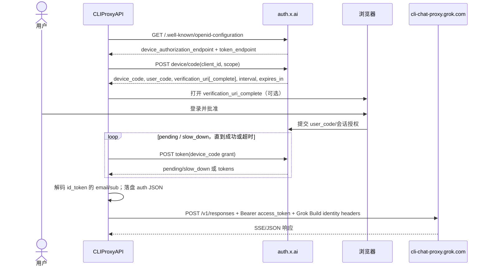
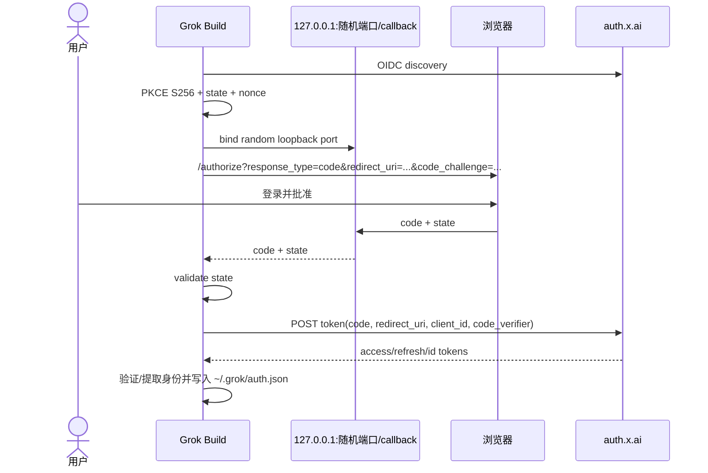

# Grok OAuth 端到端研究

> **范围与证据等级**：本文以 `router-for-me/CLIProxyAPI` 默认分支在 **2026-08-28** 读取的 commit `d36b776c790a4d58027fd4fb434800fb5334bceb` 为实现证据；以 xAI 的公开 OIDC 元数据、xAI 官方文档和 xAI 官方 `grok-build` 源码为协议交叉核验。标记为“实现细节”的内容是 CLIProxyAPI 当前行为，不是 xAI 对第三方代理的承诺；“推断”是根据源码链路作出的解释。本文不包含任何真实 token、cookie 或授权码。

## 1. 先给结论

CLIProxyAPI 当前的 `xai` OAuth 登录是 **OAuth 2.0 Device Authorization Grant（RFC 8628）**，而不是浏览器 Authorization Code + PKCE：

1. `-xai-login` 进入 `cmd.DoXAILogin`，再由 SDK `XAIAuthenticator` 调用 `StartDeviceFlow`、打印验证 URL/用户码并轮询授权。
2. `-oauth-callback-port` 虽然是通用登录参数并传入 `LoginOptions`，但 xAI authenticator 不读取它；当前 xAI 登录不启动本地 callback server，也不生成 PKCE `code_verifier`/`code_challenge`。
3. xAI 端点不是写死 token URL，而是从 `https://auth.x.ai/.well-known/openid-configuration` 发现；CLIProxyAPI 只接受 HTTPS 且主机为 `x.ai` 或其子域名的发现结果。
4. 授权成功后，CLIProxyAPI 从 `id_token` 的 JWT payload **不验签解码** `email` 与 `sub`，不调用 OIDC `userinfo_endpoint`，随后以 `xai-<email>.json`（无 email 时退回 subject 或毫秒时间戳）落盘。
5. 请求阶段，OAuth `access_token` 被放进 `Authorization: Bearer …`。默认非媒体聊天走 `https://cli-chat-proxy.grok.com/v1/responses`；显式 `using_api=true` 才走 `https://api.x.ai/v1/responses`（或显式自定义 `base_url`）。

xAI 官方资料描述的 Grok Build 默认登录则是浏览器 OIDC（Authorization Code + PKCE、loopback callback），并另外提供 Device Code；这是官方 Grok Build 的流程，不应误写成 CLIProxyAPI 当前实现。官方源码的 browser OIDC 流程可作为 Stravia 未来实现 callback/PKCE 的一手参考。

## 2. 版本、入口与调用链

### 2.1 固定版本

- CLIProxyAPI：`d36b776c790a4d58027fd4fb434800fb5334bceb`，提交时间 `2026-08-28T05:01:42+08:00`。
- xAI 官方 Grok Build（用于协议对照）：`9684fa3cdbf2995e30ea8b9b637f1db008f144fc`，提交时间 `2026-08-27T13:30:20Z`。
- GitHub 永久链接的形式均为 `blob/<SHA>/...#Lx-Ly`，避免默认分支后续变化影响结论。

### 2.2 CLI 入口

`cmd/server/main.go` 注册 `-xai-login`、通用 `-no-browser` 和 `-oauth-callback-port`，命令分支最终调用 `cmd.DoXAILogin`：

- [CLIProxyAPI `cmd/server/main.go#L75-L103`](https://github.com/router-for-me/CLIProxyAPI/blob/d36b776c790a4d58027fd4fb434800fb5334bceb/cmd/server/main.go#L75-L103)
- [CLIProxyAPI `cmd/server/main.go#L587-L591`](https://github.com/router-for-me/CLIProxyAPI/blob/d36b776c790a4d58027fd4fb434800fb5334bceb/cmd/server/main.go#L587-L591)
- [CLIProxyAPI `cmd/server/main.go#L646-L666`](https://github.com/router-for-me/CLIProxyAPI/blob/d36b776c790a4d58027fd4fb434800fb5334bceb/cmd/server/main.go#L646-L666)

`DoXAILogin` 创建 `sdkAuth.LoginOptions`（含 `NoBrowser`、`CallbackPort`，后者在 xAI 流程中未被消费），然后调用 `manager.Login(ctx, "xai", cfg, authOpts)`：[CLIProxyAPI `internal/cmd/xai_login.go#L12-L43`](https://github.com/router-for-me/CLIProxyAPI/blob/d36b776c790a4d58027fd4fb434800fb5334bceb/internal/cmd/xai_login.go#L12-L43)。默认服务还把 `NewXAIAuthenticator()` 注册进共享 Auth Manager：[CLIProxyAPI `sdk/cliproxy/service_auth.go#L17-L25`](https://github.com/router-for-me/CLIProxyAPI/blob/d36b776c790a4d58027fd4fb434800fb5334bceb/sdk/cliproxy/service_auth.go#L17-L25)。

调用链（成功路径）为：

```text
-xai-login
  -> DoXAILogin
  -> sdk/auth.Manager.Login("xai")
  -> XAIAuthenticator.Login
  -> XAIAuth.StartDeviceFlow
     -> GET auth.x.ai/.well-known/openid-configuration
     -> POST discovered device_authorization_endpoint
  -> 打开 verification_uri_complete（可关闭自动打开）
  -> XAIAuth.PollForToken（立即一次，之后按 interval 轮询）
  -> parseJWTIdentity(id_token) / CreateTokenStorage
  -> FileTokenStore.Save（xai-<email>.json）
```

对应实现：[CLIProxyAPI `sdk/auth/manager.go#L50-L94`](https://github.com/router-for-me/CLIProxyAPI/blob/d36b776c790a4d58027fd4fb434800fb5334bceb/sdk/auth/manager.go#L50-L94)、[CLIProxyAPI `sdk/auth/xai.go#L16-L36`](https://github.com/router-for-me/CLIProxyAPI/blob/d36b776c790a4d58027fd4fb434800fb5334bceb/sdk/auth/xai.go#L16-L36)、[CLIProxyAPI `sdk/auth/refresh_registry.go#L9-L27`](https://github.com/router-for-me/CLIProxyAPI/blob/d36b776c790a4d58027fd4fb434800fb5334bceb/sdk/auth/refresh_registry.go#L9-L27)。

## 3. 授权入口、发现和参数

### 3.1 CLIProxyAPI 当前端点

常量定义了：

- issuer：`https://auth.x.ai`
- discovery：`https://auth.x.ai/.well-known/openid-configuration`
- public client ID：`b1a00492-073a-47ea-816f-4c329264a828`
- scope：`openid profile email offline_access grok-cli:access api:access`
- device grant type：`urn:ietf:params:oauth:grant-type:device_code`
- 默认 API base：`https://api.x.ai/v1`
- OAuth 聊天默认代理：`https://cli-chat-proxy.grok.com/v1`

见 [CLIProxyAPI `internal/auth/xai/types.go#L6-L29`](https://github.com/router-for-me/CLIProxyAPI/blob/d36b776c790a4d58027fd4fb434800fb5334bceb/internal/auth/xai/types.go#L6-L29)。这些是源码中的常量；“client ID 是公开 client”是代码注释的描述，不代表可用于任意第三方应用。

`Discover` 对 discovery 做 GET、要求 `Accept: application/json`，读取 `device_authorization_endpoint` 和 `token_endpoint`，并拒绝非 HTTPS 或非 x.ai 主机：[CLIProxyAPI `internal/auth/xai/xai.go#L46-L110`](https://github.com/router-for-me/CLIProxyAPI/blob/d36b776c790a4d58027fd4fb434800fb5334bceb/internal/auth/xai/xai.go#L46-L110)。

**实际公开元数据（读取日期同上）**：[https://auth.x.ai/.well-known/openid-configuration](https://auth.x.ai/.well-known/openid-configuration) 当前返回：

- `authorization_endpoint`: `https://auth.x.ai/oauth2/authorize`
- `device_authorization_endpoint`: `https://auth.x.ai/oauth2/device/code`
- `token_endpoint`: `https://auth.x.ai/oauth2/token`
- `userinfo_endpoint`: `https://auth.x.ai/oauth2/userinfo`
- `jwks_uri`: `https://auth.x.ai/.well-known/jwks.json`
- `grant_types_supported`: `authorization_code`、`refresh_token`、`urn:ietf:params:oauth:grant-type:device_code`
- `code_challenge_methods_supported`: `S256`
- `scopes_supported`: 包含 `openid`、`profile`、`email`、`offline_access`、`grok-cli:access`、`api:access`、`team:read`、`conversations:*`、`workspaces:*` 等。

这是服务器此时公开的元数据，端点/支持 scope 可能变化；CLIProxyAPI 的 device 实现只依赖其中两个发现字段。

### 3.2 Device Authorization 请求与响应

CLIProxyAPI 向发现的 device endpoint POST `application/x-www-form-urlencoded`，参数只有：

```text
client_id=b1a00492-073a-47ea-816f-4c329264a828
scope=openid profile email offline_access grok-cli:access api:access
```

见 [CLIProxyAPI `internal/auth/xai/xai.go#L113-L175`](https://github.com/router-for-me/CLIProxyAPI/blob/d36b776c790a4d58027fd4fb434800fb5334bceb/internal/auth/xai/xai.go#L113-L175)。响应字段是 `device_code`、`user_code`、`verification_uri`、`verification_uri_complete`、`expires_in`、`interval`；缺少 device code、user code 或两个验证 URI 都报错，token endpoint 仅在进程内附加到结构体而不序列化：[CLIProxyAPI `internal/auth/xai/types.go#L39-L54`](https://github.com/router-for-me/CLIProxyAPI/blob/d36b776c790a4d58027fd4fb434800fb5334bceb/internal/auth/xai/types.go#L39-L54)。

SDK 随后优先展示 `verification_uri_complete`，否则展示 `verification_uri` 和 `user_code`，除非 `-no-browser` 或系统无可用浏览器：[CLIProxyAPI `sdk/auth/xai.go#L47-L80`](https://github.com/router-for-me/CLIProxyAPI/blob/d36b776c790a4d58027fd4fb434800fb5334bceb/sdk/auth/xai.go#L47-L80)。

### 3.3 轮询、token 获取与字段

轮询行为：

- `interval` 小于 5 秒时强制使用 5 秒；
- 立即发起第一次 token 请求；
- 总等待上限为 30 分钟，若响应的 `expires_in` 更短则取更短的 deadline；
- `authorization_pending` 继续；`slow_down` 把间隔增加 5 秒；`expired_token`、`access_denied` 和其他错误终止。

见 [CLIProxyAPI `internal/auth/xai/xai.go#L196-L253`](https://github.com/router-for-me/CLIProxyAPI/blob/d36b776c790a4d58027fd4fb434800fb5334bceb/internal/auth/xai/xai.go#L196-L253) 和 [错误分支 `#L299-L327`](https://github.com/router-for-me/CLIProxyAPI/blob/d36b776c790a4d58027fd4fb434800fb5334bceb/internal/auth/xai/xai.go#L299-L327)。

每次轮询向 token endpoint POST 表单：

```text
grant_type=urn:ietf:params:oauth:grant-type:device_code
device_code=<一次性 device code>
client_id=b1a00492-073a-47ea-816f-4c329264a828
```

成功响应读取：`access_token`（必需）、`refresh_token`、`id_token`、`token_type`、`expires_in`；源码没有读取或保存响应中的 `scope` 字段：[CLIProxyAPI `internal/auth/xai/xai.go#L255-L327`](https://github.com/router-for-me/CLIProxyAPI/blob/d36b776c790a4d58027fd4fb434800fb5334bceb/internal/auth/xai/xai.go#L255-L327)。

## 4. 回调、PKCE、state 与账号身份

### 4.1 CLIProxyAPI 的 xAI device flow 没有本地回调

当前 xAI authenticator 只消费 `LoginOptions.NoBrowser`，不消费通用的
`CallbackPort`。因此：

- 不监听 `127.0.0.1`；
- 没有 `redirect_uri`；
- 不生成或校验 `state`、`nonce`；
- 不生成 PKCE `code_verifier` / `code_challenge`；
- 浏览器只负责打开 `verification_uri_complete`，授权结果由 CLI 持有
  `device_code` 并轮询 token endpoint 取得。

这不是安全功能缺失，而是 RFC 8628 device flow 与 Authorization Code
flow 的不同边界。`device_code` 必须留在 CLI 进程内，`user_code` 可以展示给
用户；两者不能混用。

管理 API 虽把 `xai` 作为可识别的 OAuth provider 名称，但
`RequestXAIToken` 仍直接启动 device flow；响应中的 `state` 是管理端跟踪/取消后台
轮询任务的 session ID，不是 authorization endpoint 回传并校验的 OAuth `state`。
该接口返回 `flow: "device"`、验证 URL、user code 和 expiry：
[CLIProxyAPI `internal/api/handlers/management/auth_files_provider_oauth.go#L511-L621`](https://github.com/router-for-me/CLIProxyAPI/blob/d36b776c790a4d58027fd4fb434800fb5334bceb/internal/api/handlers/management/auth_files_provider_oauth.go#L511-L621)。

### 4.2 身份来源不是 userinfo

CLIProxyAPI 在 token 成功响应后把 `id_token` 按 `.` 分段，仅 Base64URL
解码 payload，再读取 `email` 和 `sub`；它没有验证 JWT 签名、`iss`、`aud`、
`exp` 或 `nonce`，也没有请求 discovery 中的 `userinfo_endpoint`：
[CLIProxyAPI `internal/auth/xai/xai.go#L459-L482`](https://github.com/router-for-me/CLIProxyAPI/blob/d36b776c790a4d58027fd4fb434800fb5334bceb/internal/auth/xai/xai.go#L459-L482)。

这里的值只被用于本地 label、文件名和 metadata，并未在该链路中作为 xAI
服务端授权判据。但若 Stravia 将 email/team/sub 用于权限、租户绑定或账号所有权
判断，必须按 OIDC 规则验证 ID Token，或调用受 access token 保护的官方 userinfo
endpoint；不能照搬这种“只解码不验签”的便利逻辑。

## 5. 凭据落盘与刷新

### 5.1 存储格式

成功登录返回的 Auth metadata/JSON 包含：

| 字段 | 来源与用途 |
|---|---|
| `type: "xai"` / `auth_kind: "oauth"` | provider 和凭据类型判定 |
| `access_token` | 上游请求 Bearer token |
| `refresh_token` | refresh grant；服务端可能轮换 |
| `id_token` | 本地提取 email/sub |
| `token_type` / `expires_in` | token 响应元数据 |
| `expired` | 由 `now + expires_in` 算出的 RFC 3339 时间 |
| `last_refresh` | 登录或刷新时间 |
| `email` / `sub` | 本地显示和文件命名 |
| `base_url` | 登录时默认为 `https://api.x.ai/v1` |
| `token_endpoint` | discovery 得到的刷新端点 |

结构定义与文件名规则见
[CLIProxyAPI `internal/auth/xai/token.go#L15-L98`](https://github.com/router-for-me/CLIProxyAPI/blob/d36b776c790a4d58027fd4fb434800fb5334bceb/internal/auth/xai/token.go#L15-L98)；
SDK 组装 metadata 见
[CLIProxyAPI `sdk/auth/xai.go#L90-L132`](https://github.com/router-for-me/CLIProxyAPI/blob/d36b776c790a4d58027fd4fb434800fb5334bceb/sdk/auth/xai.go#L90-L132)。

文件名优先 `xai-<sanitized email>.json`，没有 email 时使用 subject，再没有则使用
毫秒时间戳。父目录以 `0700` 创建。需要注意：xAI `TokenStorage.SaveTokenToFile`
内部使用 `os.Create`，文件最终权限受进程 umask 和既有文件权限影响；它没有像
FileTokenStore 的纯 metadata 分支那样显式以 `0600` 创建文件。这是 CLIProxyAPI
当前实现细节，也是 Stravia **不应照搬**的本地凭据保护缺口：
[xAI 写文件实现](https://github.com/router-for-me/CLIProxyAPI/blob/d36b776c790a4d58027fd4fb434800fb5334bceb/internal/auth/xai/token.go#L39-L69)、
[FileTokenStore 对照](https://github.com/router-for-me/CLIProxyAPI/blob/d36b776c790a4d58027fd4fb434800fb5334bceb/sdk/auth/filestore.go#L90-L157)。

### 5.2 refresh grant

CLIProxyAPI 在 access token 到期前 5 分钟进入刷新窗口：
[refresh lead 常量](https://github.com/router-for-me/CLIProxyAPI/blob/d36b776c790a4d58027fd4fb434800fb5334bceb/internal/auth/xai/types.go#L28-L37)、
[统一刷新判定](https://github.com/router-for-me/CLIProxyAPI/blob/d36b776c790a4d58027fd4fb434800fb5334bceb/sdk/cliproxy/auth/conductor_refresh.go#L114-L170)。

刷新请求为：

```text
POST <stored-or-discovered token_endpoint>
Content-Type: application/x-www-form-urlencoded

grant_type=refresh_token
client_id=b1a00492-073a-47ea-816f-4c329264a828
refresh_token=<stored refresh token>
```

相同 refresh token 的并发刷新通过 `singleflight` 合并。调用时使用
`context.WithoutCancel(ctx)`，即某个原请求取消后，共享刷新仍可完成：
[CLIProxyAPI `internal/auth/xai/xai.go#L345-L393`](https://github.com/router-for-me/CLIProxyAPI/blob/d36b776c790a4d58027fd4fb434800fb5334bceb/internal/auth/xai/xai.go#L345-L393)。

刷新响应必须含新 `access_token`。只有服务端返回非空值时才覆盖旧
`refresh_token`、`id_token`、`token_type`、email/sub；因此支持 refresh-token
rotation，也不会因服务端省略新 refresh token 而丢掉旧值：
[CLIProxyAPI `internal/runtime/executor/xai_executor_auth.go#L20-L75`](https://github.com/router-for-me/CLIProxyAPI/blob/d36b776c790a4d58027fd4fb434800fb5334bceb/internal/runtime/executor/xai_executor_auth.go#L20-L75)。
refresh 失败时，401/unauthorized 会把凭据标为 unavailable/error；其他失败进入
backoff 并重新调度：
[CLIProxyAPI `sdk/cliproxy/auth/conductor_refresh.go#L500-L600`](https://github.com/router-for-me/CLIProxyAPI/blob/d36b776c790a4d58027fd4fb434800fb5334bceb/sdk/cliproxy/auth/conductor_refresh.go#L500-L600)。

**边界**：当前源码只实现 refresh-token grant。它不会在 refresh token 失效后用
浏览器 cookie 或 SSO session 静默恢复；恢复路径是重新登录。仓库
[issue #4489](https://github.com/router-for-me/CLIProxyAPI/issues/4489)
提出过 cookie/device recovery，但已关闭为 `not planned`，不能把该提案当成现有行为。

## 6. 代理请求如何使用 token

`xaiCreds` 优先取 attributes 中的 API key，否则取 metadata 的 OAuth
`access_token`。所有路径都以标准头发送：

```http
Authorization: Bearer <access_token-or-api-key>
```

见 [CLIProxyAPI `internal/runtime/executor/xai_executor_request.go#L172-L188`](https://github.com/router-for-me/CLIProxyAPI/blob/d36b776c790a4d58027fd4fb434800fb5334bceb/internal/runtime/executor/xai_executor_request.go#L172-L188)
和 [同文件 `#L289-L318`](https://github.com/router-for-me/CLIProxyAPI/blob/d36b776c790a4d58027fd4fb434800fb5334bceb/internal/runtime/executor/xai_executor_request.go#L289-L318)。

非媒体 HTTP chat 的路由规则是：

1. `using_api=true`：使用配置的 `base_url`，为空时使用 `https://api.x.ai/v1`；
2. OAuth 默认 `using_api=false`：空 base URL 或默认 API base 会被改写为
   `https://cli-chat-proxy.grok.com/v1`；
3. 显式非默认 custom base URL 保留；
4. `/responses/compact`、WebSocket、图片/视频有单独路由，不应从 chat 路由外推。

见 [CLIProxyAPI `internal/runtime/executor/xai_executor_request.go#L191-L257`](https://github.com/router-for-me/CLIProxyAPI/blob/d36b776c790a4d58027fd4fb434800fb5334bceb/internal/runtime/executor/xai_executor_request.go#L191-L257)。

仅当走官方 CLI chat-proxy 时，实现还模拟 Grok Build 客户端身份头，包括
`X-XAI-Token-Auth: xai-grok-cli`、固定 client version、`User-Agent` 和 client
identifier：
[头常量](https://github.com/router-for-me/CLIProxyAPI/blob/d36b776c790a4d58027fd4fb434800fb5334bceb/internal/runtime/executor/xai_executor.go#L46-L55)、
[应用条件](https://github.com/router-for-me/CLIProxyAPI/blob/d36b776c790a4d58027fd4fb434800fb5334bceb/internal/runtime/executor/xai_executor_request.go#L320-L344)。
这些头是 CLIProxyAPI 为兼容当前 Grok Build 服务而复制的**易变实现细节**，不是
xAI 公共 API 契约。

## 7. 两条端到端时序

### 7.1 CLIProxyAPI 当前 device flow



### 7.2 xAI 官方 Grok Build browser OIDC 对照

官方 Grok Build 默认 flow 是 Authorization Code + PKCE，而不是上图的 device
flow：发现 metadata，生成 S256 PKCE、state、nonce，在 `127.0.0.1` 随机端口
监听 `/callback`，浏览器回跳后校验 state，再用 code + verifier 换 token。远程
机器还支持粘贴 callback URL/code；显式 `--device-auth` 才改用 device flow。



一手证据：

- [官方登录编排、loopback 和交换](https://github.com/xai-org/grok-build/blob/9684fa3cdbf2995e30ea8b9b637f1db008f144fc/crates/codegen/xai-grok-shell/src/auth/oidc/login.rs#L335-L503)
- [官方 discovery、PKCE、authorize/token 参数](https://github.com/xai-org/grok-build/blob/9684fa3cdbf2995e30ea8b9b637f1db008f144fc/crates/codegen/xai-grok-shell/src/auth/oidc/protocol.rs#L300-L429)
- [官方 issuer、client ID 和默认 scopes](https://github.com/xai-org/grok-build/blob/9684fa3cdbf2995e30ea8b9b637f1db008f144fc/crates/codegen/xai-grok-shell/src/auth/config.rs#L1-L22)
- [xAI Authentication guide](https://github.com/xai-org/grok-build/blob/9684fa3cdbf2995e30ea8b9b637f1db008f144fc/crates/codegen/xai-grok-pager/docs/user-guide/02-authentication.md#L10-L94)
- [xAI Enterprise Deployments](https://docs.x.ai/build/enterprise)

## 8. 与 OAuth 2.0 / OIDC 的对应关系

| 当前行为 | 标准语义 |
|---|---|
| CLIProxyAPI `StartDeviceFlow` + polling | OAuth 2.0 Device Authorization Grant，RFC 8628 |
| `openid` scope + `id_token` | OIDC 扩展；但 CLIProxyAPI 只解码 claim，不完成 ID Token 验证 |
| `offline_access` + `refresh_token` | OIDC/OAuth 离线续期 |
| public client，无 client secret | native/CLI public client 的常见模型 |
| 官方 Grok Build loopback + S256 | OAuth native app Authorization Code + PKCE，符合 RFC 8252 的 loopback 思路 |
| discovery metadata | OIDC Discovery；客户端仍需验证 issuer/endpoint 信任边界 |

## 9. Stravia 的推荐实现边界

### 可复用

1. **core 拥有协议状态机**：discovery 校验、device-code start/poll、token
   exchange/refresh、错误分类、expiry/refresh rotation；不要把这些规则放在 Axum
   route 或 Svelte UI。
2. **transport 只做适配**：server/desktop 负责“打开浏览器”“显示 verification
   URL/user code”“取消登录”；core 返回结构化状态和 deadline。
3. **凭据与 provider 请求分离**：auth service 产出 provider credential；xAI
   executor 决定 Bearer 注入和 upstream capability。不要让 OAuth 模块知道
   OpenAI-compatible request translation。
4. **发现端点白名单**：至少保留 HTTPS、issuer exact match、endpoint host
   allowlist；防止恶意 discovery 把 refresh token 发往任意主机。
5. **refresh single-flight + rotation**：同一 principal 只允许一个 refresh，
   原子持久化新 refresh token，并保留服务端省略时的旧 token。

### 不可照搬

1. **不要复用 xAI/Grok Build 的 client ID，除非 xAI 明确授权 Stravia。**
   公开源码中的 public client ID 不等于第三方注册许可。
2. **不要依赖 `cli-chat-proxy.grok.com` 和模拟客户端 identity headers。**
   官方文档把该 host 定义为 Grok Build inference proxy，但没有承诺第三方代理
   可使用；稳定集成应优先 xAI API key + `api.x.ai`，或取得 xAI 正式 OAuth
   client/onboarding。
3. **不要只解码 ID Token。** 任何身份/租户决策都要验证签名、issuer、
   audience、expiry、nonce/principal，或使用官方 userinfo。
4. **不要明文以普通文件权限写 token。** Desktop 优先 OS credential vault；
   server 使用现有 secret storage/加密边界。若确需文件，原子写入且 owner-only，
   Windows 使用 ACL，不以 Unix `0600` 的表象替代 Windows 权限模型。
5. **不要把 browser PKCE 与 device flow 混成一套 callback 状态。** 两者可以共享
   token/discovery/persistence primitives，但授权交互是两个独立 state machine。

### 建议的 Stravia 最小接口

```text
GrokAuthService
  begin_device_login() -> DeviceAuthorization
  poll_device_login(device_handle) -> Pending | Authorized(Credential) | TerminalError
  begin_browser_login(callback_uri) -> AuthorizationRequest
  exchange_browser_code(callback, verifier) -> Credential
  refresh(credential) -> Credential

GrokCredentialStore
  load(principal_id)
  save_atomically(principal_id, credential)
  delete(principal_id)
```

这是建议的语义接口，不是要求照搬 CLIProxyAPI 的 Go 类型或 xAI wire 字段。
是否同时实现 browser PKCE 和 device flow，应由 Stravia 的产品面决定：desktop
优先 browser PKCE，纯 server/headless 管理优先 device flow。

## 10. 安全边界、未知项与风险

1. **第三方授权状态未知**：公开 metadata 和源码证明端点/协议存在，不证明 xAI
   允许 Stravia 或任意代理复用 Grok Build client、subscription token 或
   chat-proxy。上线前必须取得 xAI 的 client registration/使用许可。
2. **scope 不是稳定公共 API**：CLIProxyAPI 只请求六个 scope；官方 Grok Build
   当前还请求 conversations/workspaces scopes。应以分配给 Stravia client 的
   server policy 为准，不硬编码“当前最多 scope”。
3. **access token audience 未由 CLIProxyAPI 检查**：同一个 token 是否同时可用于
   `cli-chat-proxy.grok.com` 与 `api.x.ai`，取决于 xAI 服务端 claims/policy；
   `using_api=true` 是路由开关，不是授权保证。
4. **失败后的请求重试语义需单独验证**：refresh scheduler 已实现，但仓库
   [issue #4046](https://github.com/router-for-me/CLIProxyAPI/issues/4046)
   报告某些 `403 bad-credentials` 可能进入 cooldown 而非 refresh。issue 是观察，
   不是已确认的源码契约。
5. **没有官方 SLA/稳定性承诺**：`auth.x.ai` discovery 属于公开协议面；
   Grok Build identity headers、client version 和 chat-proxy 路由是产品内部兼容面，
   随版本变化风险高。

## 11. 来源清单

### CLIProxyAPI（固定 commit）

- [xAI constants/types](https://github.com/router-for-me/CLIProxyAPI/blob/d36b776c790a4d58027fd4fb434800fb5334bceb/internal/auth/xai/types.go)
- [device flow、token exchange、refresh、JWT claim extraction](https://github.com/router-for-me/CLIProxyAPI/blob/d36b776c790a4d58027fd4fb434800fb5334bceb/internal/auth/xai/xai.go)
- [persisted token model](https://github.com/router-for-me/CLIProxyAPI/blob/d36b776c790a4d58027fd4fb434800fb5334bceb/internal/auth/xai/token.go)
- [SDK authenticator](https://github.com/router-for-me/CLIProxyAPI/blob/d36b776c790a4d58027fd4fb434800fb5334bceb/sdk/auth/xai.go)
- [executor refresh](https://github.com/router-for-me/CLIProxyAPI/blob/d36b776c790a4d58027fd4fb434800fb5334bceb/internal/runtime/executor/xai_executor_auth.go)
- [request routing/header injection](https://github.com/router-for-me/CLIProxyAPI/blob/d36b776c790a4d58027fd4fb434800fb5334bceb/internal/runtime/executor/xai_executor_request.go)

### xAI 一手来源

- [OIDC discovery metadata](https://auth.x.ai/.well-known/openid-configuration)
- [Grok Build authentication guide（固定 commit）](https://github.com/xai-org/grok-build/blob/9684fa3cdbf2995e30ea8b9b637f1db008f144fc/crates/codegen/xai-grok-pager/docs/user-guide/02-authentication.md)
- [Grok Build OAuth/OIDC implementation（固定 commit）](https://github.com/xai-org/grok-build/tree/9684fa3cdbf2995e30ea8b9b637f1db008f144fc/crates/codegen/xai-grok-shell/src/auth/oidc)
- [xAI Enterprise Deployments](https://docs.x.ai/build/enterprise)
- [xAI Grok Build overview](https://docs.x.ai/build/overview)
- [xAI 开源公告](https://x.ai/news/grok-build-open-source)
